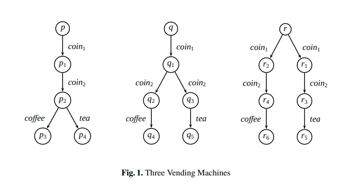
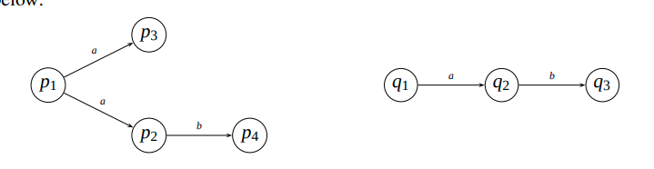
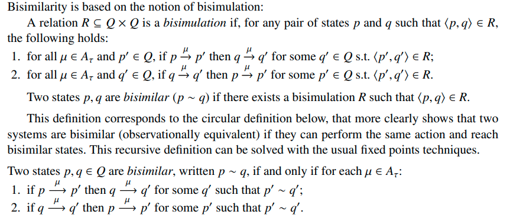
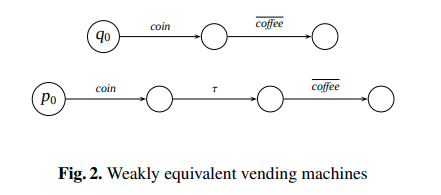
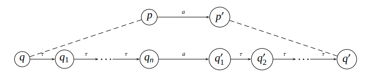

# Behavioral Equivalences

http://eprints.imtlucca.it/1073/1/De_Nicola_2011_Behavioral_Equivalences.pdf

> Almost all the proposed equivalences are based on the idea that two systems
are equivalent whenever no external observation can distinguish them

Se suele especificar el comportamiento de sistemas concurrentes mediante
*semántica operacional*, modelandolos con LTSs.

Un primer approach para equivalencia de comportamiento podría ser que sean
isomorfos, pero consideraría cosas como un loop en un mismo estado con una
acción `a` y una transición a ese loop por la acción `a` como diferentes
cuando son iguales.

Cualquier equivalencia razonable debería,

- abstraer los estados, considerar solo las acciones
- abstraer de comportamiento interno
- identificar procesos cuyos LTSs son isomorfos
- considerar dos procesos como equivalentes solo si ambos pueden ejecutar las
  mismas secuencias de acciones (trazas)
- permitir reemplazar un subproceso por uno equivalente sin cambiar la semántica
  del sistema.

Las equivalencias principales sobre LTSs de la literatura consideran como
equivalentes sistemas que,

1. **Traces equivalence**: Hacen las mismas acciones
2. **Decorated-traces equivalence**: Hacen las mismas secuencias de acciones y
   luego de cada una están listos para aceptar el mismo conjunto de acciones
3. **Bisimulation-based equivalence**: Hacen las mismas secuencias de acciones y
   luego de cada una exhiben, recursivamente, el mismo comportamiento.

Ejemplo:

- Traces toma 1 2 y 3 como equivalentes
- Decorated traces toma 2 y 3 como equivalentes y 1 como distinguida.
- Bisimulation distingue todas

## Traces equivalence

Copiado de teoría de autómatas en donde dos son equivalentes si reconocen el
mismo lenguaje.

Contra: No es sensible a deadlocks

## Bisumulation equivalence

La alternativa clásica a traces es bisimilaridad (aka observational equivalence)
que considera equivalentes dos sistemas que se pueden simular paso a paso.

La idea básica detrás bisimilaridad es que dos estados se consideran
equivalentes si realizando las mismas secuencias de acciones partiendo de ellos,
es posible llegar a estados equivalentes.

## Weak versions

Antes presenta otras, y luego dice que son todas demasiado discriminantes porque
distinguen estas dos

- Weak bisimulation equivalence

  intuitivamente, para considerar dos estados p y q como equivalentes, para cada
  acción visible realizada por uno el otro tiene que tener la posibilidad de
  realizar la misma, precedida o seguida por cualquier número de acciones tau.

  

- Branching bisimulation tiene en cuenta también que las acciones tau pueden
  estar en branching points. Solo se ignoran las tau actions que no eliminan
  posibleinteracciones con observadores externos.