<!-- omit in toc -->
# Resumen final ing2 - Parte 1, análisis de programas

- [Tipos de análisis](#tipos-de-análisis)
- [Análisis estático](#análisis-estático)
  - [Soundness y completeness](#soundness-y-completeness)
  - [Dataflow Analysis](#dataflow-analysis)
    - [Esquema](#esquema)
    - [Algoritmo: Chaotic iteration](#algoritmo-chaotic-iteration)
  - [Pointer analysis](#pointer-analysis)
- [Testing automatizado](#testing-automatizado)
  - [Terminología](#terminología)
  - [Mutation testing](#mutation-testing)
    - [Órdenes de mutación](#órdenes-de-mutación)
    - [Mutantes equivalentes](#mutantes-equivalentes)
    - [Mejoras en performance](#mejoras-en-performance)
  - [Fuzzing](#fuzzing)
    - [Herramientas reales](#herramientas-reales)
    - [Pros y cons](#pros-y-cons)
    - [Graybox fuzzing](#graybox-fuzzing)
    - [Gramáticas](#gramáticas)
  - [Generación automática de tests](#generación-automática-de-tests)
    - [Korat (Systematic testing)](#korat-systematic-testing)
    - [Randoop (Feedback directed random testing)](#randoop-feedback-directed-random-testing)
- [DSE](#dse)
  - [Computation trees](#computation-trees)
  - [Symbolic execution](#symbolic-execution)
  - [Constraint solvers](#constraint-solvers)
  - [Dynamic Symbolic Execution (DSE)](#dynamic-symbolic-execution-dse)
  - [Comparación](#comparación)
  - [Unrolls](#unrolls)
- [SBT](#sbt)
  - [Hill climber](#hill-climber)
  - [Tabú search](#tabú-search)
  - [Algoritmos evolutivos](#algoritmos-evolutivos)
    - [Dominadores](#dominadores)
    - [Función de fitness](#función-de-fitness)
    - [Testability transformation](#testability-transformation)

## Tipos de análisis

- **Dynamic** (runtime)

  Corren el programa y analizan su comportamiento.

- **Static** (compile time)

  Analizan solamente el código fuente.

- **Hybrid** (static + dynamic)

|               | Dynamic                                          | Static                                       |
| ------------- | ------------------------------------------------ | -------------------------------------------- |
| Cost          | Proporcional al tiempo de ejecución del programa | Proporcional al tamaño del programa          |
| Effectiveness | Unsound (puede perderse errores)                 | Incomplete (Puede reportar errores espurios) |

## Análisis estático

Trabajan sobre CFGs (Control Flow Graphs). Abstraen estados que juntan muchos
valores posibles en vez de trabajar con estados concretos, porque no corren el
programa.

Esto hace que sacrifiquen **completitud**. Puede pasar que haya ejecuciones que
no cumplan la propiedad pero como abstraemos nos la perdemos.

> Un proof system es completo si puede demostrar todo lo verdadero.
> i.e no tira alertas para los programas que no tienen fallas.
> no tiene fallas => no tira alertas
>
> tira alertas => tiene fallas
>
> pero podría haber una falla que suceda para un estado abstracto, pero tan
> abstracto que en realidad no pasa en el programa, causando un falso positivo.

En cambio, son sound

> Sound si se puede probar => es verdadero
> no tira alertas => no tiene bugs
> tiene bugs => tira alertas
>
> como estamos sobre representando los inputs, si no tira alertas, como estamos
> sobre un superconjunto de los inputs, en particular vale para todos los inputs
> del programa, entonces podemos afirmar que no tiene bugs.
>
> Por eso es sound.

### Soundness y completeness

En lógica, hay un *proof system* y un *model*. El proof system es un conjunto de
reglas con las cuales uno puede probar propiedades (o *statements*) sobre el
modelo. El modelo es una estructura matemática, como por ejemplo los naturales.

Un proof system L es

- *sound* (o correcto) si las propiedades que puede probar son efectivamente
  verdaderas en el modelo.

  se puede probar => es verdadera

- *complete* si puede probar cualquier propiedad verdadera sobre el modelo.

  propiedad es verdadera => se puede probar

> Muchos proof systems no son sound y complete, ver el [teorema de incompletitud
> de
> gödel](https://en.wikipedia.org/wiki/G%C3%B6del%27s_incompleteness_theorems).
> Puede haber algunas propiedades verdaderas que L no puede probar (incomplete)
> o puede "probar" propiedades falsas junto con las verdaderas (unsound o
> incorrect)

Se pueden ver los análisis estáticos como un proof system para establecer que
ciertas propiedades se cumplen para las *ejecuciones* de programas. El programa
cumple el rol del modelo.

Para un analizador, un programa P cumple con una propiedad R si no emite ninguna
alerta mientras analiza P. Si levanta una alerta, no tiene la propiedad.

Por ejemplo, si un static analyzer A quiere probar la propiedad R "ninguna
ejecucion del programa va a exhibir runtime errors por división por 0",

- A se debería considerar **sound** para R si, cuando dice que R se cumple,
  efectivamente no hay ejecuciones que exhiben un runtime error

  En cambio, sería unsound si dice que la propiedad se cumple cuando en realidad
  no, i.e al menos una ejecución es errónea.

  se puede probar => es verdadera

  traduciendo a lo que quiere decir que se pueda probar y que sea verdadera,

  no emite alertas => no hay ejecuciones

  sii (contrarecíproco)

  hay ejecuciones => emite alertas

  **no hay falsos negativos**, pues

- A se debería considerar **complete** si puede probar R si es verdadera

  si es verdadera, es porque no existen ejecuciones que tiran error.

  Si no existen ejecuciones => no tira alertas
  
  sii (contrarecíproco)

  tira alertas => existen ejecuciones que fallan

  esto quiere decir que **no hay falsos positivos**, ya que toda alerta se
  corresponde a ejecuciones que fallan. Pero puede haber falsos negativos

  que es el contrarecíproco de la definición de lógica

  no lo prueba => la prop no es verdadera

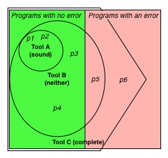

### Dataflow Analysis

Es un análisis **estático** que razona sobre el *flujo de datos* de un programa.
Sacrifican completeness pero garantizan soundness y terminación.

Formas clásicas:

- Reaching definitions analysis

  Goal: Determinar para cada punto del programa, qué asignaciones se hicieron y
  llegaron a él sin ser sobreescritas.

  El algoritmo es monotónico, IN y OUT crecen y tienen una cota superior, por lo
  tanto siempre termina.

  > Encontrar usos de variables no inicializadas

- Very busy expressions analysis

  Goal: Determinar en el exit de cada nodo cuales son las **very busy**
  expressions.
  
  Decimos que una expresión está very busy si se usa antes de que se redefinan
  las variables que contiene, sin importar el camino que se tome.

  > Reducir tamaño del código

  En el algoritmo los conjuntos se modifican de forma monótona decreciente (no
  estricta, porque se puede elegir el mismo nodo)

- Available expressions analysis

  Goal: Determinar en cada punto del programa qué expresiones fueron computadas
  pero **no** modificadas en ningún camino que lleva a él

  > Evitar recomputar expresiones, como una cache. El valor puede cambiar en el
  > tiempo, pero en un punt ose que tengo el valor disponible y loi puedo usar
  > sin computarlo. Por ej. sirve en un loop

- Live variables analysis

  Goal: determinar para cada punto del programa qué variables podrían estar
  **live** a su salida.

  Una variable está live si hay un camino a un uso de una variable que no la
  redefine.

  > Asignar registros a variables eficientemente. Si sabemos en cada nodo
  > cuantas variables están vivas a la vez, sabemos cuantos registros
  > necesitamos concurrentemente.

Cada uno tiene un *goal* que especifica la información de dataflow que computa

#### Esquema

- In: Conjunto de facts que fueron calculados por el análisis a la entrada de un
  nodo n
- Out: facts a la salida de un nodo n
- Gen: Conjunto de hechos que son generados por el análisis al fluir por el nodo
  n
- Kill: Conjunto de hechos que son eliminados por el análisis al fluir por el
  nodo n

Se pueden clasificar como **forwards** o **backwards** y como **may** o **must**

- forward: calcula OUT a partir de IN
- backwards: calcula IN a partir de OUT
- may: reporta hechos que suceden en algún camino (unión)
- must: reporta hechos que suceden en todos los caminos (interseccion)

|          | May                     | Must                  |
| -------- | ----------------------- | --------------------- |
| Forward  | Reaching definitions    | Available expressions |
| Backward | Live variables analysis | Very busy expressions |

#### Algoritmo: Chaotic iteration

Para computarlos usamos un algoritmo de *iteración caótica*. Se elije un nodo
random y se calculan los in y out. El algoritmo frena cuando llega a un punto
fijo (o está saturado), que es que no cambian los IN y OUT para todos los nodos.

### Pointer analysis

Los punteros permiten que haya *aliasing*, por ejemplo

```c
Circle x = new Circle();
Circle z = ?
x.radius = 1;
// [x.radius == 1]
z.radius = 2;
// [x.radius == ?] depende de si z es un alias de x
y = x.radius;
assert(y == 1)
```

Dos tipos de análisis: may-alias analysis (pointer analysis) y must-alias. Son
problemas duales, pero must requiere una maquinaria más compleja que may.

Se centra en la pregunta: **x may-alias z?**

- No: No hay posibilidad de que x,z sean aliases (x $\neq$ z)
- Si: No se puede determinar si lo son (tal vez lo son, puede haber falsos
  positivos)

Los algoritmos por lo tanto son sound, y sacrifican completeness. Se diferencian
según

sound si puede probar => verdadero
x != z => no son alias

- Como abstraen el **heap**: tienen que particionar un espacio no acotado de objetos concretos
  en una cantidad finita de *objetos abstractos*
  - **Allocation site based**: un objeto abstracto por allocation site
  - **Type based**: uno por tipo
  - **Heap insensitive**: un solo objeto representa todo el heap.

  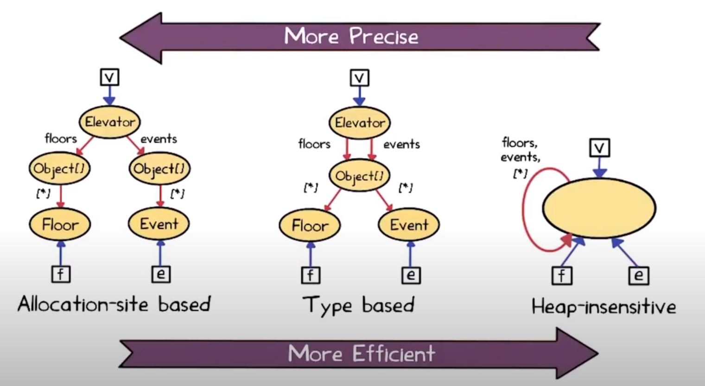

- Como abstraen el **control flow**
  - **Flow sensitivity**: Como modelar control flow *dentro* de procedimientos o
    funciones (intra-procedural)
    - Flow insensitive:
      - Hacen weak updates.
      - Ven a los programas como statements sin orden,
      - nunca matan facts.
      - Suelen alcanzar para may alias.
    - Flow sensitive: strong updates
      - Pueden matar facts
      - suelen ser requeridos para must alias analysis.
  - **Context sensitivity**: Como modelar control flow *a través* de los
    procedimientos o funciones (inter-procedural)
    - Context insensitive
      - analizan cada función una sola vez, sin importar cuantas veces se llaman
      - Son imprecisos porque juntan aliasing facts que vienen de distintos
        contextos de ejecución
      - Pero son muy eficientes, ya que analizan cada proc una sola vez
    - Context sensitive
      - analizan cada proc una vez por cada *abstract calling context*
      - Son relativamente precisos pero caros

- Como tratan **aggregate data types**, arrays y records
  - Arrays: se usa un solo campo `[*]` para representar todos los obj del array,
    haciendo que no se puedan distinguir elementos.
  - Records (structs)
    1. **Field insensitive**: juntar todos los campos de cada record object

        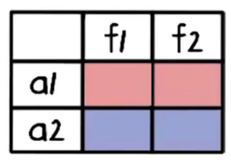

        Previene que distingan entre f1 y f2 en a1 o a2

    2. **Field based**: junta cada campo de todos los objetos

        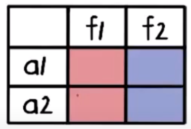

        No permite distinguir campos entre objetos. Entre a1 y a2 pero si f1 y f2

    3. **Field sensitive**: Cada campo de cada abstract record object está separado.

        

        Es la más precisa de todas.

Para realizar los análisis, se lleva el programa a **forma normal** (un conjunto
de instrucciones) y se construye un points-to-graph sobre él. El algoritmo para
construirlo es uno de iteración caótica. Para cada statement, se aplica la regla
correspondiente a él hasta que el grafo no cambie.

Una vez que está construido el points-to-graph, decimos que dos variables
may-alias si apuntan al mismo allocation site. Si no lo hacen, estamos seguros
de que no son alias.

## Testing automatizado

- Tipos de tests
  - Caja blanca
  - Caja negra
  - Manual
  - Automatizado
- Pre y post condiciones
- Coverage

### Terminología

1. Un programador crea un **defecto** en el código
2. Cuando es ejecutado, se genera una **infección**
3. La infección se *propaga*
4. Hasta ser observable, momento en el cual se convierte en una
   **falla**

Donde,

- **Error**: desviación de lo esperado o correcto
- **Defecto**: Error en el código, que puede crear una infección que conduce a
  una falla

  > pero no siempre la ejecución de un código defectuoso lleva a una infección

- **Infección**: Un error en el estado del programa que puede conducir a una
  falla

  > Pero no siempre una infección se propaga hasta ser visible

- **Falla**: un error *externamente visible* en el comportamiento del programa

### Mutation testing

- Vamos a juzgar la efectividad de un test suite midiendo que tan bien puede
  encontrar defectos *artificiales*. Los **mutantes** van a ser una versión
  levemente modificada del programa original, que tienen cambios simples
  (emulando typos) que sean sintácticamente válidos.

  Por ejemplo,

  ```diff
  int foo(int x, int y) {
    if (x < y)
  -    return x + y
  +    return x - y // mutante
    return x * y
  }
  ```

- Se van a generar con **operadores de mutación** que dicen qué es lo que hay
  que cambiar. Son reglas para derivar mutantes a partir de un programa.

- Decimos que un mutante está **muerto** si hubo un test que lo detectó (i.e
  pasa para el programa y falla para el mutante o al revés) y **vivo** si no.

  Si hay un mutante vivo, es porque hacen falta más tests.

- Mutation score = #muertos / #total

  (con #total = #muertos + #vivos)

#### Órdenes de mutación

- **FOM** (First Order Mutant)

  - Tiene exactamente una mutación
  - Cada mutación define un conjunto de FOMs
  - #FOM = # referencias a datos $\times$ # referencias a objetos

- **HOM** (Higher Order Mutant)
  - Es una mutación de otra mutación
  - #HOM = $2^{\\#FOM} - 1$

#### Mutantes equivalentes

Como las mutaciones son cambios *sintácticos*, no necesariamente alteran la
**semántica** del programa. Pueden ser alcanzados y que no se infecte el estado
del programa, o producir una infección sin propagación.

Por ejemplo

```diff
if (x > 0) {
- if (y > x) {
+ if (y > abs(x)) {
    ...
  }
}
```

pero como en el branch true x > 0, abs(x) = x y ambos programas son
equivalentes. No vamos a poder matar al mutante.

#### Mejoras en performance

Hay muchos mutantes, y hay que correr todos los tests para cada uno, lo cual
puede ser muy lento. Se puede optimizar en diferentes aspectos

- Fewer
  - Sampling de mutantes: no ejecutar todos
  - Mutación selectiva: usar un subconjunto de operadores

    Hago estudios empíricos, me quedo con el minimo cjto de operadores de
    mutación que sea equivalente al de todos.

    Un estudio dice que es ABS, AOR, COR, ROR, UOI.

- Smarter
  - Paralelización
  - Mutación débil: ver afectación en el estado del programa en vez de esperar
    a que sea observable. (fuerte: que mute hasta una falla observable)
  - Uso de coverage: solo ejecutar los tests que pasen por la línea modificada.
  - Impacto
- Faster
  - Mutar bytecode directamente (evita compilar para cada mutante)
  - Meta-mutantes: en lugar de generar distintas versiones del mismo programa,
    generar una única versión distinta que contenga todos los cambios. Y con
    alguna configuración elegir qué mutante usamos, por ej. con un switch. (te
    ahorrás compilación)

### Fuzzing

Random testing (fuzzing) tiene como idea darle inputs random a un programa, y
ver si se comporta "correctamente". Es un caso particular de mutation analysis.

Es un *paradigma* y no algo que usamos out of the box. La generación de inputs
va a depender de cada programa, y se puede especificar por ejemplo con
gramáticas.

Toma como premisa el **infinite monkey theorem**,

> "A monkey hitting keys at random on a typewriter keyboard will produce any
> given text, such as the complete works of Shakespare, with probability
> approaching 1 as time increases".

El monkey es un fuzz testing tool, y un texto es encontrar un input que expone
un bug en el programa siendo testeado.

#### Herramientas reales

- **Monkey tool**: de google para fuzzing en android. Genera una secuencia de
  eventos, puede generar gestos.

- **Cuzz**: De microsoft para apps multithread
  - En los programas concurrentes los bugs se trigerrean con schedules
    particulares de los threads, que no es determinístico.
  - Para forzar un schedule, se introducen automáticamente delays random entre
    instrucciones (`sleep`s)
  
  - **Bug depth** = el número de *ordering constraints* (cuantos threads tienen
    que correr en cierto orden) que un schedule tiene que satisfacer para
    encontrar bug.

    Ejemplos

    ```text
    // thread 1
    t = new T();

    // thread 2
    t.state == 1
    ```

    como hay un solo constraint, depth 1

    ```text
       // thread 1
    1: p = null;

       // thread 2
    1: if (p != null) {
    2:   p.close();
       }
    ```

    bug depth 2 (porque 2.1 antes de 1.1 y 2.2 después de 1.1).

  - típicamente tienen poco depth los bugs. "small test case hyphotesis": si hay
    un bug, hay un test chiquito que lo encuentra.

#### Pros y cons

Pros

- Fácil de implementar
- Se puede probar que tiene buen cubrimiento con suficientes tests
- Puede funcionar con programas de cualquier formato
- Está bueno para vulns de seguridad (encuentra cosas raras que los testers
  humanos no encuentran)

Cons

- Test suite ineficiente (test bloat)
- Puede encontrar bugs que no son tan importantes (tal vez side effects
  benignos)
- Mala cobertura

#### Graybox fuzzing

En fuzzing casi siempre partimos de un **seed**, que es un conjunto inicial de
inputs que son fuzzeados o modificados. (no confundir con seeds aleatorias que
son números enteros)

- **Blackbox fuzzing**: partimos de un seed, y se elige cada seed para aplicar
  una cantidad aleatoria de mutaciones hasta K (insert char, flip bit, etc.)
- **Greybox fuzzing**: mezcla entre whitebox y blackbox
  - Se fija si un input aportó cobertura, y en ese caso lo agrego al corpus de
    inputs para futuras mutaciones.
  - Para eso es necesario medir la coverage del programa.
  - Todos los inputs tienen la misma probabilidad de ser elegidos. Como se van
    agregando inputs, esto hace que cada vez haya menos probabilidad.
- **Boosted greybox fuzzing**
  - El normal tiene el problema de que cuando agrego un input al seed,
    decremento la probabilidad de elegir cada uno.
  - La idea de boosted es que aumento la proba de elegir un input según las
    chances de descubrir otros caminos en el CFG.
  - Quiero elegir un input si ejercitó un camino que antes no se había
    ejercitado. Cada elemento del seed posee una **energía**, que es la proba de
    elegirlo, que se define como

    $$e(s) = \frac{1}{f(p(s))^a}$$

    donde

    - $p(s)$ es el camino que recorrió la ejecución de s
    - $f(p(s))$ es la frecuencia de apariciones de un camino en el test suite.
    - $a$ es un exponente que se usa para controlar cuanto *decae* el valor de
      los caminos ya recorrido. Cuanto mayor es, más decae.

#### Gramáticas

Si los inputs del programa tienen cierta estructura, se pueden generar
respetándola usando gramáticas.

### Generación automática de tests

#### Korat (Systematic testing)

Usa los tipos para generar los tests, por lo tanto es **whitebox**.

Para poder explorar todas las posibles formas de un tipo sistemáticamente, vamos
a representar estructuras como vectores ordenando los campos de un struct. De
esa manera, cada *forma* de un tipo es un vector de valores de los campos.

Y como enumeramos los vectores?

Algoritmo naive:

- Se selecciona un tamaño máximo K
- Se generan todos los posibles inputs hasta tamaño K
- Se descartan los que no cumplen la precond
- Corre el programa en los que quedan
- Valida los resultados usando la post cond

Problemas:

- Es ineficiente generar inputs y después chequear la pre condición, sería mejor
  generar inputs válidos de una.

En Korat, se *instrumenta* la precondición (func `repOK`) para ver qué campos
accede. Y se van enumerando en ese orden. Itera el último campo visitado por la
pre condición. Cuando se terminan las posibilidades, hace backtracking.

Evita **isomorfismos** permitiendo a lo sumo incrementos de 1 en la numeración
del vector.

Por ejemplo, `repOK` de un árbol binario (usa BFS)

```text
public boolean repOK(BinaryTree bt) {
  if (bt.root == null) return true;
  Set visited = new HashSet();
  List workList = new LinkedList();
  visited.add(bt.root);
  workList.add(bt.root);
  while (!workList.isEmpty()) {
    Node current = workList.removeFirst();
    if (current.left != null) {
      if (!visited.add(current.left)) return false;
      workList.add(current.left);
    } 
    if (current.right !=null) {
      if (!visited.add(current.right)) return false;
      workList.add(current.right);
    } 
  } 
  return true;
}
```

Pros y cons

- Es bueno cuando podemos enumerar todas las posibilidades: estructuras con
  procedimientos simples y en unit testing
- Es débil cuando no se puede enumerar todo, por ej. con enteros floats o
  strings. (DSE para esto)
- Es tan bueno con las pre y post conds.

#### Randoop (Feedback directed random testing)

> RANDom tester for Object Oriented Programs

Idea: Crear de forma **aleatoria** un nuevo test, **guiado por el feedback** de
tests creados previamente. Un test es una secuencia de method calls.

Receta

- Crea nuevas secuencias incrementalmente, extendiendo las previas.
- Ni bien se crea una, se ejecuta
- Usa el resultado para guiar la generación hacia secuencias que creen nuevos
  estados de los objetos.

Inputs: clases a testear, límite de tiempo, conjunto de constraints (o
assertions)

Output: tests que violan las constraints, con estructura

```text
<secuencia de llamados a input classes que arman el estado>
<contrato stated as assertion>
```

Para que sea valido,

- No se deberia violar un contrato durante la ejecucion (secuencias
  **ilegales**)
- La assertion del final debería fallar al ser ejecutada.

Para clasificar cada secuencia que se genera,

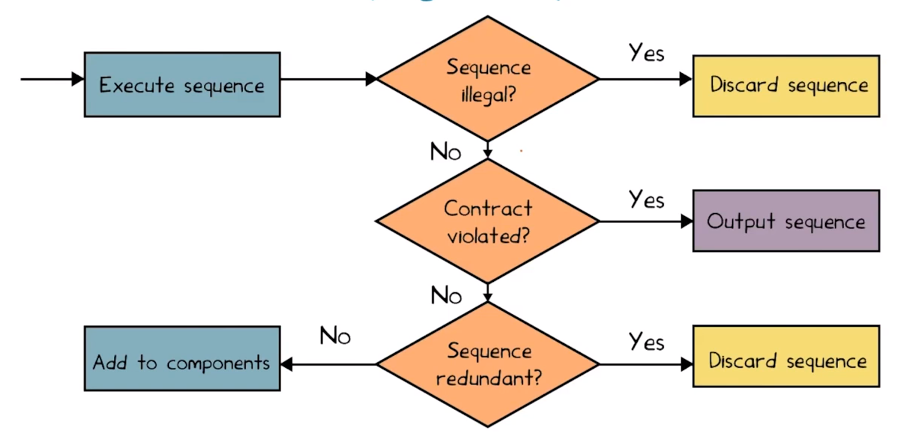

## DSE

Es una técnica híbrida que combina static y dynamic analysis.

### Computation trees

- Es una forma de ver a los programas como árboles binarios de profundidad
  potencialmente infinita (si hay loops).
- Cada nodo es un condicional
  - arista izquierda rama false
  - derecha la rama true.
- Cada camino representa una **clase de equivalencia** de inputs.

La idea entonces va a ser generar sistemáticamente inputs no equivalentes.

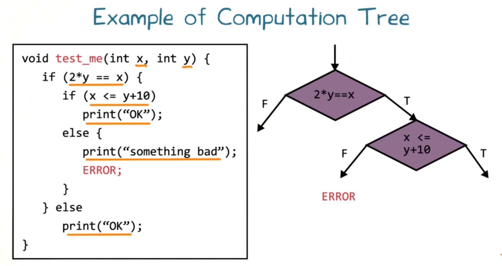

Sacado de lección: diferencias entre CFG y CT:

- En el control-flow graph una sentencia es representada por un único nodo
  mientras que en el árbol de cómputo la misma sentencia puede aparecer en
  distintos nodos del árbol.
- En el control-flow graph todas las sentencias se representan con un nodo
  (independientemente si son de bifurcación o no), mientras que en el árbol de
  cómputo únicamente las sentencias de bifurcación se representan con nodos.
- El control-flow graph puede tener ciclos mientras que el árbol de cómputo no
  posee ciclos.
- Un nodo en el control-flow graph puede tener muchos predecesores mientras que
  un nodo en el árbol de cómputo siempre tiene un único predecesor.

### Symbolic execution

- Los inputs se representan con *símbolos* en vez de valores concretos.
- El programa se ejecuta **simbólicamente**, guardando *path constraints* simbólicas.
- Se usa un **constraint solver** (a.k.a theorem prover) para ver si hay valores
  que satisfacen cada branch condition.

Pero tiene varios problemas,

- No escala para programas grandes, porque son muchas condiciones.
- Si la pregunta a responder es demasiado difícil para el constraint solver, se
  toma un approach *sound* y se asume que se puede satisfacer, llevando
  poitencialmente a falsos positivos (ya que tal vez no era satisfacible)

### Constraint solvers

Le das como argumento una fórmula en algún lenguaje, y da como output

- SAT y con que input
- UNSAT
- No se (sat es indecidible para LPO por ej.)

### Dynamic Symbolic Execution (DSE)

Es una combinación de dos approaches para tener las ventajas de ambos: concrete
execution de random testing con symbolic execution.

- Arranca con inputs random y observa los branches tomados
- Ejecuta el programa **concretamente** y **dinámicamente**
- Todo se define en función de las variables de entrada, no importan las locales
  que sean definidas en el medio.
- Cuando llega al fin del cómputo, hace backtracking hasta algún branch point y
  decide si es SAT el otro branch (la negación) con un SAT solver.
  - Si es SAT, el solver genera una asignación, y sino se ignora.
  - Si una cond es compleja para el solver, las **simplifica** reemplazando
    valores simbólicos por concretos.

    Esto hace que sea un **incomplete solver**: nunca declara UNSAT como SAT,
    pero puede fallar en marcar como SAT algo que en realidad lo es. (marca SAT
    como UNSAT).
- Luego se vuelve a ejecutar con los valores concretos y se repite el proceso de
  negación.

> Ejemplo de DSE en el cuaderno

Trackea 3 piezas de información

- Concrete state: Lo usa para simplificar la parte de resolución de constraints
  de análisis estático

- Symbolic state: Lo usa para guiar el análisis dinámico a seleccionar inputs
  concretos no redundantes.

- Path condition (constraints simbólicas que le pasa al solver)

Además, DSE no tiene garantizado terminar si hay input-dependent loops. se puede
modificar DSE para que termine después de explorar una cantidad finita de
caminos del computation tree.

### Comparación

> En DSE "se puede probar" = "no tira una alerta" (no dice nada)
>
> sound:
>
> - se puede probar => es verdad
> - no tira una alerta => no hay falla
> - falla => tira una alerta
> - (no hay falsos negativos)
>
> complete:
>
> - es verdad => se puede probar
> - no hay falla => no tira una alerta
> - tira una alerta => falla
> - (no hay falsos positivos)

Cuando las restricciones son muy complejas para ser manejadas por el demostrador
de teoremas, DSE "simplifica" las restricciones enviadas al demostrador
reemplazando un valor simbólico con un valor concreto. Esto produce

- Las restricciones simplificadas son un subconjunto de las soluciones para
  recorrer ese camino, por lo tanto, un resultado de insatisfabilidad (UNSAT) no
  es concluyente, ya que no se analizó todo el espacio de búsqueda.

- Reduce el espacio de búsqueda de soluciones del demostrador de teoremas, lo
  que le permite en algunos casos encontrar soluciones que de otra manera no
  podría.

- El uso de restricciones simplificadas introduce unsoundness, ya que DSE puede
  producir falsos negativos (i.e. no reportar que se puede producir un error
  cuando existe un input concreto que puede alcanzar ese error)

Diferencia entre DSE y SE, parecida a diferencia entre static analysis y dynamic
analysis.

- DSE nunca modela un run del código que no podría pasar, entonces no hay
  falsos positivos (es complete). Pero puede perderse casos, entonces hay falsos
  negativos (no es sound).

- SE siempre toma branches que no está seguro de si se pueden alcanzar, entonces
  puede modelar corridas del programa que sean imposibles: no hay falsos
  negativos (nunca determina incorrectamente que un programa no tiene errores,
  es sound) pero hay falsos positivos (retorna errores espúreos, es incomplete)

### Unrolls

Se pueden hacer unrolls para que los árboles de cómputo infinitos sean finitos,
ya que sino ni SE ni DSE terminarían.

Tiene efecto de,

- SE: Asegura terminación pero introduce "unsoundness", ya que puede existir un
  estado de error alcanzable con K+1 unrolls pero como se efectuaron únicamente
  K unrolls el algoritmo no lo puede alcanzar.

## SBT

Random testing es una búsqueda casi no guiada, y se suele usar como punto de
comparación para las técnicas sistemáticas. Es barata y suele funcionar
decentemente bien.

Limitaciones:

- Random testing: dificultad para generar inputs que alcancen código poco
  probable (tienen dist uniforme)
- DSE (concolic testing): tamaño de las path conditions para programas grandes,
  capacidad del constraint solver.

Alternativa: tratar la búsqueda del espacio de inputs como un problema de
optimización combinatoria. Podemos aplicar **algoritmos de búsqueda
meta-heurísticos**. Estos no van a encontrar la mejor sol, pero encuentran una
suficientemente buena en una cantidad razonable de tiempo.

### Hill climber

Si tengo una función objetivo que me dice para cada input un score (o fitness),
puedo intentar de explorar el espacio para llegar a máximos locales.

Idea:

1. Definir una noción de **cercanía** del input con respecto al goal que
   queremos alcanzar
2. Por cada nueva sol, explorar la vecindad de todas las soluciones
3. Elegir la vecina que sea mejor que la actual
4. Repetir hasta no encontrar mejores

Pseudocódigo

```text
Elijo de forma random una primera sol

while (no alcancé el goal)
  Busco entre los vecinos
  Si existe un vecino que es mejor
    Actualizo la nueva posición
  Si no
    Termino la búsqueda
```

Problema: puede llegar a caer en un máximo local

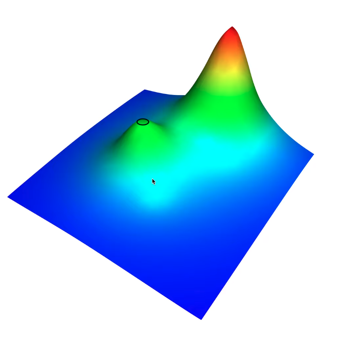

### Tabú search

### Algoritmos evolutivos

> Cuando el vecindario es demasiado grande (por ej. tridimencional), hill
> cimbing se torna muy lento. Necesitamos algo mejor

- Gen: unidad de info pasada de generación en generación
- Selección natural

Pasos

1. inicializar población
2. evaluar población con función de fitness (que tan apto está para el ambiente)
3. while no termine
   1. seleccionar padres
   2. crear nuevos individuos, hijos, generando una población.
4. volver a 2
5. Retornar el mejor individuo de la población

Cuestiones a resolver:

- Como representamos la población? Como la generamos?

  En el ejemplo pueden ser ternas

  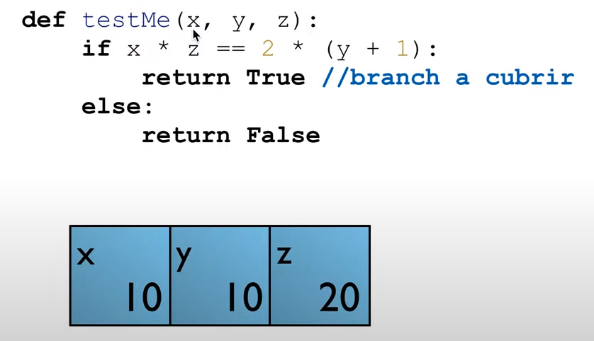

  Para generarla,

  - Aleatoriamente
  - Usar sol existentes
  - Usar un test suite con cobertura de un criterio de menor potencia
  - Manualmente

- Que función de fitness usamos? Como la evaluamos?
  - La func de fitness responde si un individuo es mejor que otro.
  - Determina el espacio de búsqueda o *fitness landscape*

  Cómo sabemos que tan cerca está un input de cumplir con un predicado? Podemos
  usar *branch distance*

  ```text
  # Branch distance
  a == b    abs(a - b)
  a < b     a < b? 0: (a-b) + k
  a =< b    a =< b? 0: (a-b)
  a > b     a > b ? 0 :(b-a) + K
  a >= b    a >= n ? 0 : (b-a)

  o.m(v1, ..., vn)  true? 0: K
  a != b            a != b? 0: K
  A && B            dist(A) + dist(B)
  A || B            min(dist(A), dist(B))
  !a                usar de morgan
  ```

- Cual es mi condición de parada?
  - Tiempo máximo
  - Cant máxima de iteraciones
  - Cant máxima de evals de la func de fitness
- Que func uso para seleccionar padres?

  - **Roulette wheel selection**: la proba de elegir un individuo es
    proporcional al valor de su función de fitness.
    - Problema: aumenta excesivamente la proba de elegir los que sean bien
      rankeados.
  
  - **Rank selection**: Rankear individuos de acuerdo a su fitness. Esto hace
    que no haya diferencia si el individuo con mayor fitness es 10 veces mejor
    que el segundo o solo 0.0001% mejor. Es el preferible en la práctica

  - **Tournament selection**. Tenemos un torneo de tamaño N, selecciono N
    aleatoriamente y el mejor es seleccionado. El tamaño define la presión
    selectiva.

    Nos permite que un individuo con mala fitness aún puede ganar con cierta
    probabilidad (el peor sería elegido con sí mismo)

- Como creo hijos? Cross over, operadores de mutación?

  Combinar individuos: hacer *crossover*
  
  - Single point crossover: elegir un único punto en los padres y dividir o unir
   ese punto.
  - Two point crossover: dos puntos
  - Fixed vs variable length
  - Uniform crossover

  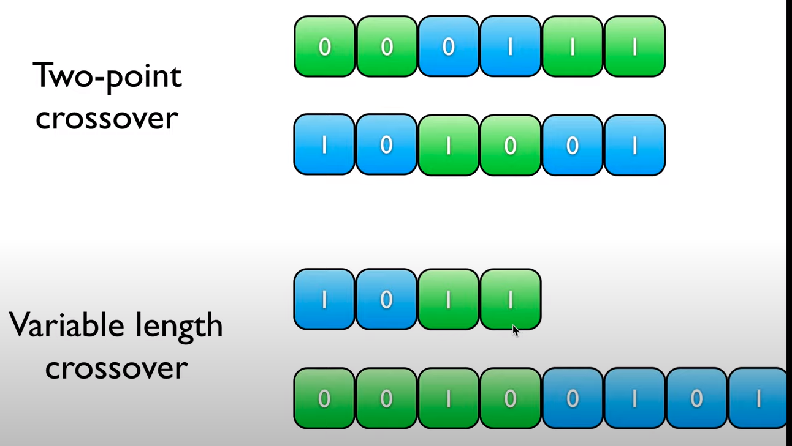

  Además se pueden aplicar pequeñas mutaciones

#### Dominadores

Una limitación de branch distance es que no tiene en cuenta condiciones
anidadas. Para esto necesitamos dominadores.

Decimos que un nodo A **domina** al nodo B si todo camino hacia B debe pasar por
A. Un dominador inmediato es el más cercano en todo el camino desde la raíz (y
la raíz no tiene)

Análogamente, decimos que B **post-domina** a un nodo A si todos los caminos
desde A a la salida tienen que pasar por B. Son dominadores vistos en reversa.

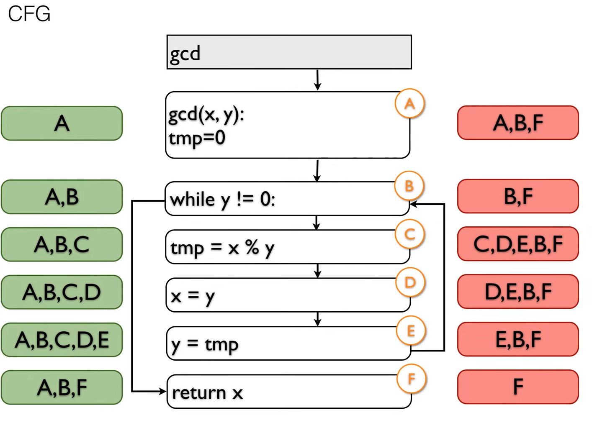

(izq domina der post dom)

Decimos que B es **control-dependiente** de A si

- A domina a B
- B no post domina a A
- A tiene al menos dos sucesores (A es una decisión)
- B post domina a un sucesor de A

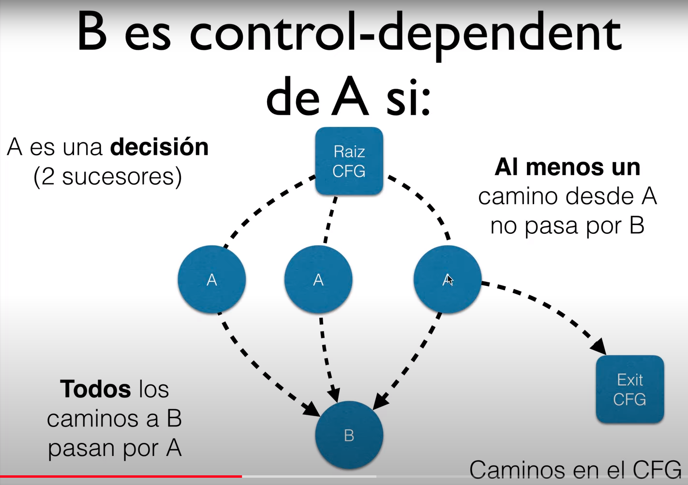

Con esto podemos armar un **Control dependency graph** (CDG) que es otra
representación de la ejecución de un programa que nos va a permitir definir la
distancia de una mejor manera.

#### Función de fitness

Función de fitness = Nodos dependientes - ejecutados

- dependientes: cantidad de nodos del CDG para el target. (ancestros del target)
- ejecutados: numero de control dependent que fueron ejecutados (ancestros)

Para armarla, necesitamos que la fitness func combine

- approach level (cuan cerca estoy del predicado)
- branch distance (cual cerca estoy de ejercitar el branch)


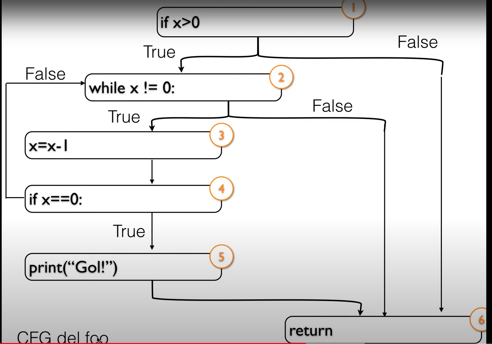
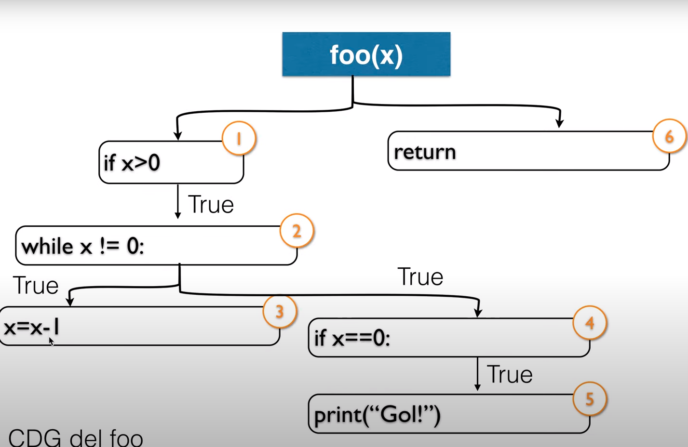

> Está teniendo en cuenta el branch distance de todos los nodos del CDG?

#### Testability transformation

Si tenemos un programa que genera una función de fitness muy dura, puede ser
complicado hacer la búsqueda. En ese caso se puede transformar un programa a
otro con semántica equivalente que tenga una func de fitness más amigable. Es
solamente usado para generar datos de test y luego **descartado**.

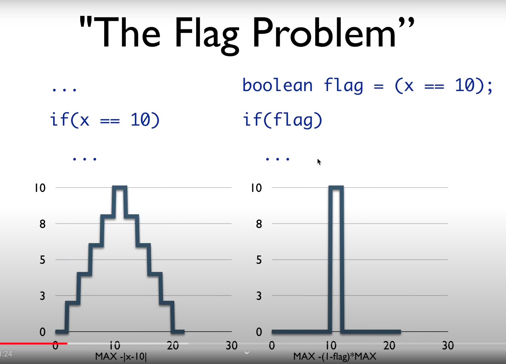

- Flag level 1: no se modifica la variable, se puede reemplazar con una
  constante
- Level 2: se modifica la variable entre la def y el if. Ahí introducimos
  variables temporales (transformando en level 1) y luego reemplazamos.
- Level 3: la bandera misma se va modificando
- Level 4: Secuencia de flags con condicionales
- Level 5: Definición de flags en diferentes loop bodies

Acá cuenta un poco como mejorar ciertas expresiones para que puedan ser
aplicables a branch distance, como list.isEmpty por list.size == 0.

para comparar strings,

- Distancia de hamming. Mala para por ej. "hello world" y "ello world" (todos
  chars distintos)
- Distancia de Levenshtein: min cant de ediciones de un único caracter que se
  necesitan para que sean iguales.
