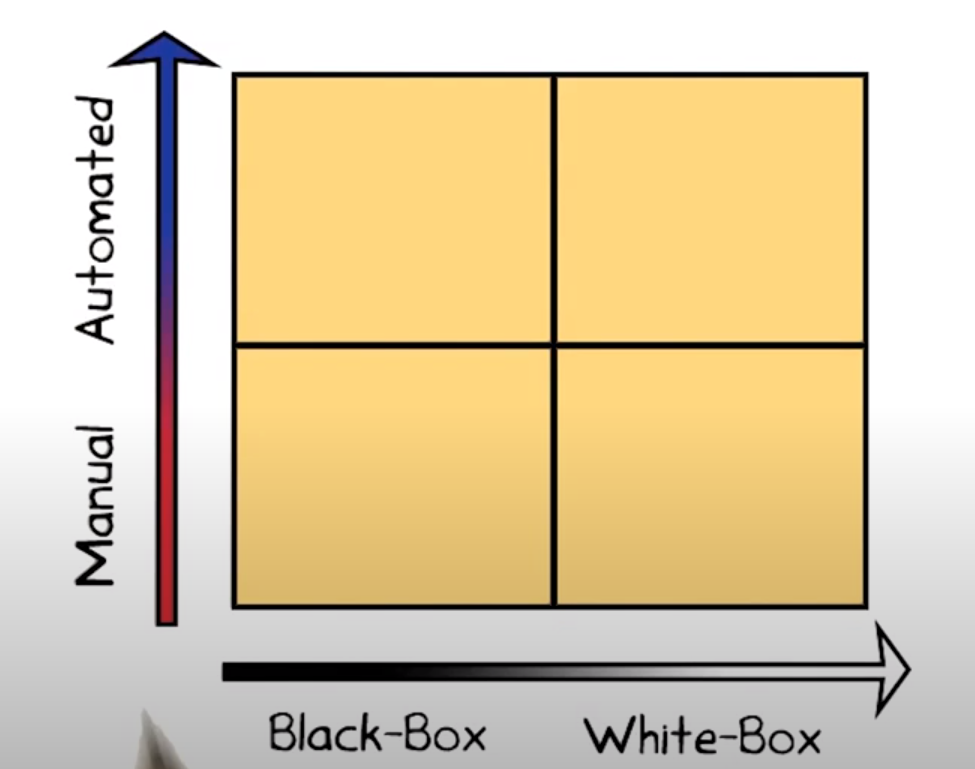
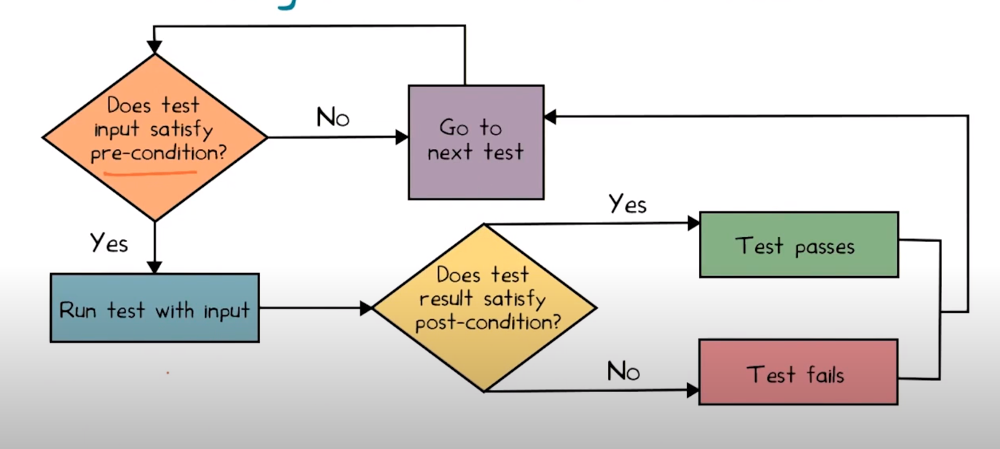
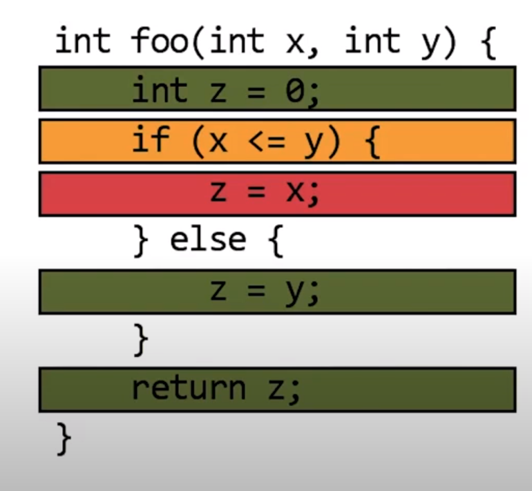
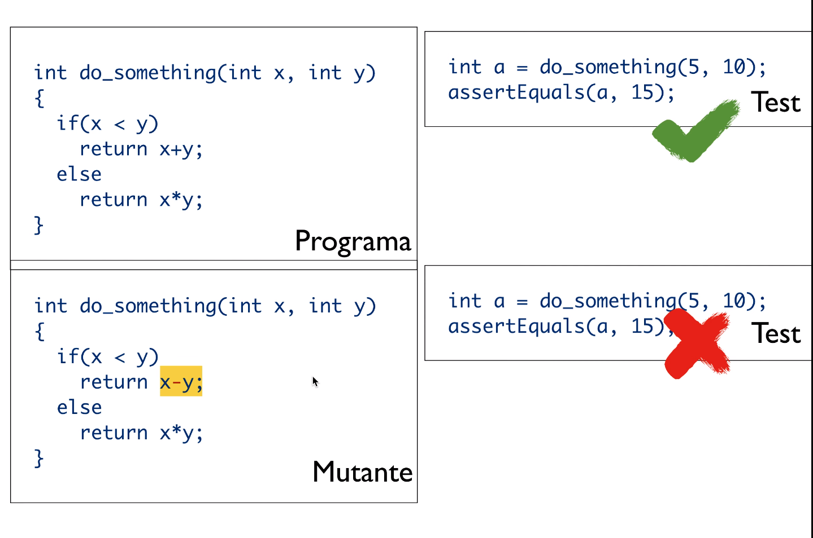
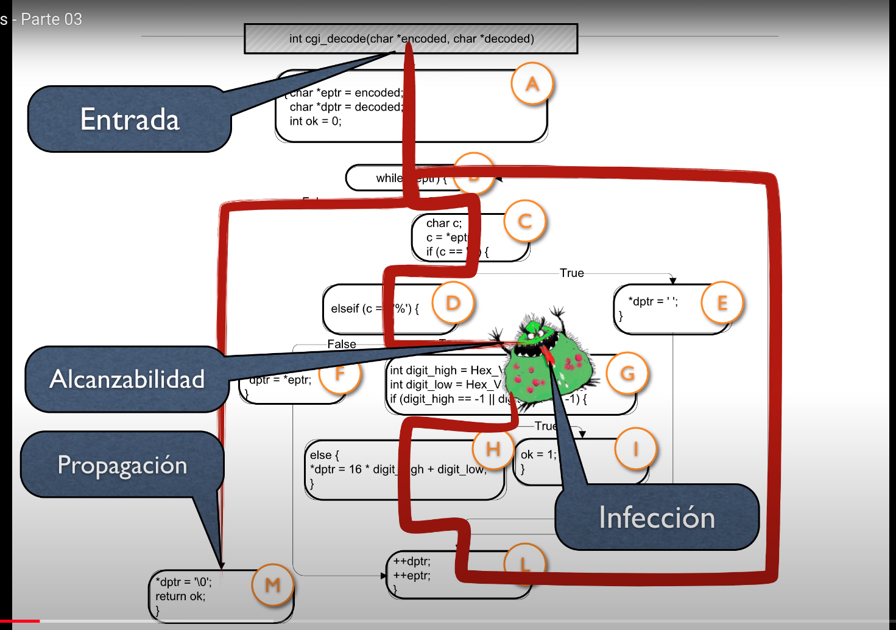
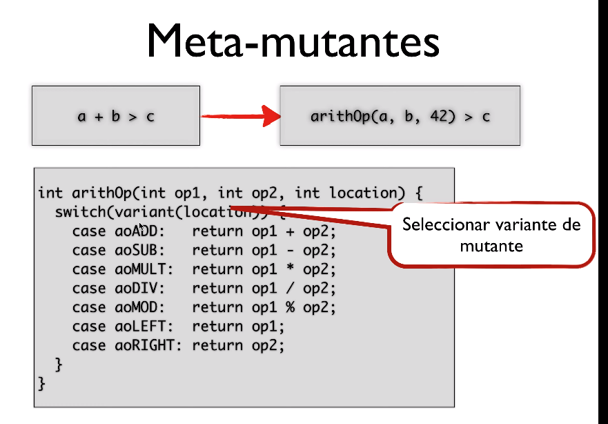

# Lección 4 - Introducción al testing automatizado

Contenido

En esta lección se dictarán los siguientes contenidos:

- Roles: PM, Developer, Tester
- Testing caja-blanca, caja-negra y caja-gris
- Testing automatizado y testing manual
- Pre y post-condiciones
- Cubrimiento de Código (Sentencias, Líneas, Branches)
- Análisis de Mutaciones
- Operadores de mutación
- Mutantes Equivalentes

## Software testing

Los teams suelen estar armados con developer, tester y un manager al que ambos
reportan.

> Duda: ahora se tiende a que los devs sean testers también, no?
> Esta parte me parece medio pava

1. Las **especificaciones** tienen que ser explícitas
  
    El testing es una forma de **consistency checking** entre **implementación**
    y **especificación**.

    > Shortcoming: que pasa si ambas están mal? Serían consistentes pero
    > erróneas.

2. El testing suele ser independiente del desarrollo

3. Los recursos son finitos -> no se pueden escribir tantos tests.
4. Las especificaciones evolucionan a lo largo del tiempo -> los tests se tienen
   que actualizar

Testing es un proceso necesario pero intenso en recursos. Estaría bueno tener
**testing automatizado**

## Landscape of testing



Manual vs automated (participación humana), black box vs white box (acceso que
tiene el aparato de testing del código).

El testing no puede ser totalmente automatizado,

- Es dificil incluso para un cachito de código
- Imposible sin especificaciones

> Obs: Dice que lo mejor que podemos hacer es separar el sistema en componentes
> que podemos testear por separado, pero los tests que más valor tienen son los
> de integración.

## Specifications - pre and post conditions

- **pre condición**: predicado que se asume que vale antes de que se ejecute una
  función
- **post condición**: predicado que se espera que se cumpla luego de la
  ejecución de una función, siempre y cuadno valía la pre.

Por lo general solamente capturan parcialmente la especificación. Por lo general
asumimos que "nada más cambia". Estas asunciones implícitas se llaman "frame
conditions".

Son útiles si son ejecutables (assertions). No tienen que ser precisos, pueden
llegar a ser mas complejos que el código.

Testing automatico con pre y post condiciones:



> quiz: B.length >= A.length, A y B != null

## Measuring test suite quality

Coverage y

mutation analysis: se muta el programa original y se corre el suite. Si no
falla, puede llegar a faltar tests.

### Code coverage

Ya se lo que es esto

- function coverage
- statement coverage
- branch coverage
- otros



- Verde: se corre
- Amarillo: solo algunos branches
- Rojo: no se corre

### Mutation testing

- Asumimos que el código del programa está cerca a ser correcto, y que va a
  haber errores pequeños
- Key idea: testear mutaciones (variaciones) del programa
  - Reemplazar < por >
  - Off by one

Si el suite es bueno, deberían fallar algunos tests

Qué pasa si el mutante es equivalente al programa original? Ningún test va a
matarlo. Se puede intentar de probar equivalencia de programas pero es
indecidible, requiere un humano.

## Anexo Galeotti

**Defecto**: un error estático dentro del código programa, bug del programador.
Cuando es ejecutado se genera una **infección**, se *propaga* por líneas
correctas del programa y se denomina **falla** cuando es observable.

- Error: desviación no buscada ni intencional de lo que es correcto, esperado o
  verdadero

- Defecto: un error en el código del programa, que puede crear una infección y
  conducir a una falla. No siempre una ejecución de una línea defectuosa lleva a
  una infección.

- Infección: un error en el estado del programa, puede conducir au na falla. No
  siempre una infección se propaga hasta ser una falla.

- Falla: Un error externamente visible en el comportamiento del programa

### Operadores de mutación

Los mutantes son

- Modificacion leve del prog original
- Cambios sintácticamente válidos (código compila)
- Simples (typos de programación)

Ejemplo:



Los **operadores de mutación** son reglas que permiten derivar mutantes a partir
de un programa.

> también podemos manualmente crear operadores de mutación a mano para cierto
> proyecto o genéricos para ciertos lenguajes.

- ABS: Absolute value insertion. Dada una expresión númerica la reemplaza por su
  valor absoluto o la negación de él. O por 0
- AOR: Aritmethic operation replacement. Reemplaza el operador binario por otro
  o bien deja uno solo de los argumentos (+, -, /, //, *, **, x, y)
- ROR: Relation Operator Replacement. Modifica un predicado (<, >, <=, >=, =,
  !=, true, false)

### Órden de mutación

- FOM (first order mutant): solo se hizo una mutacion
  - Cada operando de mutación define un cjto de FOMs
  - El número de FOMs es #referencias a datos * #referencias a objetos
- HOM (higher order mutant): mutación de otra mutación.
  - #HOM = 2^#FOM - 1
  - En general las herramientas de mutation testing no lo consideran

Si logramos matar un mutante, no tiene más utilidad. Pero si sigue vivo y
nuestro test suite no lo logró matar, tenemos que agregar más.

El mutation score = muertos / generados.

### Mutantes equivalentes

Ejemplo de un bug que queremos exponer con un test



Los cambios sintácticos no necesariamente afectan la semántica del programa,
pueden generar un mutante equivalente.

Ejemplo:

```c
if (x > 0) {
  if (y > abs(x)) { ... } // orig x
}
```

Como la modificación de ABS era en un contexto en donde x = abs(x), no vamos a
poder matar al mutante. Es equivalente.

### Performance

Medidas para aumentar la perf de mutation testing

Dado un operador de mutacion y un programa, la cantidad de mutantes es altísima.
Estrategias:

1. Do fewer
   1. Samping de mutantes: para no ejecutar todos
   2. Mutación selectiva: solamente me interesa un subcjto de mutantes. Hago
      estudios empíricos, me quedo con el minimo cjto de operadores de mutación
      que sea equivalente al de todos.

      Un estudio dice que es ABS, AOR, COR, ROR, UOI.

2. Do smarter
   1. Paralelización: se ejecutan por separado
   2. Mutación débil: ver infecciones, afectaciones del estado del programa.
      Compara el estado interno luego de la mutación. Esto también puede
      permitir cortarlo antes
      1. la fuerte es que la mutación se mute hasta un error (i.e falla observable)
   3. Uso de cobertura: No ejecutar todo el test suite sobre todos los mutantes,
      sino que solo los que pasen por la línea modificada.
   4. Impacto

3. Do faster
   1. Mutar bytecode: sin recompilar
   2. Meta-mutantes: en lugar de generar distintas versiones del mismo programa,
      generar una única versión distinta que contenga todos los cambios. Y con
      alguna configuración elegir qué mutante usamos, por ej. con un switch. (te
      ahorrás compilación)

      

## Bibliografía de la lección

Software Testing and Analysis: Process, Principles and Techniques
Book by Mauro Pezze and Michal Young

Capítulo 12 - Structural Testing
Capítulo 16 - Fault Based Testing