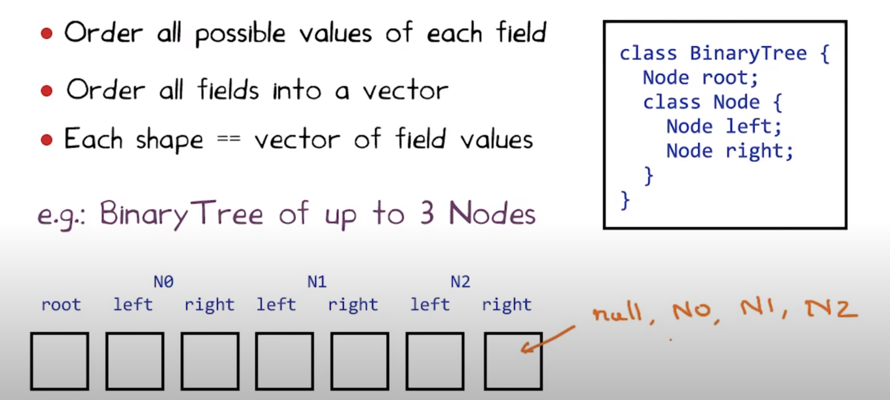
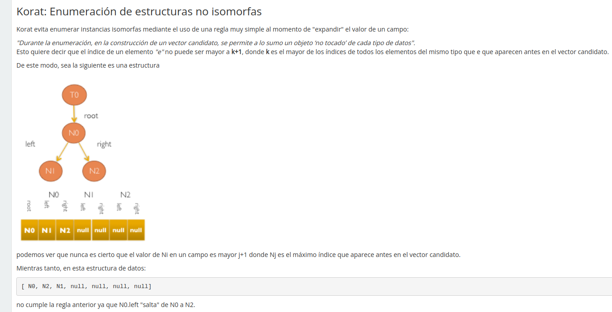

# Lección 6 - Generación automática de tests

No es práctico para sistemas enteros, entonces nos enfocamos en testear los
componentes más chicos posibles: units.

> Duda: pero los mejores tests no son los de integración de grandes partes del
> sistema? De que nos sirven entonces los tests chiquitos?

Vamos a ver **unit testing**.

## Outline

Previamente vimos **fuzzing** (random testing)

Ahora vamos a ver

- **systematic testing**: Korat (linked data structures)
- **Feedback directed random testing**: Randoop (java classes & libraries)

## Korat

Test generation research project. Usa las pre y post condiciones de las
funciones para generar input que tiene sentido.

Small test case hypotesis: si hay un test que causa que el programa falle, hay
uno chico.

> ejemplo: si una lista funciona para longitudes de 0 a 3, probablemente ande
> para todos.
>
> ejemplo: los bugs de concurrencia suelen tener poco depth

Korat usa los **tipos** (whitebox testing). Solo tiene que enumerar todas las
posibles *formas*

### Esquema de representar formas

- Ordena los campos de un struct
- Cada *forma* no es más que un vector de valores de los campos.



### Algoritmo de enumeración

- El usuario selecciona un tamaño máximo **K**
- Genera todos los posibles inputs hasta tamaño **K**
- Descarta los que no cumplen la **pre condición**
- Corre el programa en los que quedan
- Valida los resultados usando la **post condición**

### Challengers

- Como evitamos generar inputs inválidos? (en el ej. trees con cíclos o inconexos)

  Es ineficiente generarlo y después chequear la pre. Queremos evitar generar.

  Se *instrumenta* la precondición para ver que campos accede. Si un campo no es
  accedido, entonces no está afectado por la pre cond.

  Se usa una func `repOk` para chequear que sea un árbol binario (se hace con
  BFS)

  ```text
  public boolean repOK(BinaryTree bt) {
    if (bt.root == null) return true;
    Set visited = new HashSet();
    List workList = new LinkedList();
    visited.add(bt.root);
    workList.add(bt.root);
    while (!workList.isEmpty()) {
      Node current = workList.removeFirst();
      if (current.left != null) {
        if (!visited.add(current.left)) return false;
        workList.add(current.left);
      } 
      if (current.right !=null) {
        if (!visited.add(current.right)) return false;
        workList.add(current.right);
      } 
    } 
    return true;
  }
  ```

- Como evitamos generar inputs redundantes? (en el ej. grafos isomorfos)

### Enumerando tests

No expande partes del input que no se examinan por la pre condición.

Itera el último campo visitado por la pre cond. Cuando se terminan las
posibilidades, hace backtracking



### Strengths and weaknesses de korat

- Es bueno cuando podemos enumerar todas las posibilidades
  - Esta bueno para testear estructuras con procedimientos simples
  - Bueno para unit testing
- Debil cuando no se puede enumerar todo, por ej. enumerar todos los enteros,
  floats o strings. (dynamic symbolic execution se banca esto)
- Es solo tan bueno como las pre y post condiciones.

## Randoop (Feedback directed random testing)

Randoop: Random Tester For Object Oriented Programs

Es mejor para generar diferentes secuencias de ejecuciones de métodos de un API.

Un test es una secuencia de public library methods. Acá queremos generar un
concise pero diverse suite para testear una biblioteca.

**Idea**: Crear de forma **aleatoria** un nuevo test **guiado por el feedback**
de tests creados previamente.

test = method sequence.

Receta:

- Crea nuevas secuencias incrementalmente, extendiendo previas
- Cuando se crea, se ejecuta.
- Usa el resultado del test para guiar la generación hacia secuencias que crean
  nuevos estados de objetos.

### Input y output

Input:

- Clases
- Limite de tiempo
- Contratos (propiedades que el objeto generado al final del test tiene que
  cumplir, suelen estar en la docu del API). Análogo a una post condición.
  
  Ejemplos:

  - `o.hashCode() no tira excepciones`
  - `o.equals(o) == true`.

Output:

- Contract violating test cases

  Estructura:

  ```text
  <secuencia de llamdados a input classes que arman el estado>
  <contrato stated as assertion>
  ```

  Para que sesa valido,

  - No se deberia violar un contrato durante la ejecucion
  - La assertion del final debería fallar al ser ejecutada.

> Duda: Debuggear un test creado por randoop tiene pinta de ser imposible.

### Clasificand una secuencia


## Bigger picture

Las técnicas automáticas dependen mucho de información de **tipos**. Y los
lenguajes más viejos no tienen lo necesario (c, lisp, etc)

## Bibliografía

- Korat: Automated Testing Based on Java Predicates (Chandrasekhar Boyapati, Sarfraz Khurshid, and Darko Marinov) Link http://mir.cs.illinois.edu/marinov/publications/BoyapatiETAL02Korat.pdf

- Feedback-directed Random Test Generation (Carlos Pacheco Shuvendu Lahiri Michael D. Ernst Thomas Ball) Link http://research.microsoft.com/pubs/76578/randoop-tr.pdf

## Pensamientos de la lección

- Randoop tiene pinta de generar tests que si fallan no se pueden debuggear
  porque son complejos y no declarativos.

- Testing automático como está ahora parece que solo va a servir para las cosas
  chiquitas, detealles, errores menores. Pero tests de negocio y funcionalidad
  real vienen después.