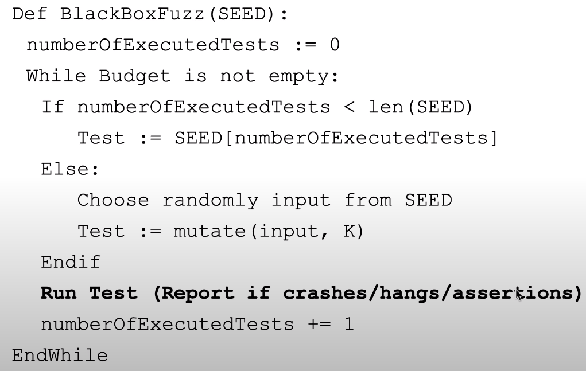
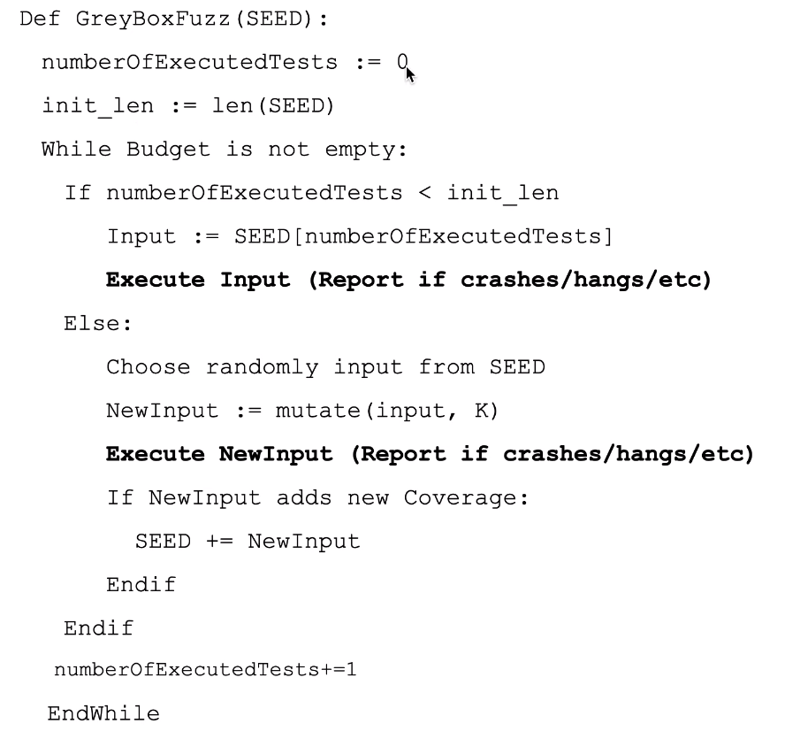
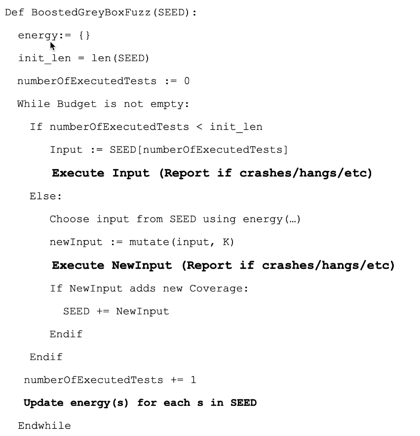

# Lección 8 - Graybox fuzzing

Para el lunes 25/04/22

## Fuzzing

- Busca aserciones violentadas, vulnerabilidades (buffer overflows), memory
  leaks
- Casi siempre partimos de un seed (conjunto inicial de inputs que son fuzzeados
  , modificados)

  Diferenciar seed aleatoria (gen numeros pseudoaleatorios) y seed de fuzzing
  (conjunto de inputs inicial)

## Blackbox fuzzing

El más básico

- Partimos de un seed
- Se elige cada seed y se le aplican una cantidad aleatoria de mutaciones hasta
  K. (insertar char, flipear bits, etc.)

## Greybox fuzzing

Mezcla entre whitebox y blackbox.

- Si un input **aportó cobertura**, lo agrego al corpus de inputs para futuras
  mutaciones. (acá la diferencia con blackbox)

- Para eso necesitamos medir la cobertura del programa bajo test (branch, block,
  etc.)

Cada elemento del seed posee una **energía**: la probabilidad  de elegirlo.

## Boosted Greybox fuzzing

Greybox fuzzing normal tiene el problema de que con cada seed que agrego,
decremento la probabilidad de que se elija un input.

Idea de boosted: aumento la proba de elegir un input del seed según las chances
de descubrir otros caminos en el CFG

Me interesa elegir un input si ejercitó un camino que antes no se había
ejercitado. Para eso definimos la energía de un input $s$, que es

$$e(s) = \frac{1}{f(p(s))^a},$$

donde $p(s)$ es el camino que recorrió la ejecución de s y $f(p(s))$ es la
frecuencia de apariciones de un camino en el test suite. $a$ es un exponente que
se usa para controlar cuanto *decae* el valor de los caminos ya recorrido.
Cuanto mayor es, más decae

## Ejemplos de fuzzers usados en al industria

### AFL (American Fuzzy Lop)

Es uno de los más populares. Funciona sobre cualquiera que pueda ser compilado
por LLVM (para poder medir block coverage).

Es determinístico.

Algoritmo:

1. Encola inputs iniciales provistos por el usuario en la cola Q
2. Toma un input de Q
3. Intenta reducir el input a su meor tamaño sin alterar su capacidad de cobertura
4. Aplica un conjunto de mutaciones al input utilizando una variedad de
   estrategias tradicionales de fuzzing
5. Si alguno de los nuevos inputs resulta en un aumento de cvg, lo agrega a Q
6. Volver a 2

Estrategias de mutación

- **Walking bit & byte flips**: flipping de uno, dos bits, etc.
- **Simple arithmetics**: incr o decr valores enteros del input
- **Known integers**: -1, 256, 1024, MAX_INT - 1, MAX_INT
- **Stacked tweaks**: borrar, duplicar, insertar bloques.

No trabajan a nivel código sino inputs. Y provienen de la comunidad de hacking y
fuzzing.

### Sanitizers - Más allá de los crashes

Un programa crashea únicamente si hay un problema **serio** (hangs, segfault,
assert failure, etc.). Pero la ejecución puede sobrevivir a defectos
**latentes** (mem leaks, index out of bounds, incorrecto manejo de punteros,
etc.).

Se agregan **sanitizers**: fwks que instrumentan un programa para realizar
chequeos en runtime. Ejemplos:

- AddressSanitizer (ASan): corrupción de manejo de memoria (buf overflow, use
  after free, etc)
- Undefined Behaviour Sanitizer (UBSan): Detecta en runtime las operaciones cuya
  semántica no está bien definida en c o cpp. (librado al implementado del
  compilador)
  - uso var no init
  - signed int overflow
  - deref null point
- Memory santiizer MSan: detecta uninit reads en el heap
  - Introduce alentecimiento de 3x
- Leak sanitizer (LSan): detecta mem leaks

### LibFuzzer

AFL fuzzea solo sistemas enteros, y LibFuzzer solo libs. Necesita implementar
una func que transforma un arreglo de bytes en un input válido de la lib. Se
tiene que ejecutar rápido.

### ClusterFuzz

Existen infraestructuras para poder hacer campañas de fuzzing a gran escala
(como un servidor de CI).

## OSS Fuzz

Continuous Fuzzing for open source software. Suministran infraestructura y
tiempo de cómputo para fuzzear proyectos open source importantes.

## Syzkaller

AFL y LibFuzzer fuzzean código de usuario, pero que pasa si está en el kernel?
Syzkaller es un fuzzer especifalizado para hacer cvg-based fuzzing de codigo de
kernel.

Usa VMs para invocar el sistema operativo objetivo

## Fuzz Driven Development

> Pensamiento: No me gusta mucho porque da a entender que lo principal es
> fuzzing, cuando para mi deberia ser siempre un complemento.

## Bibliografía

The Fuzzing Book (https://www.fuzzingbook.org) by Zeller, Gopinath, Boehme, Fraser and Holler 
Capítulo 2 Lexical Fuzzing - Greybox Fuzzing (https://www.fuzzingbook.org/html/GreyboxFuzzer.html)
