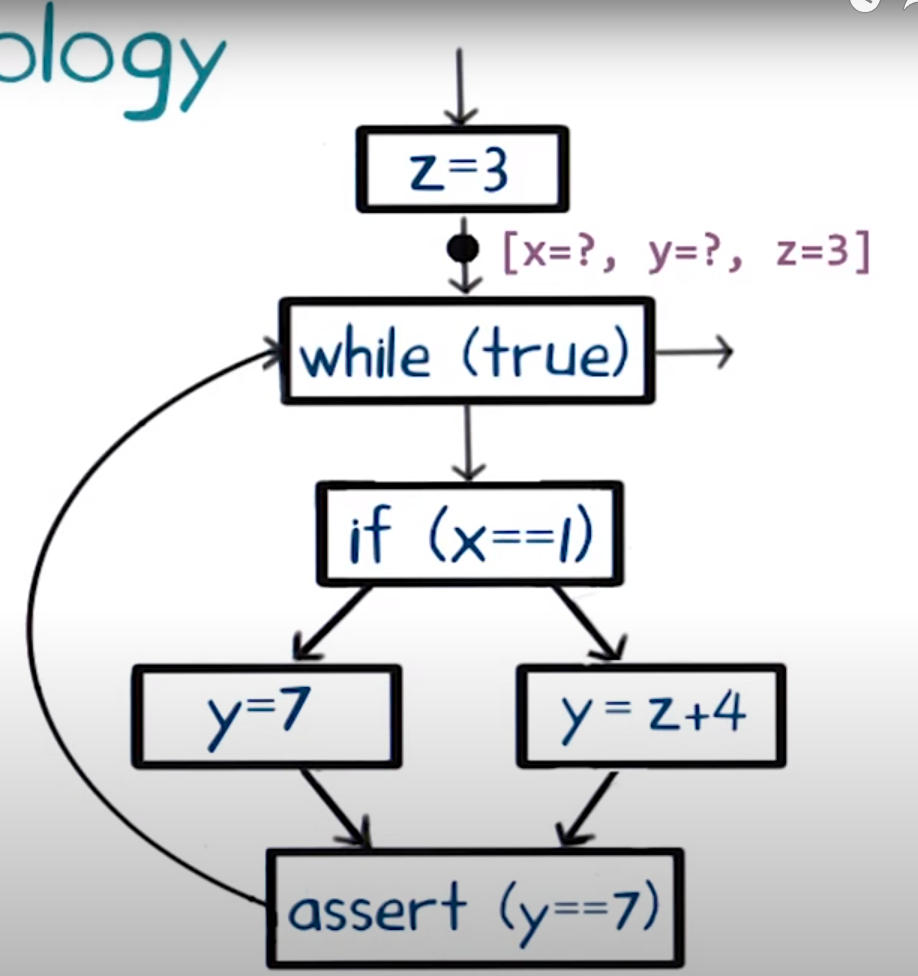
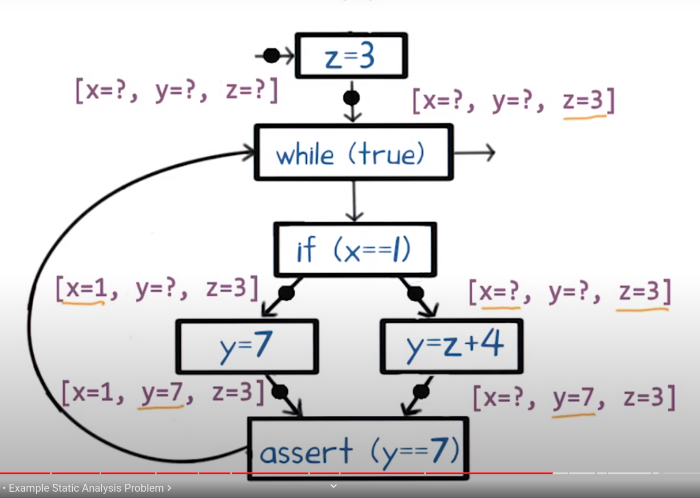
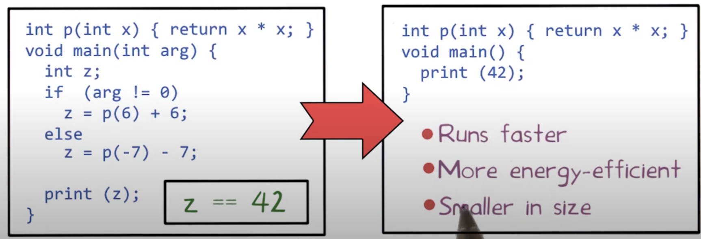

# Lección 1 - Introduction to software analysis

## Program analysis

A futomaticamente descubrir hechos útiles sobre programas. Tres
clasificaciones

- **Dinamic** (run time)

  Descubren info corriendo el programa y analizando su comportamiento.

  Infiere hechos de los programas monitoreando sus corridas.

  Ejemplos

  - Array bound checking (purify c, cpp)
  - Memory leak detection (valgrind, x86)
  - Data race detection en programas concurrentes (eraser)
    - Dos threads en un programa concurrente acceden al mismo cacho de memoria y
      al menos uno es un write. Esto seguro genera una race condition, porque
      dependiendo del orden en el cual se ejecuten se producen diferentes resultados.
  - Finding **likely** invariants (daikon)
    - Invariantes
  
    > Likely y no seguro porque en los programas generales hay loops, lo que
    > genera que haya una cantidad arbitraria de caminos. Como no se pueden ver
    > *todos*, no se puede verificar el invariante.
  
    Un analizador dinámico no puede **garantizar** que algo va a ser de una
    forma, pero si que **no** va a serlo. Porque encuentra un contraejemplo con
    una corrida.

- **Static** (compile-time)

  Descubren info solamente analizando el codigo fuente

  - Suspicious error patterns (Lint, FindBugs, Coverity java)
  - Checking API usage rules (Microsoft SLAM)
    - Lo usan para ver que los drivers usen la interfaz de windows correctamente
  - Verificar/probar invariantes (ESC/Java)
  - Memory leak detection (Facebook Infer)

  Un analizador estático puede concluir un invariante

- **Hybrid** combina dynamic + static.

## Análisis estático

### Terminología

Por lo general trabajan en el CFG (Control flow graph) del programa.



Operan sobre abstract states que juntan muchos valores posibles (con ?), en vez
de concrete states, porque no corren el programa. Esto asegura que termina
incluso cuando hay una cantidad de estados no acotadas.

El análisis estático sacrifica **completitud** porque puede perderse de que una
variable tiene un valor constante. Pero cuando dice que una tiene un valor
constante, está seguro de que es así para todas las ejecuciones, y decimos que
tiene **soundness** o **correctness**.

### Iterative approximation

Analiza cada punto del programa usando la información del punto anterior.



Como hay loops, tal vez tiene que visitar un punto más de una vez.

## Estático vs dinámico

|               | Dynamic                                          | Static                                       |
| ------------- | ------------------------------------------------ | -------------------------------------------- |
| Cost          | Proporcional al tiempo de ejecución del programa | Proporcional al tamaño del programa          |
| Effectiveness | Unsound (puede perderse errores)                 | Incomplete (Puede reportar errores espurios) |

- **Dynamic**: sacrifica soundness (puede fallar en reportar un error, aunque
exista) pero es complete (cuando reporta un error, este error no es espúreo)

- **Static**: sacrifica completeness (puede reportar errores espúreos) pero es sound
  (si hay un error, lo reporta)

> Duda boba sobre "segura soundness", técnicamente uno podría hacer un análisis
> estático que no sea bueno y que falle en reportar, no?

## Indecibilidad de las propiedades de un programa

Puede un análisis de programa ser **sound** (no hay falsos negativos) y
**complete** (no hay falsos positivos)? No si queremos que termine! Es
**Indecidible**.

Una pregunta como "es un punto del programa alcanzable en algún input?" es
indecidible.

Diseñar un program análisis entonces se trata del tradeoff entre terminación,
soundness y completeness. Esto se dicta por el **consumidor**

## Consumidores

- **Compiladores**

  Lo usan para generar código eficiente

  > Por ejemplo los invariantes se pueden usar para simplificar programas
  
  

- **Software quality tools**: Es el foco principal del curso.

  Herramientas para mejorar la calidad del software: testing, debugging y
  verificación.

- **IDEs** (Ejs VS, Eclipse)

  Refactors, entender programas. Importantes para lidiar con programas muy
  grandes.

## Soundness vs completeness

En logica matemática, los *sistemas de razonamiento* son clasificados de acuerdo
a su **correctitud** (soundness) y **completitud** (completeness). Un sistema
"sound" es aquen en donde son demostrables solamente propiedades verdaderas,
mientras que un sistema "complete" demuestra todas las sentencias verdaderas

> Por eso el teorema de incompletitud de Gödel muestra que la matemática es un
> sistema incompleto, hay cosas verdaderas que no son demostrables.

### Definiciones de LyC

- Correctitud (soundness):

  ```text
  Si P |- Q entonces P |= Q
  ```

  demostrable => verdadero

  > Duda: que eran esas cosas?

  > Si algo pasa, lo reporta

- Completitud (completeness)

  ```text
  Si P |= Q entonces P |- Q
  ```

  verdadero => demostrable

### Por qué las herramientas estáticas sacrifican "completeness"?

Un analizador de programas es un sistema que nos permite analizar si un programa
es incorrecto, es decir, buscar defectos en el programa.

- El análisis estático sobre aproxima el conjunto de ejecuciones de un programa
(puede incluir mas que solo las del programa) puede ser el caso que `P |= Q`,
donde P es el programa y Q que no contiene errores (que sea verdadero que P no
contenga errores). Pero sin embargo, como hay más ejecuciones que las que son
del programa, el analizador concluye que no es cierto que `P |- Q`. Concluye que
no puede asegurar que el programa no contiene errores. Por esto no cumple la
definición de completitud y concluimos que es **incomplete**

- Por otro lado, al sobre aproximar los comportamientos, si el analizador logra
  concluir que no tiene errores (i.e `P |- Q`), como es sobre un superconjunto
  de ejecuciones, vale para todas las ejecuciones reales, y puede asegurar que
  el programa no tiene errores. Por lo tanto `P |= Q` y es **sound**.

### Por qué las herramientas dinámicas sacrifican "soundness"?

Si un analizador dinámico sub aproxima el conjunto de ejecuciones, puede que
erróneamente indique que el programa no tiene errores (ya que no analizó la
ejecución que producía la falla). Entonces tenemos que `P |- Q` (el analizador
concluye que P no tiene errores) pero no es cierto que P esté libre de errores
(`P |= Q`). Por lo tanto no se cumple la definición de soundness y es
**unsound**.

## Bibliografía

Les dejamos la siguiente bibliografía a modo de que puedan ampliar lo visto durante la clase teórica 

Static Program Analysis (https://cs.au.dk/~amoeller/spa/spa.pdf) Autores: Anders Møller and Michael I. Schwartzbach

Capítulo 1: "Introduction"
Capítulo 2: "A Tiny Imperative Programming Language"
