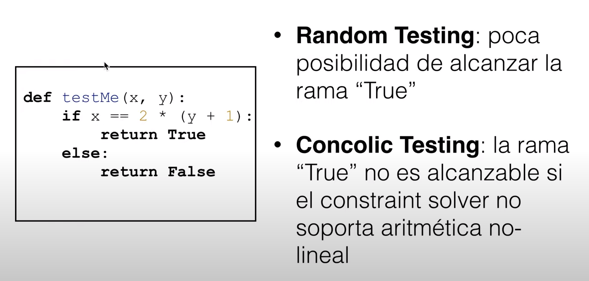

# Lección 10 - Search Based Testing

## Repaso

### Random testing

- Es una búsqueda casi no guiada
- Si la técnica sistemática no es mejor que random testing, entonces no es valiosa
  - Se suele usar para comparación
- Barata y fácil de implementar
- Suele funcionar decentemente bien en muchos casos

### DSE (Concolic testing)

- Ejecuta concretamente el test pero guarda las paths conditions
- Utiliza un constraint solver (theorem prover en los videos) para crear nuevos
  inputs

### Limitaciones



- Random testing: dificultad en generar inputs que alcancen código poco probable
  (los inputs generados tienen una distribución uniforme)
- Concolic testing (DSE)
  - Tamaño de las path conditions
  - capacidad del constraint solver

## Search based software engineering

Transformar problemas de ingsoft en problemas de optimización combinatoria. Como
los espacios de búsqueda son grandes, se puede aplicar **algoritmos  de búsqueda
meta-heurísticos** para resolver estos problemas.

Las heurísticas pueden no encontrar la mejor sol, pero encuentran una
suficientemente buena en una cantidad razonable de tiempo. Sacrifican
completitud pero ganan eficiencia.

## Hill climber

Si tengo una función objetivo que me dice para cada input un score (o fitness),
puedo intentar de explorar el espacio para llegar a máximos locales.

Idea:

1. Definir una noción de **cercanía** del input con respecto al goal que
   queremos alcanzar
2. Por cada nueva sol, explorar la vecindad de todas las soluciones
3. Elegir la vecina que sea mejor que la actual
4. Repetir hasta no encontrar mejores

Pseudocódigo

```text
Elijo de forma random una primera sol

while (no alcancé el goal)
  Busco entre los vecinos
  Si existe un vecino que es mejor
    Actualizo la nueva posición
  Si no
    Termino la búsqueda
```

Problema: puede llegar a caer en un máximo local


## Tabu search

Evita ciclos

## Algoritmos evolutivos

> Cuando el vecindario es demasiado grande (por ej. tridimencional), hill
> cimbing se torna muy lento. Necesitamos algo mejor

- Gen: unidad de info pasada de generación en generación
- Selección natural

Pasos

1. inicializar población
2. evaluar población con función de fitness (que tan apto está para el ambiente)
3. while no termine
   1. seleccionar padres
   2. crear nuevos individuos, hijos, generando una población.
4. volver a 2
5. Retornar el mejor individuo de la población

Cuestiones a resolver:

- Como representamos la población? Como la generamos?

  En el ejemplo pueden ser ternas

  

  Para generarla,

  - Aleatoriamente
  - Usar sol existentes
  - Usar un test suite con cobertura de un criterio de menor potencia
  - Manualmente

- Que función de fitness usamos? Como la evaluamos?
  - La func de fitness responde si un individuo es mejor que otro.
  - Determina el espacio de búsqueda o *fitness landscape*

  Cómo sabemos que tan cerca está un input de cumplir con un predicado? Podemos
  usar *branch distance*

  ```
  # Branch distance
  a == b    abs(a - b)
  a < b     a < b? 0: (a-b) + k
  a =< b    a =< b? 0: (a-b)
  a > b     a > b ? 0 :(b-a) + K
  a >= b    a >= n ? 0 : (b-a)

  o.m(v1, ..., vn)  true? 0: K
  a != b            a != b? 0: K
  A && B            dist(A) + dist(B)
  A || B            min(dist(A), dist(B))
  !a                usar de morgan
  ```

- Cual es mi condición de parada?
  - Tiempo máximo
  - Cant máxima de iteraciones
  - Cant máxima de evals de la func de fitness
- Que func uso para seleccionar padres?

  - **Roulette wheel selection**: la proba de elegir un individuo es
    proporcional al valor de su función de fitness.
    - Problema: aumenta excesivamente la proba de elegir los que sean bien
      rankeados.
  
  - **Rank selection**: Rankear individuos de acuerdo a su fitness. Esto hace
    que no haya diferencia si el individuo con mayor fitness es 10 veces mejor
    que el segundo o solo 0.0001% mejor. Es el preferible en la práctica

  - **Tournament selection**. Tenemos un torneo de tamaño N, selecciono N
    aleatoriamente y el mejor es seleccionado. El tamaño define la presión
    selectiva.

    Nos permite que un individuo con mala fitness aún puede ganar con cierta
    probabilidad (el peor sería elegido con sí mismo)

- Como creo hijos? Cross over, operadores de mutación?

  Combinar individuos: hacer *crossover*
  
  - Single point crossover: elegir un único punto en los padres y dividir o unir
   ese punto.
  - Two point crossover: dos puntos
  - Fixed vs variable length
  - Uniform crossover

  

  Además se pueden aplicar pequeñas mutaciones

### Dominadores

Una limitación de branch distance es que no tiene en cuenta condiciones
anidadas. Para esto necesitamos dominadores.

Decimos que un nodo A **domina** al nodo B si todo camino hacia B debe pasar por
A. Un dominador inmediato es el más cercano en todo el camino desde la raíz (y
la raíz no tiene)

Análogamente, decimos que B **post-domina** a un nodo A si todos los caminos
desde A a la salida tienen que pasar por B. Son dominadores vistos en reversa.


(izq domina der post dom)

Decimos que B es **control-dependiente** de A si

- A domina a B
- B no post domina a A
- A tiene al menos dos sucesores (A es una decisión)
- B post domina a un sucesor de A


Con esto podemos armar un **Control dependency graph** (CDG) que es otra
representación de la ejecución de un programa que nos va a permitir definir la
distancia de una mejor manera.

### Función de fitness

Función de fitness = Nodos dependientes - ejecutados

- dependientes: cantidad de nodos del CDG para el target. (ancestros del target)
- ejecutados: numero de control dependent que fueron ejecutados (ancestros)

Para armarla, necesitamos que la fitness func combine

- approach level (cuan cerca estoy del predicado)
- branch distance (cual cerca estoy de ejercitar el branch)


> Está teniendo en cuenta el branch distance de todos los nodos del CDG?

### Testability transformation

Si tenemos un programa que genera una función de fitness muy dura, puede ser
complicado hacer la búsqueda. En ese caso se puede transformar un programa a
otro con semántica equivalente que tenga una func de fitness más amigable. Es
solamente usado para generar datos de test y luego **descartado**.


- Flag level 1: no se modifica la variable, se puede reemplazar con una
  constante
- Level 2: se modifica la variable entre la def y el if. Ahí introducimos
  variables temporales (transformando en level 1) y luego reemplazamos.
- Level 3: la bandera misma se va modificando
- Level 4: Secuencia de flags con condicionales
- Level 5: Definición de flags en diferentes loop bodies

Acá cuenta un poco como mejorar ciertas expresiones para que puedan ser
aplicables a branch distance, como list.isEmpty por list.size == 0.

para comparar strings,

- Distancia de hamming. Mala para por ej. "hello world" y "ello world" (todos
  chars distintos)
- Distancia de Levenshtein: min cant de ediciones de un único caracter que se
  necesitan para que sean iguales.

## Evosuite - Whole test suite generation

Automatic Test Suite Generation para Java. Optimiza test suites enteros. Usa el
algoritmo genético.

- Estrategia de goal/objetivo unico

  La población es un conjunto de test cases. Si tengo G1, G2, G3 objetivos, como
  podemos *distribuir* el budget de generación de tests?

- EvoSuite: Whole-test suite generation, la poblacion son test suites.

## Bibliografía

The Fuzzing Book (https://www.fuzzingbook.org/)

by Andreas Zeller, Rahul Gopinath, Marcel Böhme, Gordon Fraser, and Christian Holler

Capítulo II - Lexical Fuzzing: Search-based Fuzzing
