# Lección 11 - Modelado de sistemas concurrentes

Temas:

- Distribución, paralelismo y concurrencia
- LTS
- FSP

Links a videos por si quieren volver atrás cuando hacen el cuestionario.

- [Parte 1: Introducción](https://youtu.be/zmEXqa9D_ls)

- [Parte 2: Sistemas de Transiciones Etiquetados (LTS)](https://youtu.be/-oB2Jn9sgaI)

- [Parte 3: Finite State Processes (FSP). Sintaxis básica.](https://youtu.be/8MmI30oZKoA)

- [Parte 4: No determinismo, extensión de alfabetos y composición paralela con aciones tau.](https://youtu.be/Z146kzJfO6U)

- [Parte 5: Azúcar sintáctica](https://youtu.be/uhwl2WyHSgM)

## Video 1 - Introducción

Hasta ahora el foco de la materia es sobre programas secuenciales, con un solo
thread. Son transformacionales (procesan un input y retornan otro).

Ahora nos vamos a enfocar en *sistemas* (no progrmas) concurrentes, con
múltiples threads. No nos interesa lo que devuelven sino su reactividad (lo que
hacen durante su ejecución).

Este no es el único enfoque posible:

- No está completamente atado reactividad con concurrencia, podrías tener algo
  que haga un cómputo de forma concurrente. Tiene sentido hablar de problemas
  transformacionales

- También tiene sentido pensar en la reactividad de programas secuenciales.

### Para qué programas concurrentes?

- Mejora de performance en HW paralelo
- Mejora de throughput (no bloquean otros cómputos)
- Mejorar tiempo de rta de la app (ej. alta prioridad para input de user)
- Estructura más apropiada para programas que interactuan para el ambiente,
  controlan múltiples actividades y reaccionan a múltiples eventos

### Por qué modelar y analizarlos?

- Son notoriamente difíciles de armar correctamente, es difícil razonar sobre
  cómputo concurrente.

- Los errores son difíciles de replicar (baja probabilidad).

  Ejemplos:

  - therac-25, sistema médico de radioterápia. Tenía bugs de concurrencia que
    causaron que a algunas personas le aplique más rayos X de lo programado que
    los mató.
  
  - el mars pathfinder también tuvo bugs de concurrencia.

### Paralelismo vs concurrencia

- Concurrencia: varios procesos que de forma lógica están ejecutando en
  simultáneo, pero no necesariamente sobre dtos procesadores. Hay una ejecución
  *interleaved* (entrelazada) en donde los threads comparten un mismo proceasdor
  recibiendo slots de tiempo y simular una ejecución paralela.

  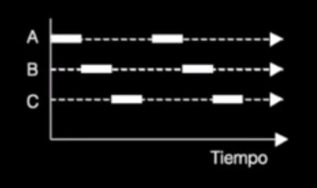

- Paralelismo: varias unidades de cpu que ejecutan distintos threads (realmente
  al mismo tiempo)

- Distribución: no solo varias cpus, sino que están distribuidos en distitans
  computadoras posiblemente mediados por una red (no neceesariamente en el mismo
  chip en la misma computadora)

En general vamos a hablar de concurrencia

### Por qué sistemas y no programas?

Por lo general hay elementos más gruesos que un programa trabajando
concurrentemente a través de una red. Tenemos más granularidad que solamente
"programas".

### Sistemas reactivos

Un sistema *reactivo* es aquél en donde lo que es interesante es la relación del
sistema con su entorno. Recibe y envía estímulos.

Tipos:

- Sistemas de control de procesos físicos donde el entorno son sensores y
  actuadores
- Sistemas que interactúan con humanos
- Sistemas que interactúan con otros sistemas reactivos.

Las propiedades de interés suelen ser *temporales*. Sobre lo que va pasando
durante la ejecución.

> Se relaciona con *mocking* en ing1, ahí estimulamos el obj bajo test y vemos
si hace los llamados correctos a otros objetos. Estimulando un obj y viendo si
su interacción con los demás objetos es correcta o no.

### Preguntas de interés

- Deadlock
- Livelock: hace cosas pero nunca avanza sobre lo que tiene que estar haciendo
- Interferencia: una escritura pisa la de otro proceso que ejecuta
  concurrentemente
- Fairness: un thread logra acceso a los recursos que necesita
- Atomicidad
- Domain specific (ej. que habla de la func de un sistema está tratando de
  lograr, como que se guarde un archivo)

### Abuso de terminología

Vamos a usar programa concurrente para hablar de sistemas socio-técnicos
reactivos y distribuidos

> socio técnicos quiere decir que los humanos forman parte de él.

## Video 2 - Sistemas de transiciones etiquetados (LTS)

- Qué **modelo** es adecuado para **razonar** sobre programas concurrentes?
  
  El lenguaje while que se usó para dataflow, es un lenguaje simple pero
  suficientemente expresivo para caracterizar los programas que uno quiere
  analizar.

  Qué tan polenta tiene que ser el modelo para caracterizar y permitir razonar
  sobre programas concurrentes?

- Que lenguaje es adecuado para **formular preguntas** sobre programas
  concurrentes?

- Como se **computa automáticamente** respuestas a esas preguntas?

Estas preguntas hacen nacer el área llamada **model checking**. Se puede resumir
como una técnica para garantizar automaicamente que un modelo de un sistema
satisface una propiedad.

### Modelos de concurrencia

Cual es el lenguaej básico con las primitivas que permiten describir como
funcionan los programas cncurrentes (y separándonos de cuestiones accidentales,
distribuidos, paralelos, tecnologia, etc.)

Las álgebras de proceso dieron lugar a un lenguaje famoso llamado CSP
(communicating sequential processes) desarrollado por tony hoare (triplas de
hoare, pre y post condiciones, como una sentencia en un programa modifica el
estado del programa)

FSP (finite state processes) es un álgebra de proceso, fue adoptado como la
base de las primitivas de go. Sus aspectos de concurrencia se construyen arriba
de esto. Cuales son las primitivas fundamentales que nos permiten razonar sobre
concurrencia.

Nosotros vamos a hablar de FSP. Hereda mucha de las ideas de CSP pero toma una
decisión fundamental: tratemos que toda expr escrita en este lenguaje de como
resultado un modelo con un número *finito* de estados. De esta forma es más
fácil analizar el comportamiento.

(se pueden hacer sobre modelos con estados infinitos, pero es más simple con
estados finitos)

### FSP

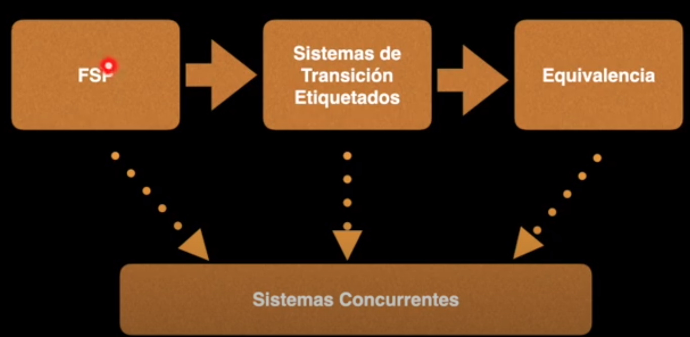

Vamos a transformar los términos de FSP a autómatas para, hopefully, poder
razonar mejor sobre ellos (debería ser más intuitivo razonar sobre autómatas)

En todos estos casos, son tres conceptos que queremos vincular con una intuición
de sistemas concurrentes de la vida real.

### Sistemas de transición etiquetados (LTS)

*LTS: labelled transition system*

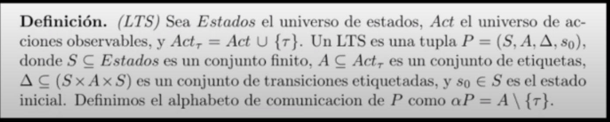

Son autómatas con acciones sobre las transiciones. Su alfabeto son las etiquetas
o acciones menos una distinguida, tau, que modela un cómputo interno del proceso
que no es observable desde el entorno.

Una representación más amigable es una gráfica

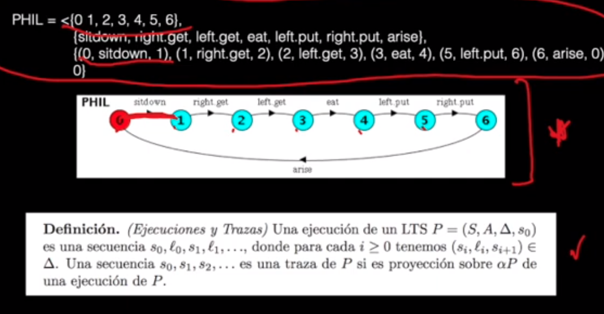

**trazas**: secuencia de etiquetas (acciones). No me suele interesar el estado
sino lo que hace.

Ejecución: 0, sitdown, 1, right.get, 2, left.get, 3, eat, 4, left.put, 5,
right.put, 6, arise, 0, sitdown, ...

Traza derivada de la ejecución: sitdown, right.gvet, left.get, eat, left.put,
right.put, arise, sitdown, ...

Esta representación en forma de autómata no termina de capturar exactamente su
definición, porque puede haber acciones que no aparezcan en ninguna transición.

## Video 3 - Lenguaje FSP

Vamos a recorrer los distintos elementos del lenguaje y una traducción al mundo
de los LTSs para darle semántica.

- **STOP** es un proceso (y palabra reservada) que describe el proceso que es
  incapaz de interactuar con su entorno. Como un deadlock

  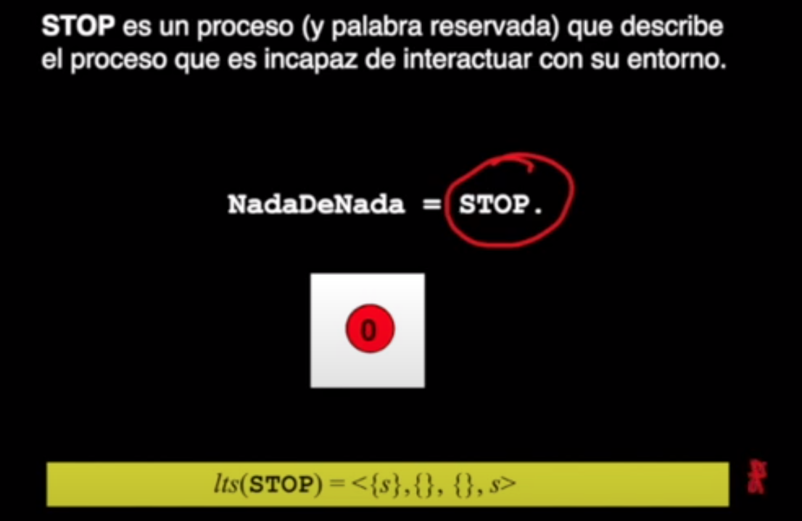

- **Action prefix**

  Si x es una acción y P un proceso, entonces (x -> P) describe un proceso que
  inicialmente interactúa a través de la acción x y luego se comporta como P

  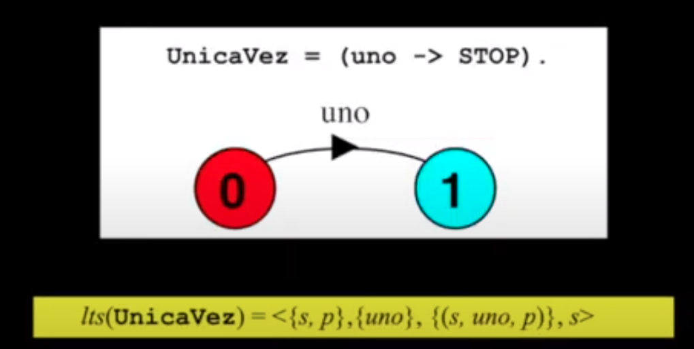

- **Recursión**: El lenguaje admite recursión

  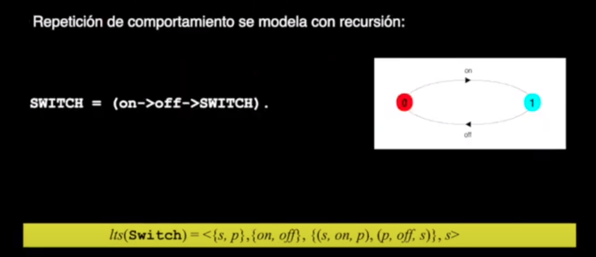

- Subprocesos: definiciones locales que sirven solo en la definición del proceso
  padre.

  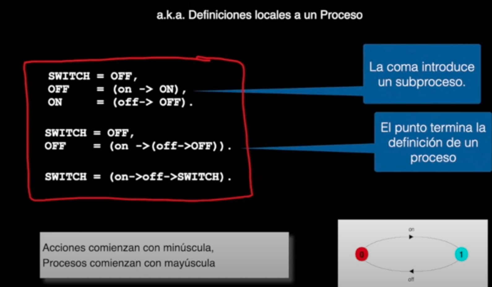

- **Alternativa**

  Si x e y son acciones, entonces (x -> P | y -> Q) describe un proceso que
  inicialmente es capaz de interactuar a través de las acciones x o y. El
  proceso pasa a comportarse como P o Q según ocurra x o y.

  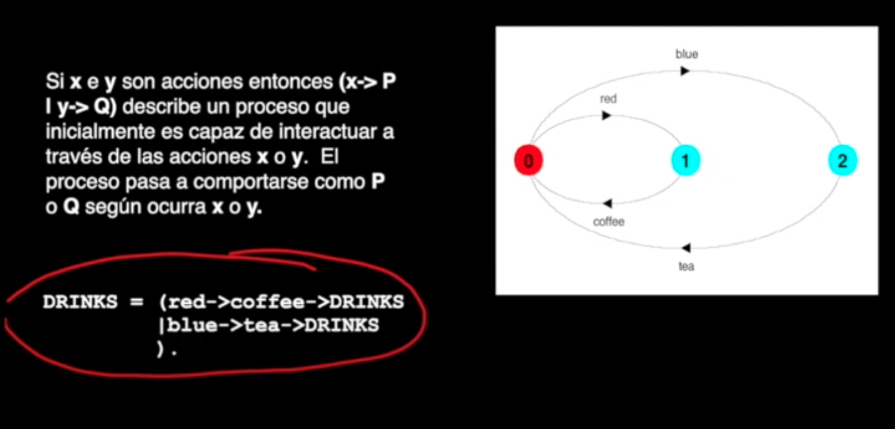

  El ejemplo modela una máquina de café que produce café o té.

  > Esto no permite cosas del estilo (P | Q), pero no lo requiere CSP. Una de
  > las razones de prefijos de acciones es para que los estados sean finitos.

  El lenguaje no hace distinción entre input o output.

Aspectos importantes del lenguaje

- Lo que representa un evento es que *hubo una interacción*, y se abstrae de
  quién la inició.
- No hay parámetros. Codificamos todo como etiquetas.

### MTSA

Es la herramienta que vamos a usar para escribir modelos con FSP. Hace de LTSA
(Labelled transition system analyser). Es una evolución del departamento para
poder analizar sistemas mas cmplejos

- Sistemas de transicion modales
- Sistemas de decisión de markov (procesos estocásticos)
- Síntesis de controladores discretos (construirlos a partir de una
  especificación)

### Composición en paralelo

> Es la operación más importante de cualquier álgebra de proceso.

Si P y Q son procesos, entonces (P || Q) representa la ejecución concurrente de
P y Q.

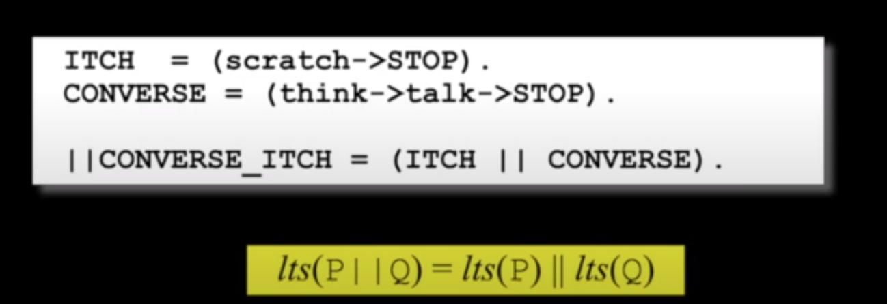

Pero qué es la composición de LTS?

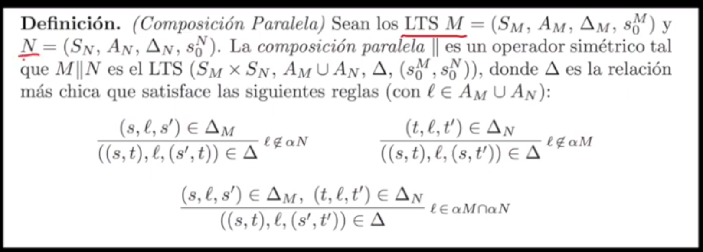

La composición paralela de dos LTS M||N es un nuevo LTS. Delta tiene que
satisfacer,

1. Si tengo una transición que va de s por l a s' y l no forma parte de la
   interfaz de N, entonces en la ejecución paralela solo evoluciona la
   componente M

2. Análogo a 1. pero con solo N
3. Forma parte de ambas interfaces. Regla de sincronización, ambas evolucionan.
   Fenomenos comúnes a ambos LTSs.

> Pregunta mía, es como la determinización de un OR entre dos autómatas finitos?

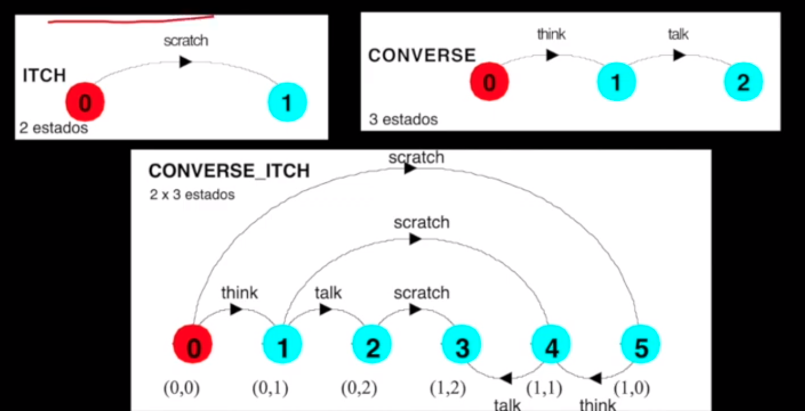

La composición en paralelo nos muestra un proceso paralelo como si fuera
secuencial. Nos muestra el comportamiento entrelazado (interleaved)

### Paralelismo vs concurrencia en FSP

El modelo de concurrencia de FSP es uno de "interleaving", no puede modelar la
ocurrencia de dos eventos en simultáneo.

Para modelos de "true concurrency" (permiten ocurrencia de eventos simultáneos)
ver redes de petri o estructuras de kripke.

### Acciones compartidas

Ejemplo 1:

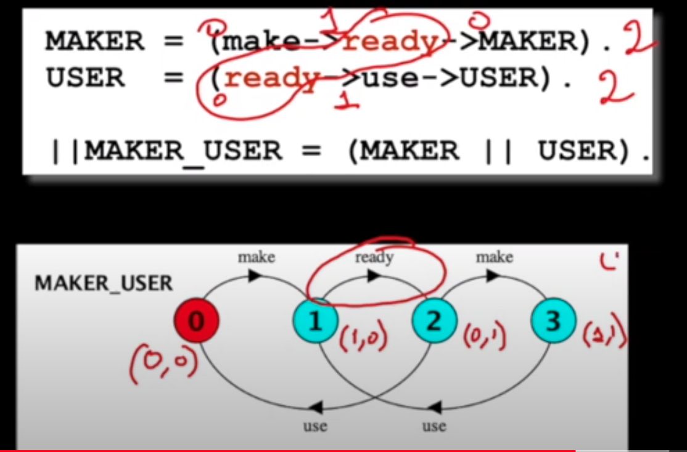

Ejemplo 2: handshake

No tenemos 9 estados. El comportamiento de un componente restringe el del otro.
Uno tiene que esperar al otro para sync y seguir avanzando.
En la def de la composición, solo agregás una transición si ambos pueden tomarla

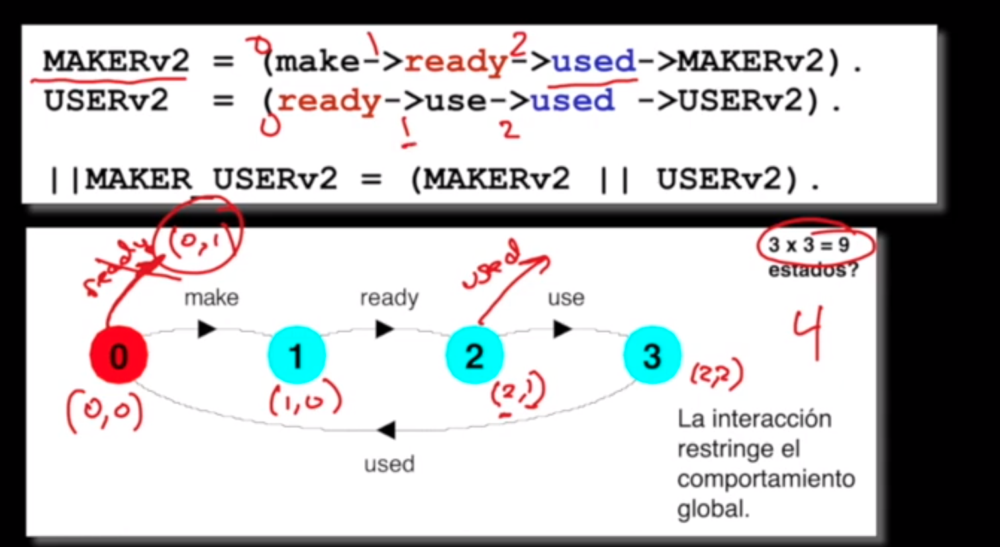

### Equivalencia

Técnicamente debería hacer lo de la izq, pero la herramienta muestra lo de la
der. Saca los estados inútiles (que no pueden formar parte de ninguna traza)


Son **equivalentes** para alguna relación de equivalencia que vamos a ver
después.

### Sync multiple

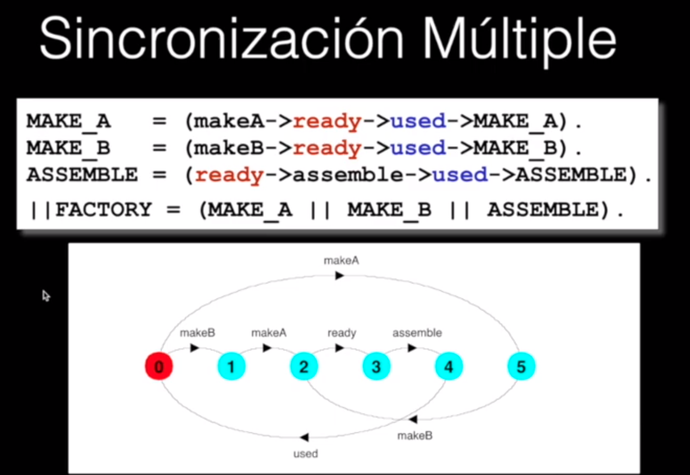

Se puede hacer con más de 2. Naturalmente se modela una comunicación tipo
broadcast. Si bien es complicado de implementar en la vida real, pero acá se
abstrae.

## Video 4

### Elección no determinística

El proceso (x -> P | x -> Q) describe una elección no determinística entre P o
Q. (ojo que no determinismo no es lo mismo que equi-probable)


El resultado de una interacción puede llevar a dos estados distintos. Es una
forma de modelar cómputo interno o decisiones internas de un sistema que no son
controlables desde afuera. Esto no es lo mismo que un proceso que al tirar
ofrece al ambiente tanto cara como seca.

Otro ejemplo: un juego en donde se juega hasta sacar dos caras o dos secas
seguidas.

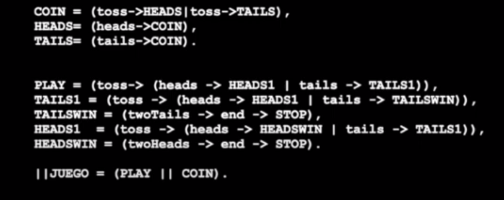

La herramienta resuelve la non deterministic choice tirando una moneda, de forma
probabilística. Pero esto no necesariamente es así, se usa para modelar algo de
lo que no sabemos absolutamente nada.

### Extensión de alfabetos

El alfabeto de un proceso era el conjunto de acciones en las que podía
participar. El operador que permite extenderlo es `+ {conjunto de etiquetas}`

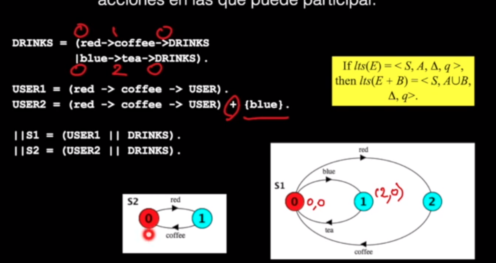

El user 2 tiene la posibilidad de apretar el azúl

s1: cuando una acción no es compartida, puede ocurrir libremente. En cambio en
s2 no está permitido blue. El usuario 2 restringe el comportamiento del evento
azul.

### Ocultamiento de acciones

Los LTS tienen tau, representa computo interno. Pero en LTS no se puede usar el
literal tau para representar la acción que representa cómputo interno. Entonces
se logra mediante ocultamiento, con dos operadores: \ y @

\ {alf}: todas las transiciones que coinciden con acciones del alfabeto se
convierten en tau

@ {alf}: opuesto de la barra. Oculta todo menos lo que está en el alfabeto (da
la interfaz visible)

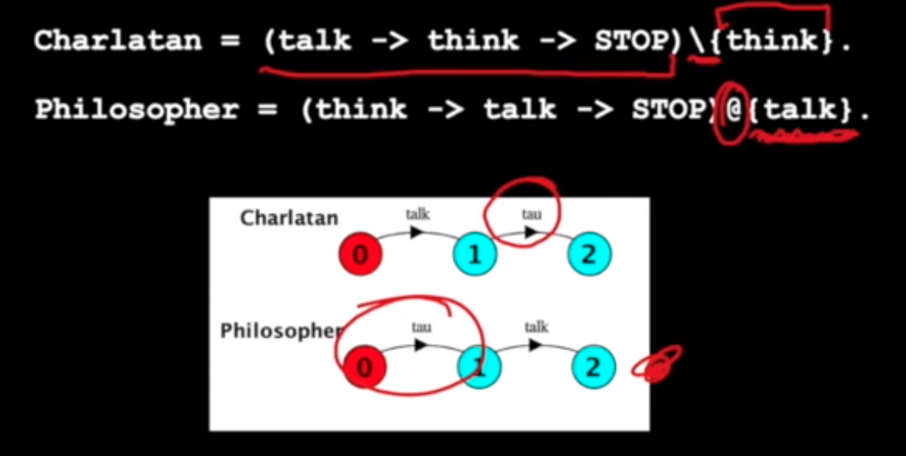

Tau impacta en la definición de composición paralela. No aplica en la regla 3
(sincronización), ya que esta solo aplica a la interfaz visible. Por lo que
siempre se pueden hacer transiciones por tau (porque siempre matchea en las
reglas 1 y 2 de composición paralela).

Esto quiere decir que los procesos avanzas de forma independiente sobre tau, y
que no hay una sincronización en tau aunque sea la misma etiqueta.

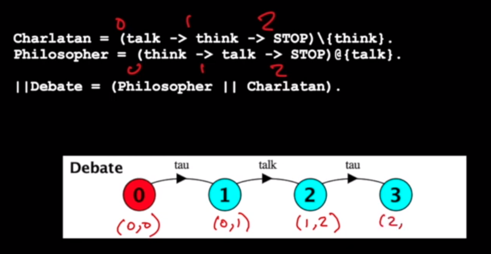

Nota del video: los LTS se pueden minimizar (se van los tau de ese ejemplo)

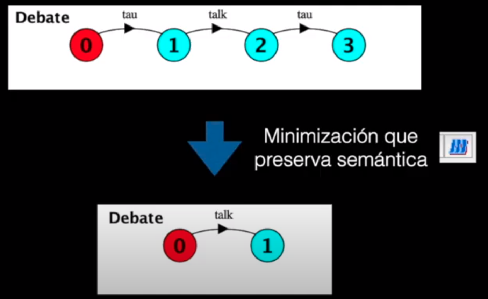

## Video 5 - Syntactic sugar

Resumen

- Hablamos mucho de FSP básico y su significado en función de los LTSs que
  determinan
- Nos queda pendiente hablar de semántica de LTS

Primitivas esenciales de FSP

- Proceso nulo `STOP`
- Prefijo de acciones `(x -> P)`
- Recursión `(P = x -> P)`
- Elección `(x -> P | y -> Q)`
- Eleccion no deterministica `(x -> P | x -> Q)`
- Ocultamiento `(P) \ {x}   P @ {x}`
- Extensión de alfabeto `(P) + A`
- Composición paralela `||S = (P || Q)`

Vamos a agregar syntactic sugar al lenguaje.

### Procesos y acciones indexadas

```fsp
BUFF = (in[i:0..3] -> out[i] -> BUFF).
```

es equivalente a

```fsp
BUFF = (
  in[0] -> out[0] -> BUFF |
  in[1] -> out[0] -> BUFF |
  in[2] -> out[0] -> BUFF |
  in[3] -> out[0] -> BUFF
).
```

o usando un parámetro de proceso con un valor por default (obligatorio)

```fsp
BUFF(N=3) = (in[i:0..N] -> out[i] -> BUFF).
```

### Definición de constantes y rangos

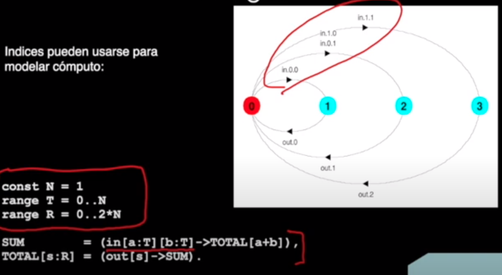

### Guardas

La alternativa `(when B x -> P | y -> Q)` significa que cuado B es verdadera
entonces tanto x como y pueden ser elegidos, caso contrario, si B es falso,
entonces x no puede ser elegida.

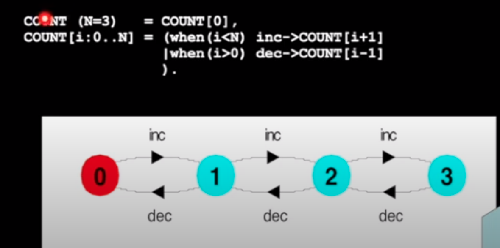

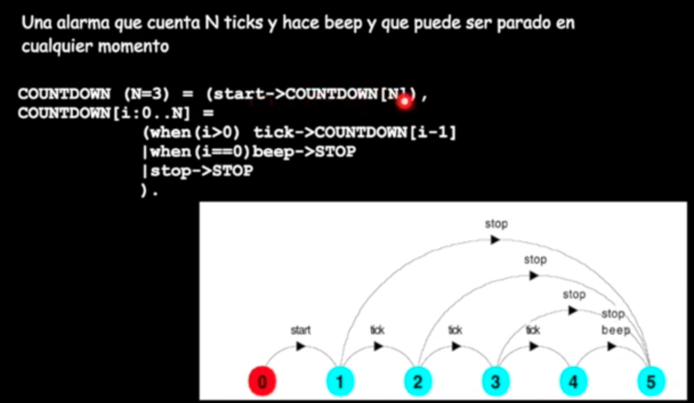

### Etiquetado de procesos

`a:P` prefija cada acción en el alfabeto de P con a.

Intuición: queremos repetir la definición de un proceso del mismo proceso para
tener distintas instancias. Pero si compongo dos veces lo mismo, como tienen la
misma etiqueta están sincronizando permanentemente. Pero queremos distinguirlos

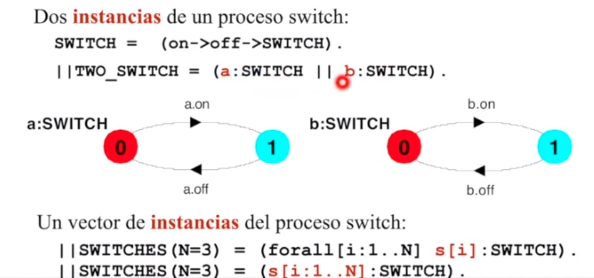

### Prefijado de procesos

`{a1, ..., an}::P` reemplaza cada accion i del alfabeto P con etiquetas
`a1.i, ..., an.i`. Además, cada transición `(i -> X)` en P se reemplaza con
`({a1.i, ..., an.i} -> X)`

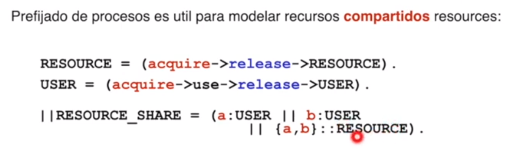

el alfabeto de resource cuando está prefjado con `{a, b}::` va a contener
`a.acquire, b.acquire, a.release, b.release`.

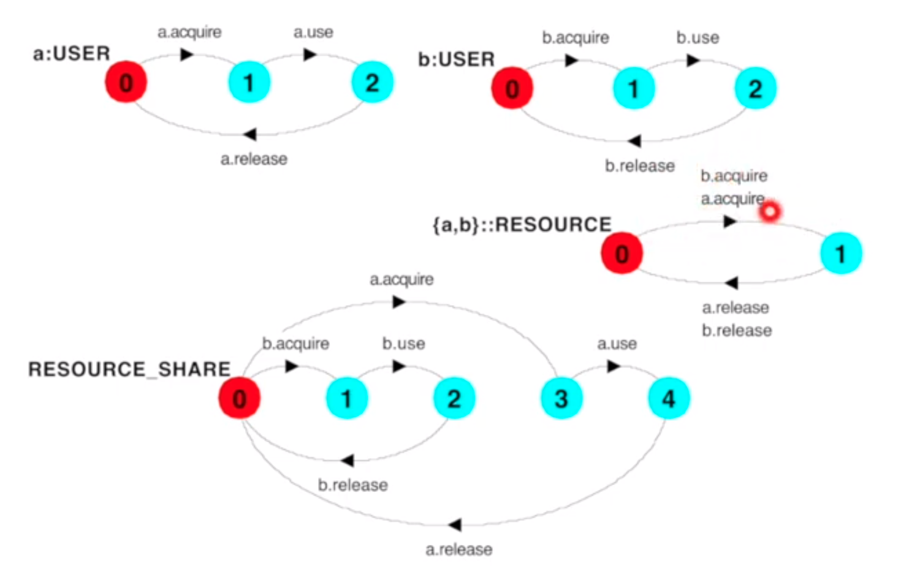

### Renombre de etiquetas

Un mapeo de renombre se aplica a un proceso para cambiar los nombres de sus
acciones. La forma general de este mapeo es

```text
{newlabel_1/oldlabel_1, ..., newlabel_n/oldlabel_n}
```

Permite asegurar que los procesos sincronizan en acciones específicas


Queremos que un llamado del cliente sea una sync con recepción de un pedido por
parte del servidor. Wait debería estar sincronizando con reply del server.

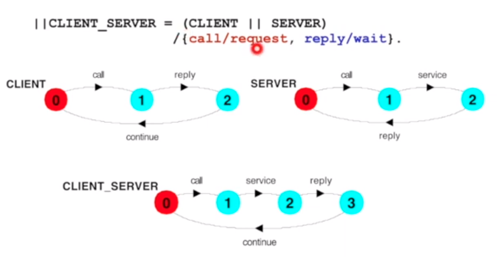

## Bibliografía

Jeff Magee and Jeff Kramer. 2000. Concurrency: State Models & Java Programs. John Wiley & Sons, Inc., New York, NY, USA. Capítulos 1 a 5 y Apéndices A (FSP) y C (Semántica de FSP)
