# Bisimulación

- [Bisimulación](#bisimulación)
  - [Equivalencias entre LTS](#equivalencias-entre-lts)
    - [Motivación](#motivación)
    - [Semántica de FSP](#semántica-de-fsp)
    - [Propuestas a equivalencia semántica](#propuestas-a-equivalencia-semántica)
      - [Isomorfismo](#isomorfismo)
      - [Trazas](#trazas)
      - [Conclusiones](#conclusiones)
    - [Propuesta: Bisimulación](#propuesta-bisimulación)
    - [Congruencia](#congruencia)
    - [Notación](#notación)
    - [Definición de bisimulación fuerte](#definición-de-bisimulación-fuerte)
    - [Relación ~ (ñuflo)](#relación--ñuflo)
    - [Libertad](#libertad)
    - [Ejemplos](#ejemplos)
    - [Lección](#lección)
  - [Juego de Bisimulación Fuerte](#juego-de-bisimulación-fuerte)
    - [El juego](#el-juego)
    - [Ejemplo](#ejemplo)
    - [Definición del juego](#definición-del-juego)
  - [Análisis de Bisimulación](#análisis-de-bisimulación)
  - [Propiedades de $\sim$](#propiedades-de-sim)
  - [Bisimulación Débil](#bisimulación-débil)
    - [Candidato a solución](#candidato-a-solución)
    - [Definición de bisimulación débil](#definición-de-bisimulación-débil)
    - [Ejemplos de bisim debil](#ejemplos-de-bisim-debil)
    - [Juego de bisim débil](#juego-de-bisim-débil)
    - [Propiedades de $\approx$](#propiedades-de-approx)
    - [Congruencia no es gratuita](#congruencia-no-es-gratuita)
  - [Nociones de equivalencia](#nociones-de-equivalencia)
  - [Armonía](#armonía)
  - [Ejemplo de validación de protocolo](#ejemplo-de-validación-de-protocolo)
    - [Minimización](#minimización)

## Equivalencias entre LTS

### Motivación

Estos dos LTS son *iguales*?

```fsp
DRINKS = (
  red -> cofee -> DRINKS |
  blue -> tea -> DRINKS
)

DRINKS = (
  blue -> tea -> DRINKS
  red -> cofee -> DRINKS |
)
```

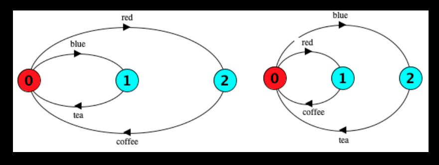

no, porque son diferentes sintácticamente. Pero *dicen lo mismo*.

Pero los LTS que produce no son exactamente iguales, pero son **semánticamente
equivalentes.**

### Semántica de FSP

Decimos uqe dos términos de FSP son semánticamente equivalentes si sos LTS lo
son

Exp1 $\equiv$ Exp2 $\iff$ lts(Exp1) $\equiv$ lts(Exp2)

### Propuestas a equivalencia semántica


Estamos de acuerdo que estos dos LTSs describen el mismo comportamiento,
entonces queremos una semántica que los determine como equivalentes.

#### Isomorfismo

> Un isomorfismo es una función que va de un estado a otro

Dos LTSs son equivalentes si existe un isomorfismo entre sus estados

Contraejemplo: Si tenemos estados que están colgados y no son alcanzables, nunca
van a poder ser isomorfos porque tienen un número de estados diferentes.

Nueva propuesta: Que exista un isomorfismo entre los estados alcanzables que
vincula sus estados iniciales.

Contraejemplo:

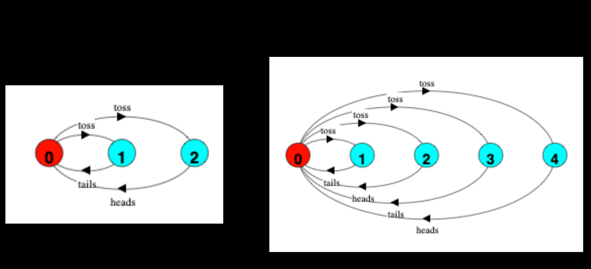

Están duplicados los estados 3 y 4, no hay ninguna diferencia, pero no son
isomorfos.

No nos alcanza con isomorfismo

#### Trazas

> Una propuesta intermedia es hablar de las ejecuciones, pero eso claramente no
> anda porque los estados pueden ser diferentes y que sea equivalente. (las
> ejecuciones contenían los estados y las acciones)

Propuesta: Dos LTSs son semánticamente equivalentes si tienen las mismas trazas

Contraejemplo: No distingue el no determinismo.

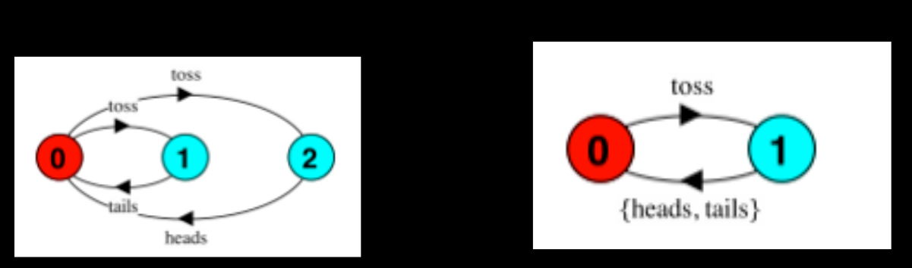

Uno querría que no sean equivalentes, pero sin embargo las trazas son iguales.
Tampoco nos sirve

#### Conclusiones

Todas las propuestas definen clases de equivalencias demasiado gruesas o finas.

- Ejecuciones e isomorfismos: distinguen aspectos estructurales irrelevantes
- Trazas: No distingue no determinismo

### Propuesta: Bisimulación

Buildup: cuales son los requerimientos que tenemos para la semántica?

- Sea una relación de equivalencia
  - Relfexiva (P = P)
  - Transitiva (P = Q y Q = R => P = R)
  - Simétrica (P = Q => Q = P)
- Abstracta con respecto a la estructura
- Más fina que las trazas
- Que sea consistente con nuestra denotación de LTS a procesos reales
  - Difícil, porque la denotación es un modelo informal.
- Que encaje con nuestro lenguaje de especificación.
  - Esto es que sea una **congruencia**

Foco: que puedo hacer en cada momento y que elijo hacer. Si se me presenta un
proc que dice que podes interactuar a través del evento coin, y después dice tea
y coffee, no es lo mismo que otro proceso que cuando interactúo a través de coin
solo me deja tea, u otro que solo coffee. Queremos que todos esos sean
diferentes.

### Congruencia

Que la semántica encaje con el lenguaje de especificación es que sea una
congruencia.

Una equivalencia es una congruencia con respecto a un contexto C(x) (x un
término) si P $\equiv$ Q implica que C(P) $\equiv$ C(Q).

Si P y Q son expresiones FSP tal que P $\equiv$ Q, entonces querríamos que

- `(a -> P)` $\equiv$ `(a -> Q)`
- `(a -> P | b -> R)` $\equiv$ `(a -> Q | b -> R)`
- `(P || R)` $\equiv$ `(Q || R)`
- `P[f]` $\equiv$ `Q[f]`
- `P \ L` $\equiv$ `Q \ L`

### Notación

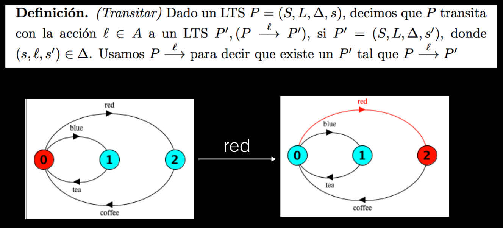

Hacer transitar un LTS es estoy parado en un estado, voy a otro por una acción y
tomo el estado al que llego como un nuevo estado inicial y eso me da otro LTS

### Definición de bisimulación fuerte

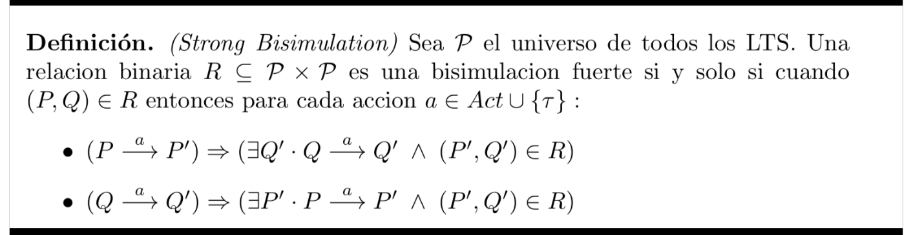

Una relación entre LTSs es una bisimulación fuerte si para todo par P, Q que
está relacionado,

- Si P puede hacer a, Q lo tiene que poder imitar y ambos caer en un par que
  sigue dentro de la bisimulación

- Idem pero al revés. Si Q puede hacer a, P tiene que poder imitarlo.

Si hay un par, cada uno tiene que poder imitar al otro de tal manera que caen en
un par que sigue dentro de la bisimulación.

### Relación ~ (ñuflo)

Decimos que dos LTS son equivalentes como `P ~ Q`.

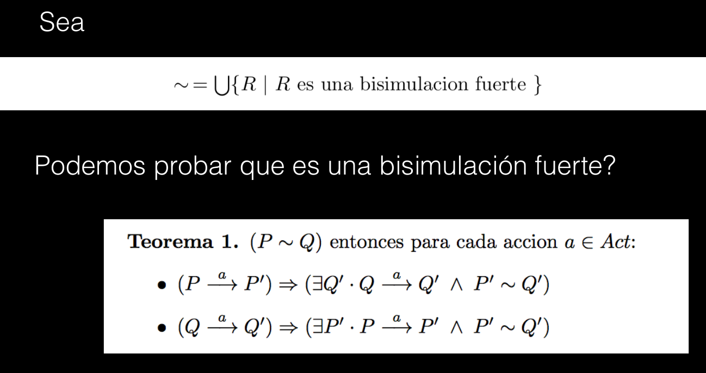

Dem: Si P, Q $\in$ ~, entonces pertenece a algún R, y se cumple la definición.

### Libertad

Si bien las relaciones de bisimulación son entre estados, podemos pensar en el
LTS P_1 como el P con el estado inicial como el 1, P_2 con el 2 y etc. Para
simplificar entonces vamos a hablar de vincular estados, y en realidad vamos a
estar vinculando estos procesos.

### Ejemplos


Doy la relación de bisimulación fuerte

```text
R = {
  (P0, Q0),
  (P1, Q1),
  (P1, Q3),
  (P2, Q2),
  (P2, Q4)
}
```

Concluimos que `P ~ Q`.


Acá no podemos dar una relación de bisimulación entre los estados.

El 0 tiene que estar relacionado con el 0. Una vez que hace toss, el 1 puede
hacer tails, no nos queda otra que vincularlo con Q1. Pero entonces P1 y Q1 no
está bien que estén en la relación, porque Q1 puede hacer heads y P1 no lo puede
imitar. Entonces no son bisimilares.

### Lección

(P0, Q0), (P1, Q1), (P0, Q2)
no. Para (P0, Q2) -a> (P1, Q0) que no están relacionados


(P0, Q0),  (P0, Q2), (P0, Q1)

no. Para (P0, Q0) -a> (P1, Q1) que no están relacionados

(P1, Q1), (P0, Q2), (P1, Q0), (P0, Q1), (P1, Q2)

(P1, Q2) -a> (P0, Q0) que no están relacionados

(P0, Q0), (P1, Q1), (P0, Q2), (P1, Q0), (P0, Q1), (P1, Q2)
si

## Juego de Bisimulación Fuerte

La bisimilaridad se puede formular como un *juego*, en el que

- El atacante quiere mostrar que **no** son bisimilares
- El defensor quiere mostrar que **si** son bisimilares

Asumimos que ambos usan la mejor estrategia posible para ganar el juego.

Si existe una estrategia para el atacante que siempre gana, no importa lo que
haga el defensor, entonces no son bisimilares

En cambio si existe una estrategia por la cual siempre gana el defensor, son
bisimilares.

### El juego

- El tablero es un par de LTS (P, Q)
- En cada ronda,
  - El atacante elige uno de los elementos de la tupla y lo hace transitar por
    alguna transición (En cada ronda puede elegir un elemento diferente del par)
  
  - El defensor toma el otro elemento de la tupla y debe hacerlo transitar por
    transición con la misma etiqueta que la del atacante.
  
- El que no puede jugar, pierde
  - El defensor no puede jugar si el atacante eligió una etiqueta que el
    defensor no puede imitar en el otro proceso.
  - El atacante no puede jugar si ni P ni Q tienen transiciones salientes
- Si el defensor nunca pierde, gana.
  - Ante un juego infinito, gana el defensor

Una buena forma de representar el juego es con un árbol de decisión

### Ejemplo

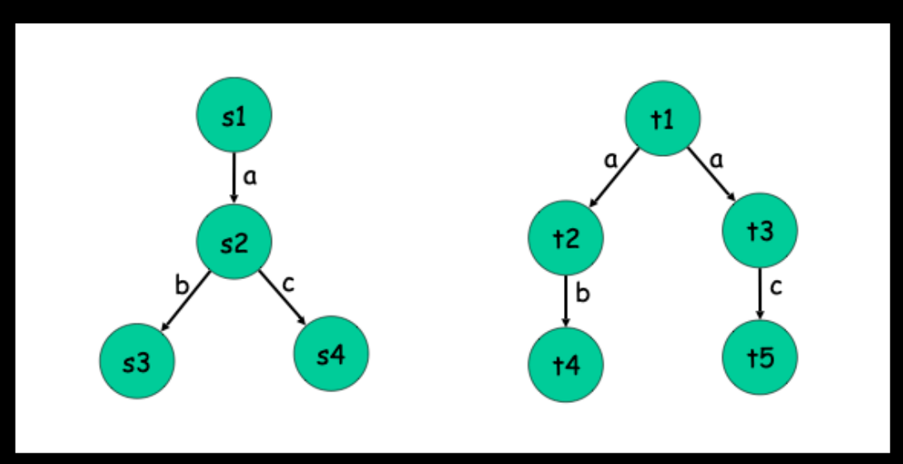

1. Atacante t1 por `a` a t3. Defensor `s1` por `a` a `s2`
2. Atacante `s2` (ojo que cambia de LTS!) por `b` a `s3`. Defensor no tiene
   movimiento, gana atacante y no son bisimilares.

Otro ejemplo,

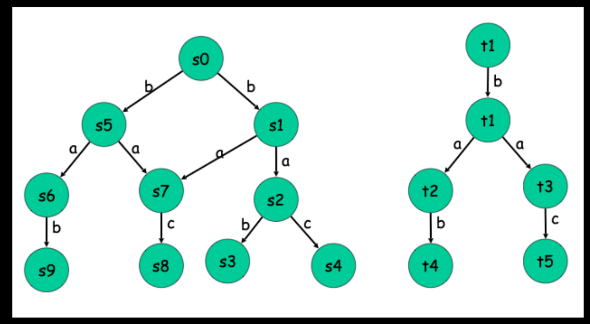

### Definición del juego

P y Q son fuertemente bisimilares si y solo si el defensor tiene una
**estrategia ganadora universal** empezando desde la config (P, Q). Las
configuraciones visitadas representan la relación de bisimulación

P y Q no son fuertemente bisimilares si y solo si el atacante tiene una
**estrategia ganadora universal** empezando desde (P, Q).

El juego provee un argumento elegante para el caso negativo, pero para el
positivo es más fácil dar una relación de bisimulación.

> La enunciación de la estrategia del atacante es una demostración por el
> absurdo de por qué no se puede hacer una relación de bisimulación.

## Análisis de Bisimulación

Quiero un algoritmo que en tiempo finito me cuente si son bisimilares o no. Es
uno de **máximo punto fijo**.

- Arranca con todos los pares posibles que pertenecen a una relación de
bisimulación, $\sim_0$
- Calcula la secuencia $\sim_0, \sim_1, \dots$
- Para cuando $\sim_n = \sim_{n+1}$

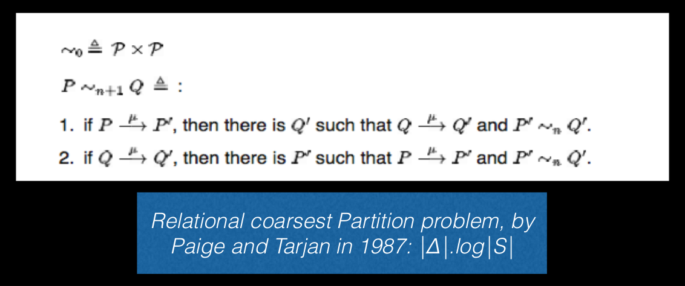

Agrego a n+1 un par si puedo hacer un paso y caer en el conjunto anterior.
$\sim_n$ son todos los pares que se pueden bisimular en $n$ pasos.

> No demostramos en la materia que el algortimo es correcto.

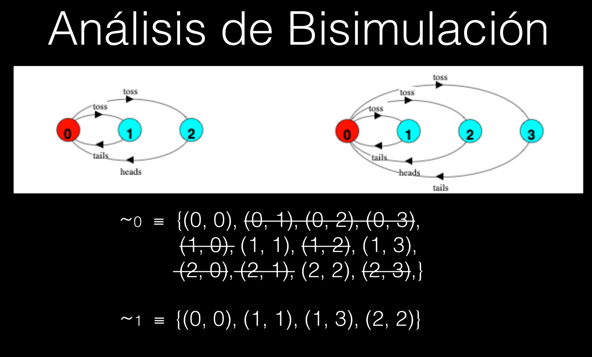

y después el 2 es igual al 1 y se estabiliza (encontramos el punto fijo).

Como el 0,0 pertenece, son bisimilares y esa es la relación de bisimulación

## Propiedades de $\sim$

- Es una relación de equivalencia
- Es una bisimulación
- Es abstracta con respecto a la estructura
- Es más fina que trazas
- Tiene un juego que la caracteriza
- Hay un algoritmo con complejidad tratable que lo resuelve
- Es una congruencia con respecto a operaciones en FSP

## Bisimulación Débil

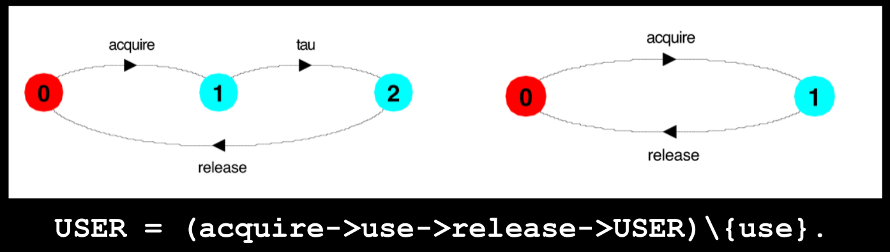

Estos dos no son fuertemente bisimilares, porque la definición incluye a tau,
pero son equivalentes. Las acciones internas nos rompen bisimulación fuerte.

### Candidato a solución

Un candidato es una eliminación de tau tipo tleng con determinización, pero esto
hace que eliminemos potencialmente el no determinismo

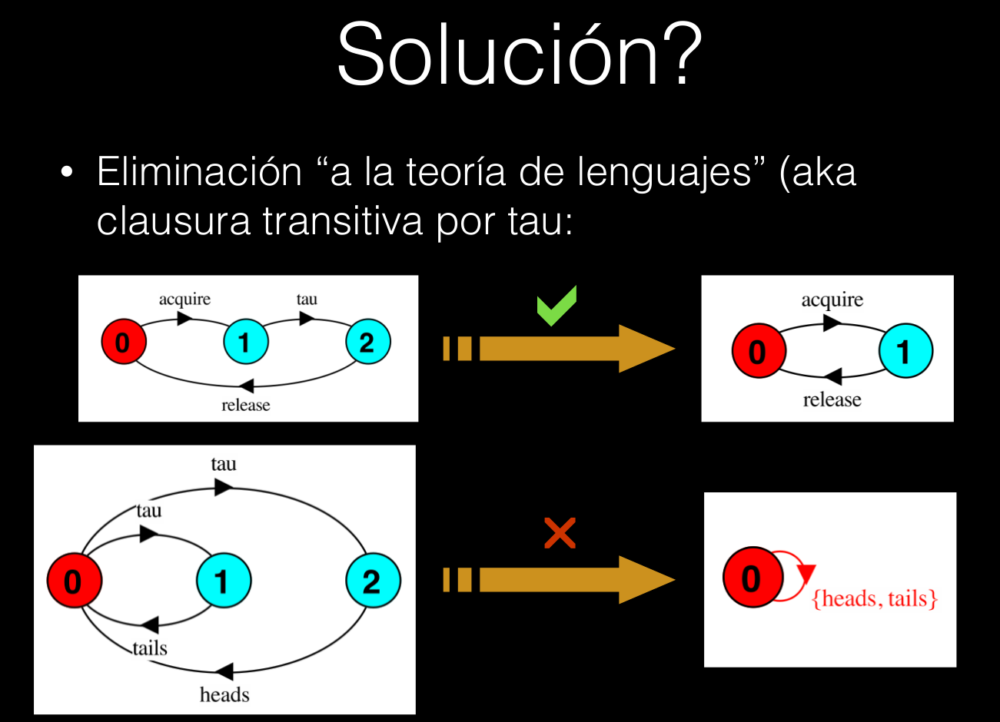

> La clausura transitiva está pensada para lenguajes, trazas, por eso tiene
> sentido que no funcione.

### Definición de bisimulación débil

Es una combinación de bisimulación fuerte y la clausura transitiva

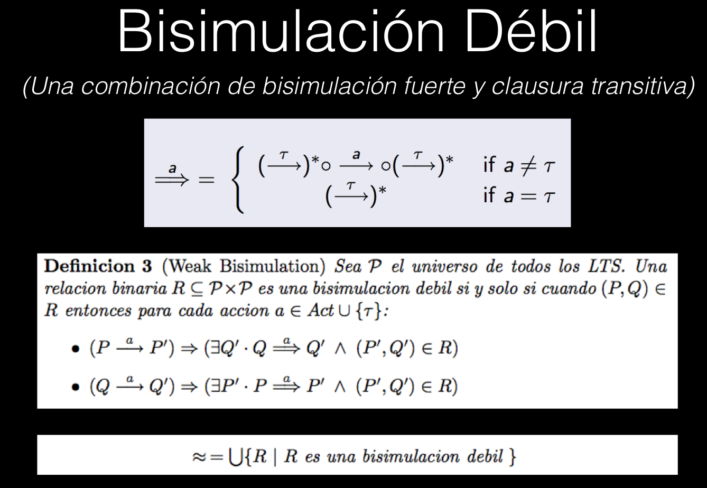

Definimos la nueva transición, en la que puede transitar por 0 o más taus antes
y después de cada acción. La definición es idéntica, solo que con la nueva
transición.

Si uno puede hacer una transición normal (de 1 línea), Q lo tiene que poder
imitar con una de doble línea y viceversa.

### Ejemplos de bisim debil

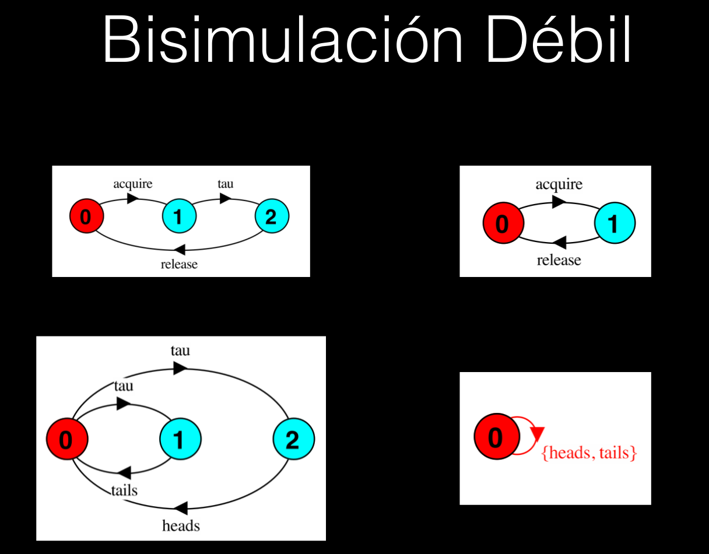

Para el primeor, relacionamos `{(0, 0), (1, 1), (2, 1)}` (para imitar, se pueden
quedar en el lugar haciendo 0 taus)

Para el segundo, todos se tienen que relacionar con el primero. Pero si 0 hace
tau y luego el opuesto al estado en el que cae, no son bisimilares.

Otro ejemplo que son bisimilares,

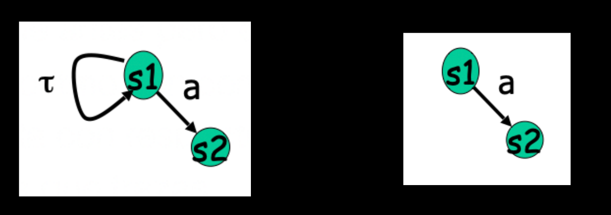

R = `{(1, 1), (2, 2)}`

> esto es controversial, poqrue s1 podría hacer computo interno infinitamente y
> nunca realmente hace la `a`. Hay en la literatura otras nociones de bisim que
> tiene otras variantes, cada una permitiendo analizar distintas propiedades.

### Juego de bisim débil

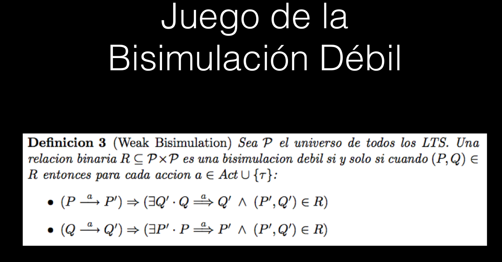

La diferencia es que el atacante va a ser jugadas de 1 paso, mientras que el
defensor puede transicionar por los taus. Solo cambia como defiende.

### Propiedades de $\approx$

- Relación de equivalencia
- Bisim debil
- Tiene un juego que la caracteriza
- También hay un algoritmo
- Cumple todas las cosas que queríamos de BS
- Es más débil que bisimilaridad fuerte ($\sim$ implica $\approx$)
- Abstrae ejecuciones divergentes (en las que se quedan dando vueltas en
  acciones internas)

### Congruencia no es gratuita

Es fácil introducir sintaxis que rompa la congruencia. Por ej. si tenemos una
alternativa que no requiere prefijo, como (P | Q) (válida en CCS)

Si tenemos

- `Q = (a -> STOP)`.
- `P1 = (c -> STOP)`.
- `P2 = (b -> c -> STOP) / {b}`.

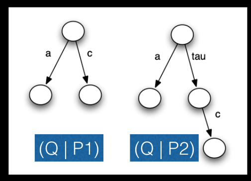

Sabemos que P1 $\approx$ P2, pero (P1 | Q) $\not\approx$ (P2 | Q)

## Nociones de equivalencia

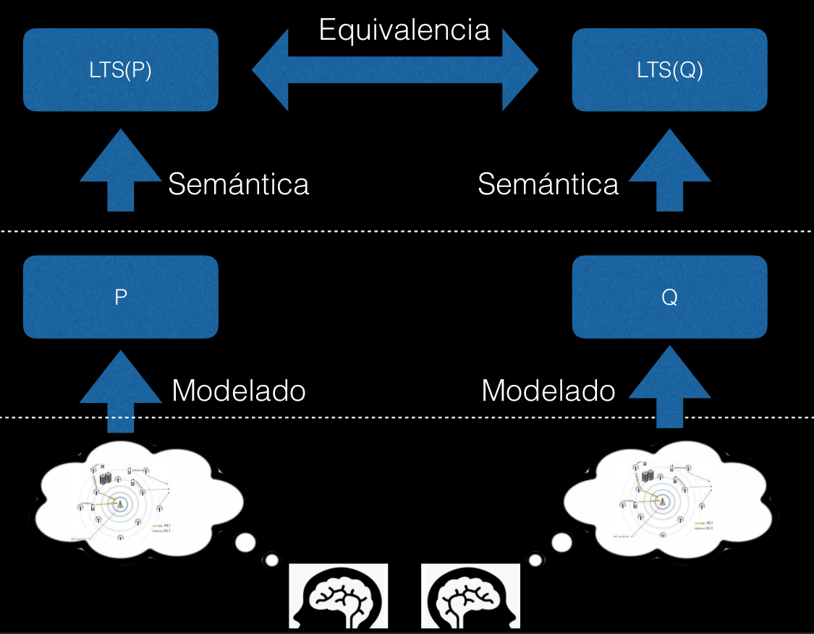

Otra forma definir la semántica de los LTS a partir de sus árboles de cómputo
infinitos, y ahí si la equivalencia serían los isomorfismos.

## Armonía

Es fundamental que las 3 cosas estén en armonía, de esa forma se pueden
implementar razonamientos formales y automáticos

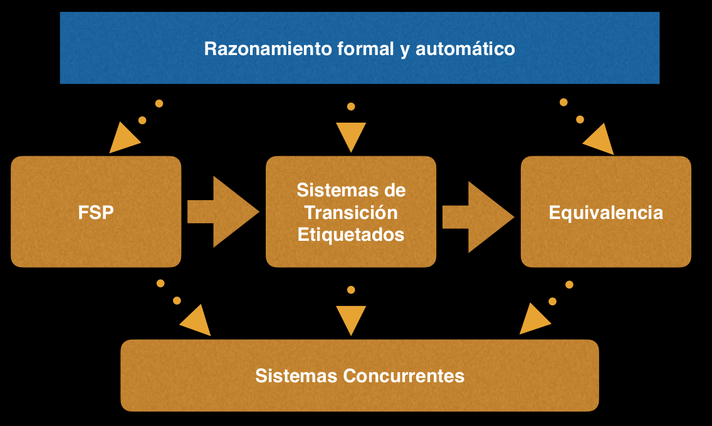

## Ejemplo de validación de protocolo

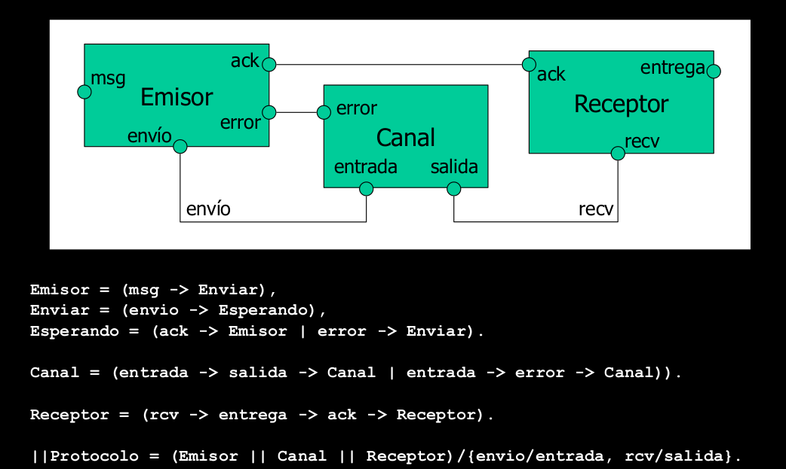

Se usan dos canales, porque el canal pierde información. Y según el ack puede
saber cuando tiene que reenviarlo.

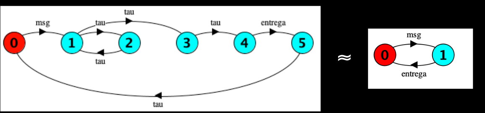

El LTS que representa se puede minimizar para que quede como el que es
bisimilar.

### Minimización

Para calcular la minimización, se puede tomar una relación de bisimulación con
un LTS con si mismo y las clases de equivalencia generadas son los estados del
LTS mínimo.

Q es el mínimo de P si son bisimilares (fuerte o débilmente, depende de la
minimización que hagamos) y además Q es el LTS con menor cantidad de estados que
es equivalente a P.
