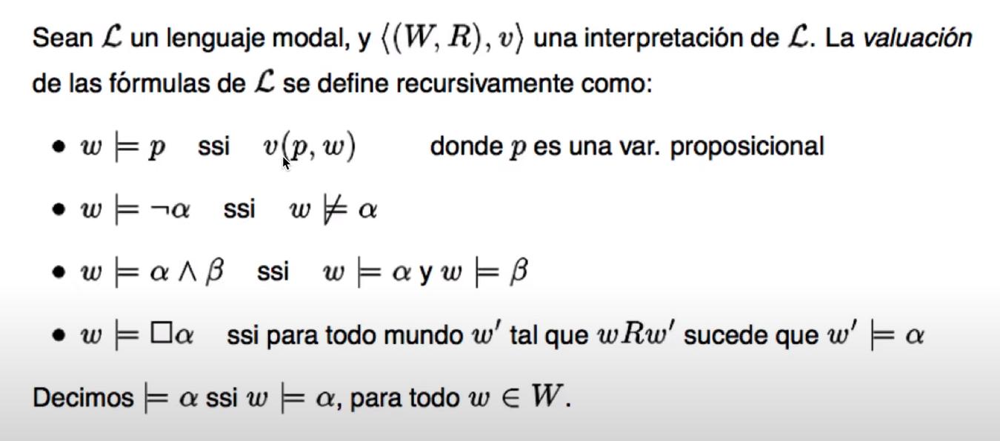
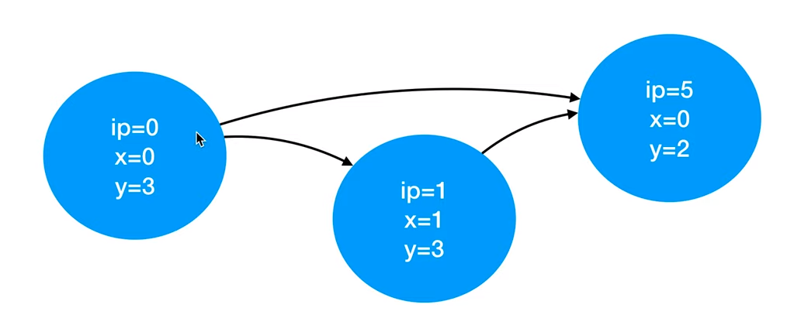
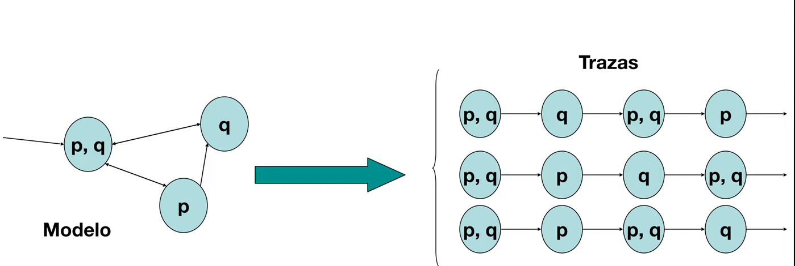
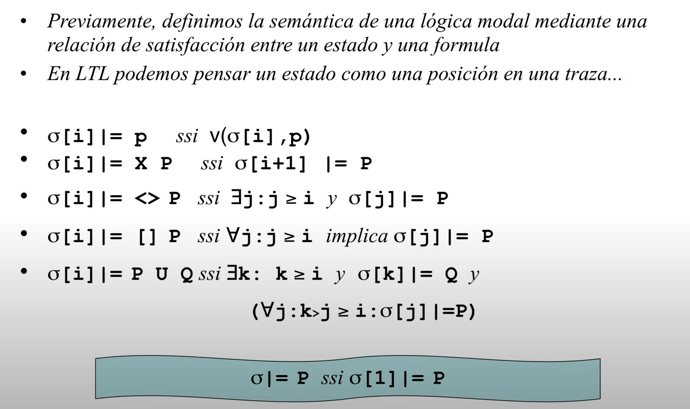
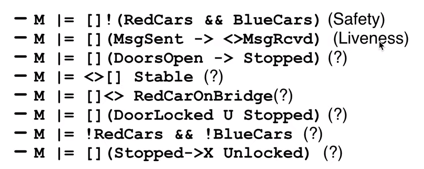
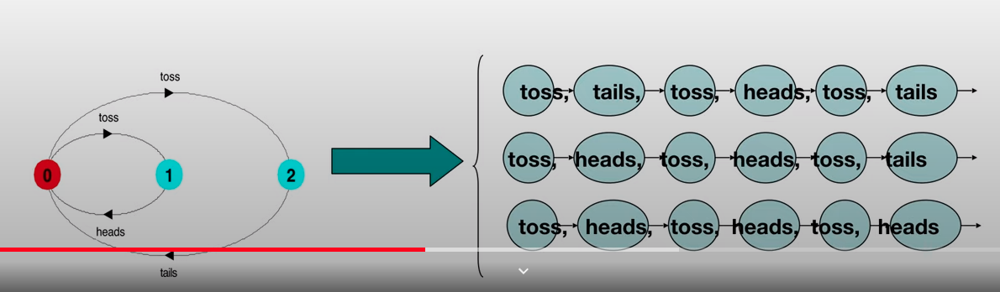
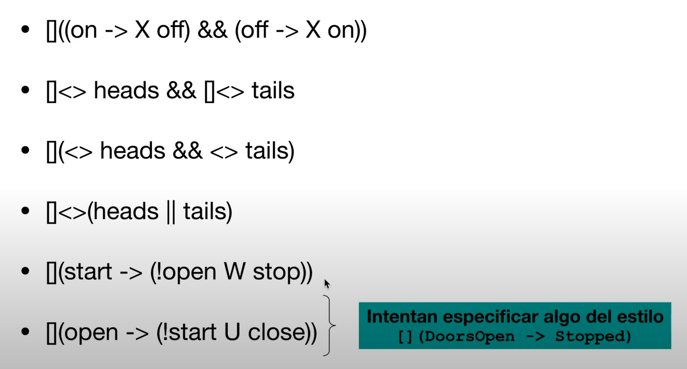
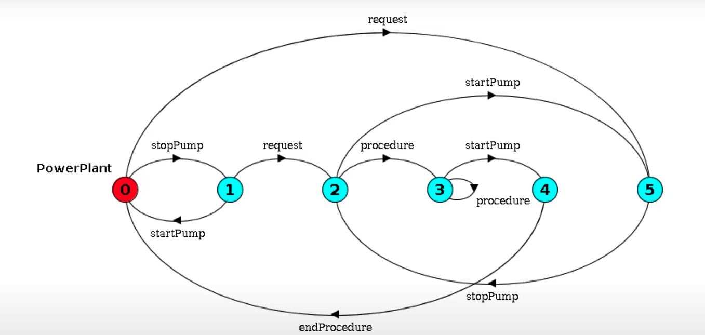

# Lección 14 - Lógica Lineal Temporal

LTL es una lógica modal en particular, que nos va a servir para escribir
propiedades a cumplir por los modelos que describimos con FSP.

## Lógicas modales

Estudia la formalización del razonamiento que involucra modalidades como
"necesariamente" o "posiblemente".

Enfoque tradicional: complementar los los operadores clásicos con operadores
**modales**

- `[]`: Necesidad (box)
- `<>`: Posibilidad (diamond)

Sintaxis:

- Variables prop: p, q, r
  - Van a ser acciones del programa concurrente
- Conectivos logicos
  - && conjunción
  - || disyunción
  - ! negación
  - -> implicación
- Operadores modales: [], <>
- Fórmulas

### Semántica

Vamos a interpretar las fórmulas modales sobre **estructuras de Kripke** y
valuaciones sobre el universo de variables prop Pr.

Una estructura de Kripke es un par (W, R):

- W es un conjunto de mundos posibles (worlds)
- R es una relacion binaria sobre W

Una función de valuación asigna a cada prop un valor de verdad en cada mundo
posible (v: Pr x W -> {T, F}).

La semántica está dada por una relación de satisfacción `|=` entre fórmulas e
interpretaciones.



El `<>` se puede definir en base a `[]` al igual que un $\forall$ a partir de un
$\exists$

```text
<> alpha sii ![]!alpha
```

- `w |= <> alpha` si en el mundo w, existe al menos un estado w' donde wRw' y w'
  |= alpha.

### Ejemplos

- `[](p -> q)` en todos los mundos a los que podemos llegar, si vale P entonces
  vale Q

- `[]p -> []q` si a todo mundo al que llego vale p, entonces a todo mundo al que
  llego vale q

- `[]p -> p` si a todo mundo al que llego vale p, entonces vale p en este mundo
  (esto es una tautología porque [] incluye el mundo en el que estás)

### Uso en verificación de programas

Vamos a ver una interpretación como un sistema de transición de estados que
representa un programa.

Sea P una propiedad a verificar de un programa Prog. Si Prog es representable
como una interpretación `<W, R>` con estado inicial `w_0` y `P` como una fórmula
modal, entonces verificar que Prog tiene la prop P es equivalente a probar que
`w_0 |= P`.



**Model checking**: procedimiento automático de verificación de un modelo contra
una propiedad.

## Lógicas temporales

Son un caso particular de las lógicas modales en las cuales los múndos
representan el paso del tiempo.

En las estructuras de kripke (W, R) para LTL, W es un conjunto numerable y R un
orden total (cada momento en el tiempo es "mayor" a todos los anteriores). Los
operadores modales entonces se interpretan como

- `[]P`: siempre en el futuro vale `P`
- `<>P`: en algún momento en el futuro vale `P`.



Definimos la semántica en cuanto a las trazas



U: until, vale P hasta que vale Q.

Tiene que ser de acciones observables.

### Ejemplos de verificación de programas

Un modelo satisface una fórmula P de LTL (M |= P) sii para toda traza $\sigma
\vDash P$



### LTL y LTS

vemos a cada traza como una estructura de Kripke



Ejemplos:



### Ejemplo

