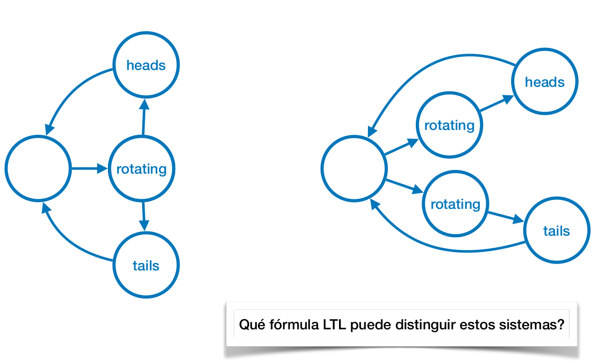
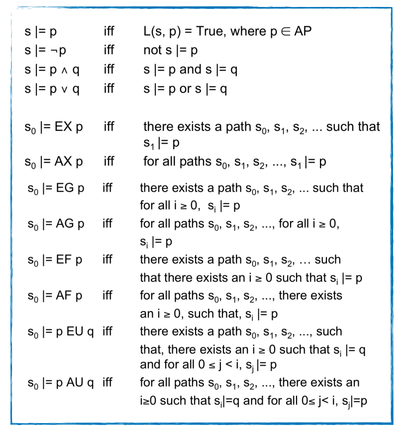
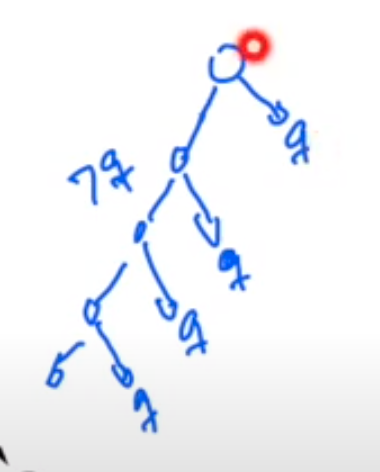
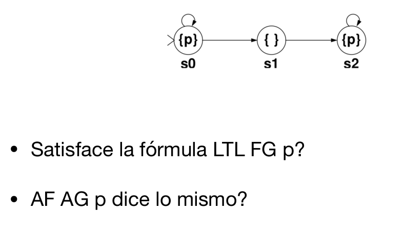
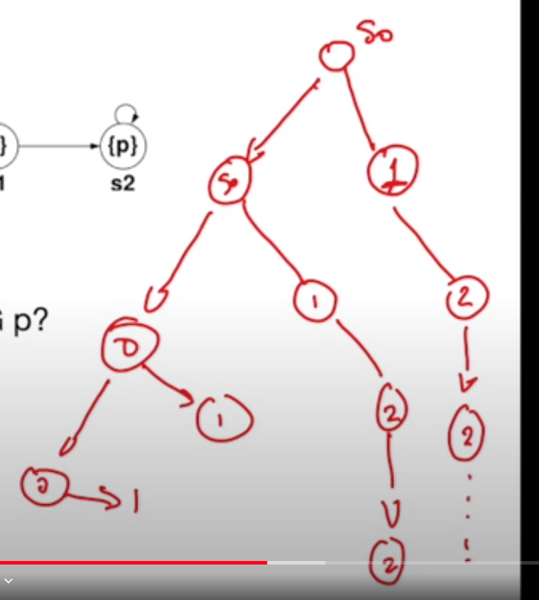
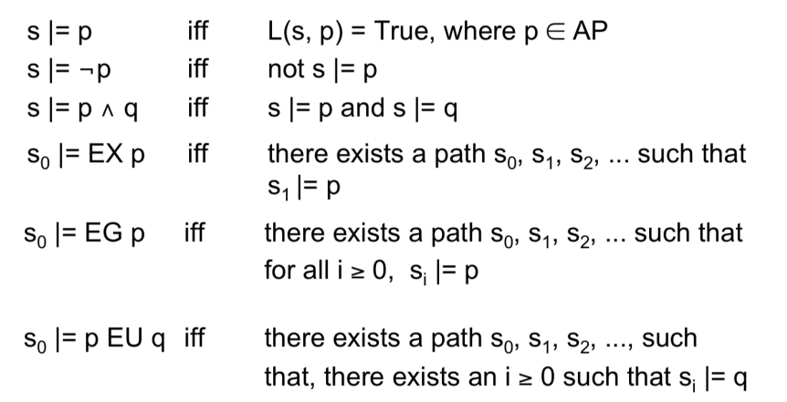
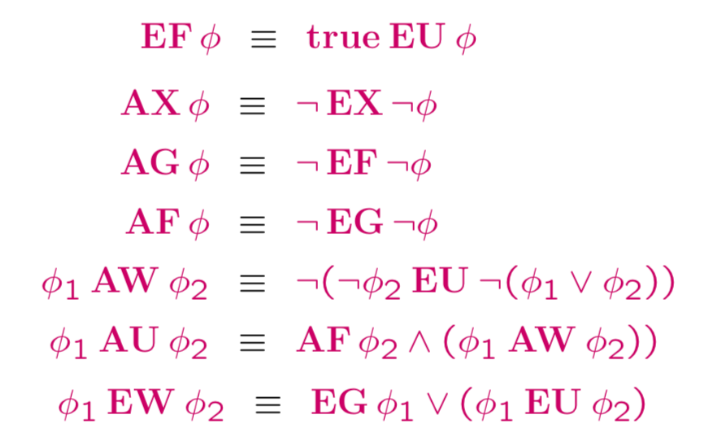

# Lección 16 - Model checking CTL

Veníamos hablando de lógicas temporales **lineales**, pero estas se quedan
cortas ara hablar de ciertos tipos de propiedades

Estas dos son distintas porque una tiene no determinismo mientras que la otra
no.

No hay. Para que un LTS satisfaga una fórmula LTL, todas sus trazas deben
satisfacerlo, pero las trazas de estos dos *son iguales*. Nunca vamos a poder
escribir una fórmula que la distinga.

LTL **no tiene la capacidad de distinguir no determinismo**

- [Lección 16 - Model checking CTL](#lección-16---model-checking-ctl)
  - [Árbol de cómputo](#árbol-de-cómputo)
  - [CTL (Computational Tree Logic)](#ctl-computational-tree-logic)
    - [Semántica](#semántica)
    - [Ejemplos de operadores combinados](#ejemplos-de-operadores-combinados)
    - [CTL > LTL](#ctl--ltl)
    - [LTL > CTL?](#ltl--ctl)
    - [Base de CTL](#base-de-ctl)
  - [Algoritmo de model checking](#algoritmo-de-model-checking)

## Árbol de cómputo

En vez de mirar los caminos, vamos a pensarlo como que representa un árbol de
cómputo. desdoblar los loops para hacer un árbol infinitamente profundo

lo que hace que sea relevante, es que una noción de **bisimulación** es que los
árboles de cómputo sean isomorfos.

## CTL (Computational Tree Logic)

Cuantificamos sobre caminos en el árbol de cómputo, con los mismos 4 operadores
temporales: X, F, G, U (F G y U sobre estados)

> F (**F**inally): <> y G (**G**lobally): []

Los anteponemos siempre uno de los dos cuantificadores de caminos:

- A: para todo camino. (**a**ll)
- E: existe un camino. (**e**xists)

En CTL se combina A y E con los operadores, quedando: Operadores temporales:

- AG, AF, AU, AX
- EG, EF, EU, EX

Ejemplos (ilustrados en las diapos):

- AG p: en todos los caminos, y en todos los estados de cada camino, vale p.
- AF p: para todo camino, existe un estado en donde vale p
- AX p: En el estado inicial, para todos los caminos, en el proximo estado vale p.
- p AU q: en todos los caminos vale que en ese camino vale p U q (vale P hasta
  que vale q)
- EG p: Existe un camino en donde en todos los estados vale p
- EF p: existe un camino en el árbol en donde vale F p (que en algún lado de ese
  camino vale p)
- EX p: existe un camino arrancando del inicial en donde en el proximo vale p
- p EU q: existe un camino en donde vale p U q.

### Semántica

Decimos que un árbol de cómputo infinito satisface una fórmula si su raíz la
satisface.

### Ejemplos de operadores combinados

- AG AF q: En todos los estados vale AF q,

  en todos los caminos
    en todos los estados
      en todos los caminos a partir de ese estado
        eventualmente vale q

  ("hay infinitos qs en todos los caminos, no necesariamente seguidos")

  se parece a []<>q

- AG EF q

  en todos los caminos y todo estado de ese camino
    existe un camino en el que eventualmente vale q
  
  No es lo mismo que AG AF q, por ej. puedo tener un árbol binario infinito en
  el que tengo un branch que a izquierda no vale nunca q, pero cada nodo tiene
  uno más a derecha en el que vale q

  

- AG (p -> AF q)

  en todos los caminos y todo estado de esos caminos
    si vale p, entonces en todos los caminos a partir de él eventualmente vale q

  "q es inevitable después de una p"

- Y como distinguimos el ejemplo de la motivación?

  

  AG (rotating -> (EX heads y EX tails))

  > siempre que vale rotating, existe un camino en el que en el proximo vale
  > heads y existe un camino en el que en el próximo vale tails

  esto lo cumple el primero pero no el segundo.

### CTL > LTL

CTL puede razonar sobre múltiples trazas simultáneamente y sobre comportamiento
*potencial* (ver todas las ramas que tiene un estado y ver si alguna tiene
cierto comportamiento). LTL te fuerza a elegir una traza y analizarla.

- AG EF abort: "siempre existe en algún momento en el futuro la posibilidad de
  alertar el proceso"
- AG (EX opcionA <-> EX opcionB): "en todo momento, el sistema me ofrece la
  opción A si y solo si me ofrece la B". Cada vez que me dice OK me dice el
  boton Cancel.
- AG (precondicion -> EX (paso1 && EX (paso2 ...)))
  
  es un **Caso de uso**, pre condicion y una serie de pasos que pueden suceder
  (no si o si, es una posibilidad).

  "si el usuario está autenticado, entonces en el proximo paso podría hacer un
  login, y después ver sus movimientos de tc", etc.

### LTL > CTL?

Si, se pueden decir algunas cosas que no se pueden decir en CTL.

- la formula LTL <> [] p vale? si.
- la formula CTL AF AG p dice lo mismo?

  "en todo camino existe un estado a partir del cual en todo camino y estado
  vale p"

  

  en el camino de la izquierda que va todos 0s, siempre existe la posibilidad de
  ir al estado 1 en el que no vale

  > duda: pero en el estado 1 siempre vas al 2 en el que vale, entonces no
  > podrías tomar el camino del AF como 0000001 en vez de 0000?

Para verlo formalmente, habría que ver que significa que una fórmula LTL sea
equivalente a una fórmula CTL

> $\forall TS: TS \models \varphi_{LTL} \iff TS \models \varphi_{CTL}$

y luego hay que probar que no existe una fórmula en CTL que sea equivalente.
Esto es algo que se puede hacer, y hay más info en el libro de Model Checking 

**Conclusión**: LTL y CTL son incomparables.

> pero hay una lógica llamada CTL* que permite no tener pegados la cuantif sobre
> caminos (A, E) de la cuantificacion sobre estados (G, F, U, X).
> Esta lógica es estrictamente más expresiva que CTL y LTL, pero queda fuera del
> scope de la materia.

### Base de CTL

> Por ej. en lógica alcanza con ! y or para definir el resto de la semántica. De
> la misma manera, en primer orden el para todo se puede definir en función del
> existe (forall = ! exists !), idem LTL con [] = ! <> !.

Es práctico encontrar bases para que el model checking o las demostraciones se
hagan sobre un conjunto de operadores más chico.

Una posible base solo incluye EX, EG y EU

Y como reescribo los operadores CTL que vimos antes?

## Algoritmo de model checking

Dada una estructura de kripke (S, s0, R, v) y una fórmula CTL f

1. Traducimos la fórmula a la base EX EG y EU
2. Constuimos los conjuntos característicos de las sub fórmulas bottom up
   1. Cada operador se analiza una vez y es resuelto en O(|S| + |R|)

La complejidad total es O(|f| x (|S| + |R|))

> mucho mejor que LTL, que era O(2^|f| x (|S| + |R|))
> El problema es que |S| explota

En el video se saltea explicar qué es un conj característico. En las diapos
están las explicaciones de como se construye cada uno, pero como esto me da la
sensación de que no entra, no voy a tomar notas.
