# Lección 3 - Pointer analysis

https://www.youtube.com/watch?v=AjwUyo8UazM&ab_channel=MayurNaik

Flujo de información no primitiva: pointers, objects y references.

c, cpp, java, python, etc. Entonces es fundamental.k

## Intrucción de punteros

Ejemplo sin punteros: si queremos probar que un assertion es válido, podemos
hacer un *forward must* analysis.

```c
x = 1;
// [x == 1]
y = x;
// [y == 1] porque sabemos de antes que x == 1
assert(y == 1); // sabemos que es válido
```

Ejemplo con punteros

```c
x = new Circle(); // object allocation statement
x.radius = 1;
// [x.radius == 1]
y = x.radius; // field read
// [y == 1]
assert(y == 1);
```

## Pointer aliasing

Los punteros permiten que distintas posiciones de memoria se refieran con
distintos nombres, llamado *pointer aliasing*.

Ejemplo

```c
Circle x = new Circle();
Circle z = ?
x.radius = 1;
// [x.radius == 1]
z.radius = 2;
// [x.radius == ?] depende de si z es un alias de x
y = x.radius;
assert(y == 1)
```

### May-alias analysis

```c
Circle x = new Circle();
Circle z = new Circle(); // denotan circulos diferentes
// [x != z]
x.radius = 1;
// [x.radius == 1, x != z]
z.radius = 2;
// [x.radius == 1] sabemos esto porque trackeamos que x != z.
y = x.radius;
// [y.radius == 1]
assert(y == 1)
```

Un análisis que está dedicado a trackear este tipo de información se llama
*may-alias analysis*, que también llamamos "pointer analysis".

### Must-alias analyis

Para entenderlo, consideremos que pasaría si z es un alias de x

```c
Circle x = new Circle();
Circle z = x; // aliasing
// [x == z]
x.radius = 1;
// [x.radius == 1, x == z]
z.radius = 2;
// [x.radius == 2] sabemos esto porque trackeamos que x == z (must alias).
y = x.radius;
// [y.radius == 2]
assert(y == 1); // Incorrecta, la correcta es y == 2
```

May alias y must alias son problemas duales, pero must alias es necesita una
maquinaria más avanzada y es menos usada en la práctica.

> Por eso nos vamos a centrar en pointer analysis.

## Por qué es difícil?

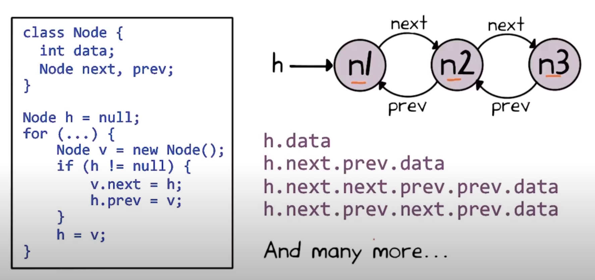

Hay muchas formas de nombrar la misma cosa, si hay ciclos, hay infinitas formas.

## Aproximación

Por eso pointer analysis (si dos punteros tienen aliasing) es indecidible. Si o
si tenemos que sacrificar una de soundness, completeness y termination.

Vamos a sacrificar completeness como con dataflow analysis. Admitimos falsos
positivos pero no falsos negativos.

## Falsos positivos

Qué son? Pregunta: queremos ver si dos punteros son aliases el uno del otro en
alguna ejecución.

Resumido: x may-alias z?

- No: no hay posibilidad de que x, z sean aliases
- Si: No puede determinar si x, z son aliases. Si no quiere decir que si o si lo
  son, sino que *pueden* serlo.

```c
Circle x = new Circle();
Circle z = new Circle();
x.radius = 1;
z.radius = 2;
y = x.radius;
assert(y == 1)
```

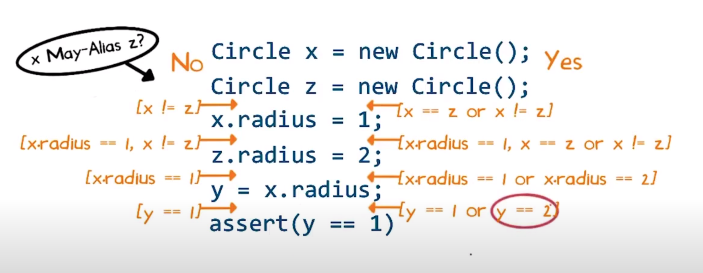

## Algoritmos

Hay muchos algoritmos sound aproximados, que varian en la precisión (cantidad de
falsos positivos que generan) y se diferencia en dos aspectos claves:

- Como abstraen el **heap** (información asignada dinámicamente)
- Como abstraen el **control-flow**
  - No necesariamente es non deterministic choice, sino que suele ir aún más
    lejos en pointer analysis: ven al programa como una lista desordenada de
    statements

## Programa de ejemplo en Java

```java
class Elevator {
  Object[] floors; // pisos en un edificio
  Object[] events; // por ej. una persona toca un botón
}

// M = #floors
// N = #events 
void doit(int M, int N) {
  Elevator v = new Elevator();

  v.floors = new Object[M];
  v.events = new Object[N];

  for (int i = 0; i < M; i++) {
    Floor f = new FLoor();
    v.floors[i] = f;
  }

  for (int i = 0; i < N; i++) {
    Event E = new Event();
    v.events[i] = e;
  }
}
```

## Heap abstraction - Points-to-graph con allocation sites

Ejemplo de `doit(3, 2)`

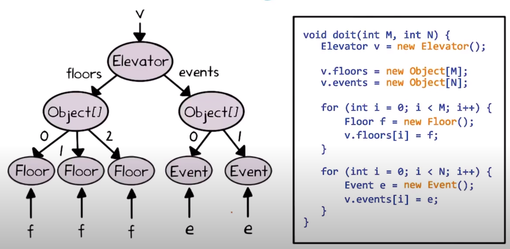

Pero el analisis tiene que poder analizar cualquier combinación de M y N. Esto
lo hace abstrayendo el heap. Hay varios esquemas con diferentes trade offs entre
precision y eficiencia.

Uno de ellos abstrae objetos basandose en el lugar en donde se asignan en el
programa. Crea un **Points-to-graph**

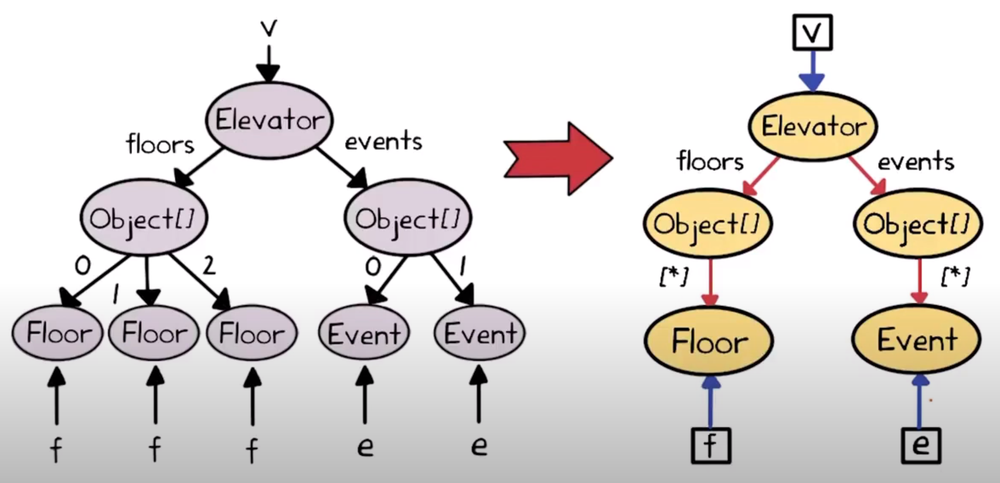

Dos tipos de nodos: variables (cajas) y allocation sites (circulos)

No se hace uno en cada punto de programa, a diferencia del dataflow analisis.
Por lo general hay uno solo global. Esto se hace abstrayendo control flow.


No son sensitivos al flow, son **flow insensible**. Diferencias:

- No hay control flow (for, ; indicando ordenamiento secuencial)
- Todo lo que no tiene que ver con punteros se elimina
- Todo lo que indexa se convierte en non-det-choice. Similar a como las
  condiciones en dataflow se convertian en *.

Los statements **no tienen precedencia** entre si, porque están desordenados

### Chaotic iteration para armar points-to-graph

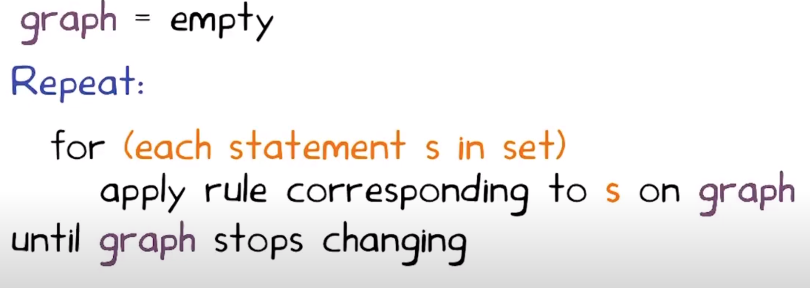

> En la practica se usa un traversal más eficiente de los statements, y
> estructuras de datos que hacen que sea más eficiente actualizar el grafo.

## Gramática de statements

```text
(statement) s ::= v = new // object allocation
  | v = v2                // object copy, genera aliasing
  | v2 = v.f              // field read
  | v.f = v2              // field write
  | v2 = v[*]             // array field read 
  | v[*] = v2             // array field write

(pointer-type var) v
(pointer-type field) f
```

Alcanza para representar todas las operaciones? Si! Todas las instrucciones
complejas se pueden representar como composiciones de las mas simples. Por
ejemplo,

```c
v.events = new Object[]

// se puede escribir como
tmp = new Object[]
v.events = tmp
```

```c
v.events[*] = e

// se puede escribir como
tmp = v.events
tmp[*] = e
```

y asi.

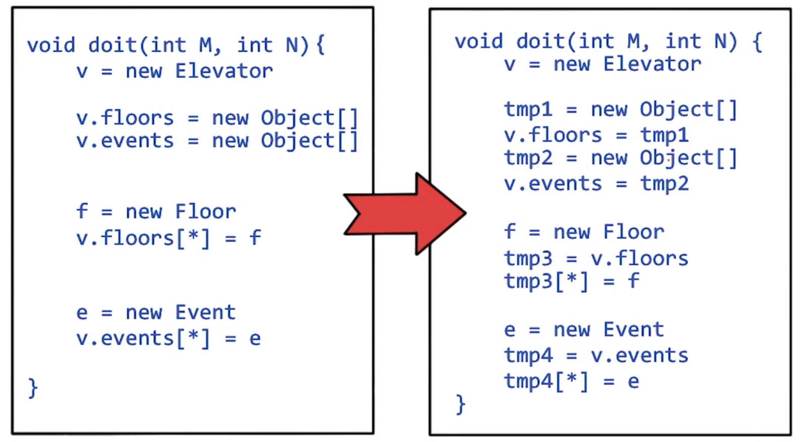

Llamamos **forma normal** (normal form) cuando se escriben como descomposición.

Quiz

```text
v.1f = v2.f

tmp = v2.f
v1.f = tmp
```

```text
v1.f.g = v2.h

tmp = v2.h
tmp2 = v1.f
tmp2.g = tmp
```

## Reglas para object allocation sites

Para poder crear el points-to-graph necesitamos reglas que digan como se
modifica con las distintas instrucciones.

- `v = new B` (allocation)

  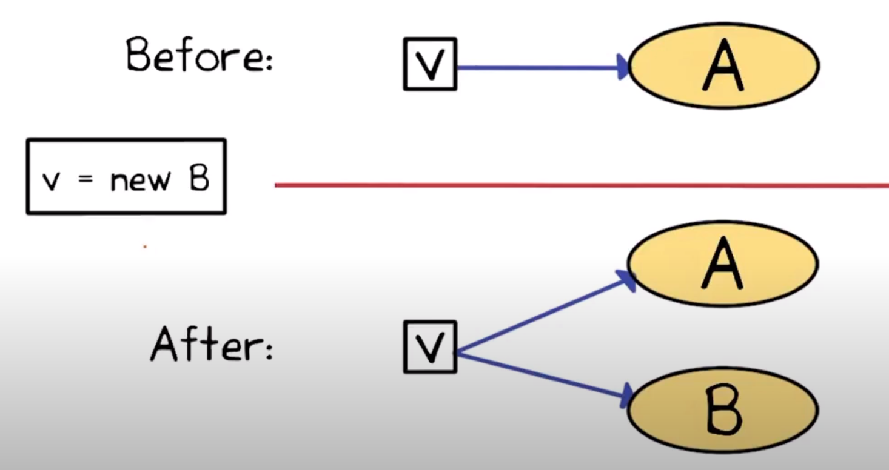

  *weak update*: agregamos en vez de modificar. Hallmark de flow insensitivity

  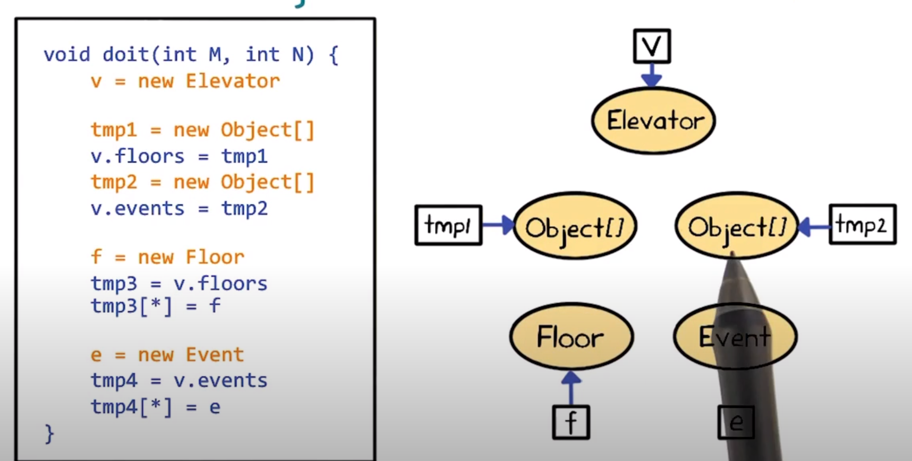

- `v1 = v2` (object copy)

  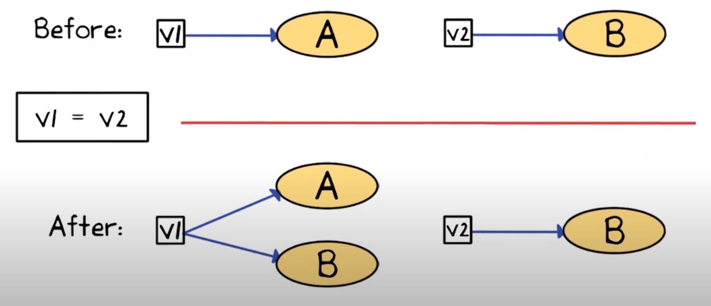

  > Duda: por qué no apuntan al mismo?

- `v1.f = v2` o `v1[*] = v2` (field write)

  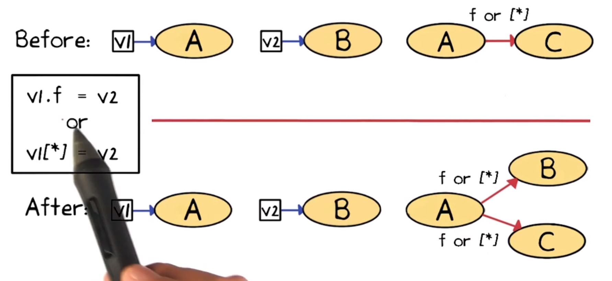

  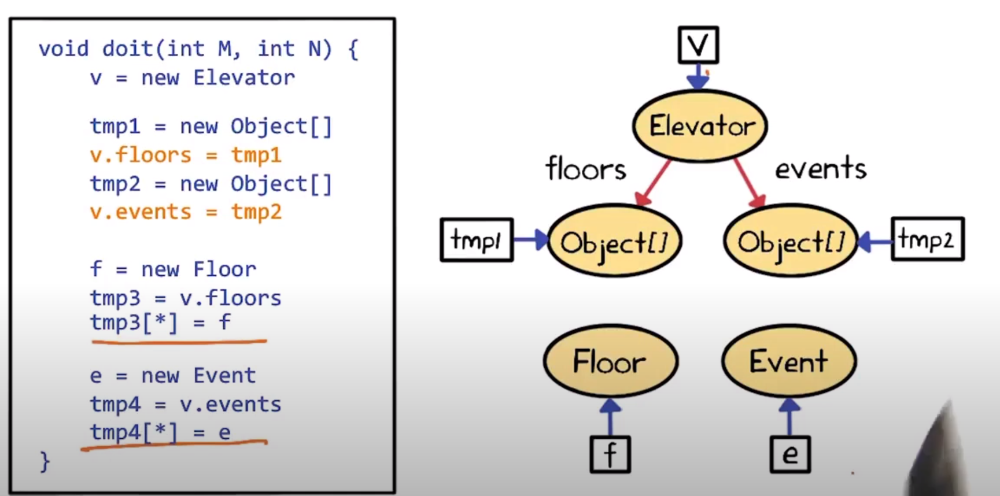
  (como todavia no se crearon tmp3 y tmp4 volvemos en la sig iteracion)

- `v1 = v2.f` o `v1 = v2[*]` (field read)

  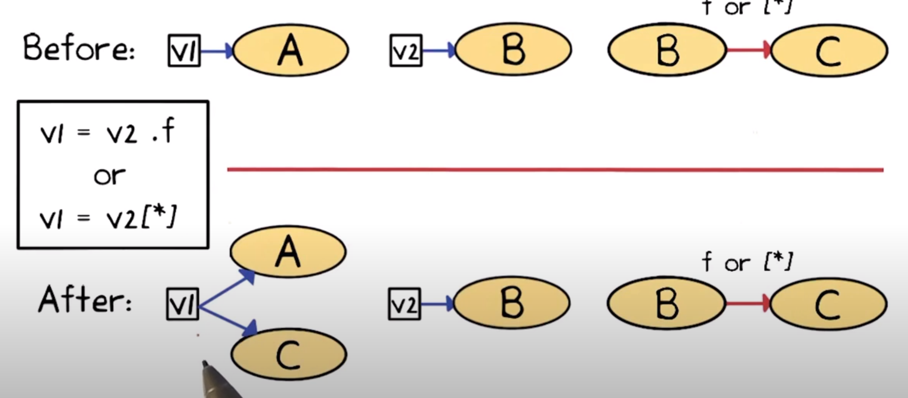
  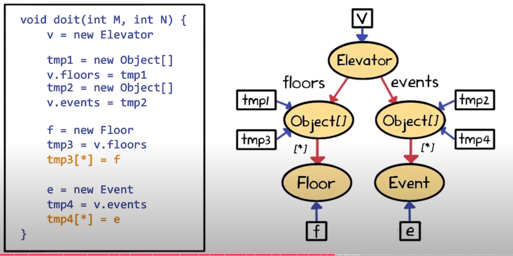

Quiz

> Ninguna. En el análisis anterior cualquier asignación a null es ignorada.

```
Node h = tmp

v = new Node()

v.next = h
h.prev = v

h = v
```

```
[h] -B-> (node) <-B- [v]
```

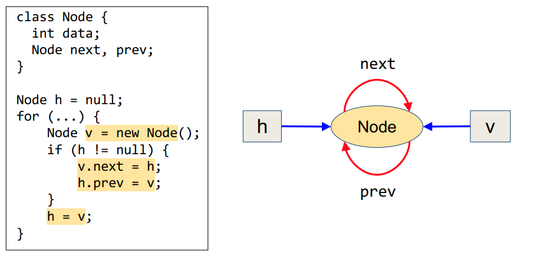

## Clasificaciones de pointer analysis

Se pueden clasificar según distintas dimensiones. 4 importantes,

1. Es flow sensitive?
2. Es context-sensitive?
3. Que esquema de abstracción de heap usa?
4. Como modela *aggregate* data types? (arrays, estructuras)

### Flow sensitivity

Como modelar control flow *dentro* de un procedimiento o funcion
(intra-procedural contro lflow). Dos tipos

- Flow insensitive: hacen **weak updates**
  - Ven a los programas como unordered statements
  - Nunca matan facts
  - Suelen alcanzar para may-alias
- Flow sensitive: hacen **strong updates**
  - Pueden matar facts
  - Suelen ser requeridos para must-alias analysis.

### Context sensitivity

Como modelar control flow *a través* de los procedimientos o funciones
(inter-procedural control flow). Dos tipos:

- Context insensitive: analizan cada func una sola vez, sin importar cuantas
  veces se llamen.
  - Son imprecisos, ya que juntan aliasing facts que vienen de diferentes
    execution contexts
  - Pero son muy eficientes, ya que analizan cada procedimiento una sola vez.
- Context sensitive
  - Analizan cada procedimiento potencialmente muchas veces, una por cada
    *abstract calling context*
  - Son relativamente precisos, pero caros.
  - Difieren en como abstraen el calling context

### Heap Abstraction

abstraccion de objetos *allocated* dinamicamente, heap. El esquema dice como
particionar un conjunto no acotado de objetos concretos en una cantidad finita
de **objetos abstractos** (nodos circulares en *points-to graph*)

Esto asegura que el pointer analysis termina.

Hacer un buen heap abstraction es un arte. Hay muchos esquemas sound, que varian
en precision y eficiencia.

- Pocos objetos abstactos => eficiente pero impreciso (junta muchos objetos)
- Muchos objetos abstractos => ineficiente pero preciso

Esquemas:

#### Allocation-site based

- Un objeto abstracto por **allocation site**: el lugar en el programa en el
  cual se crean.
- Los allocation sites estan identificados por `new` en java/cpp y `malloc` en
  c.

Como hay una cantidad finita de allocation sites, está garantizado que tiene
una cantidad finita de objetos abstractos.

Desventajas: puede ser caro

- programas grandes (muchos allocations site)
- los clientes necesitan quick turnaround times
- hay demasiada granularidad de los sitios, y puede no ser necesario

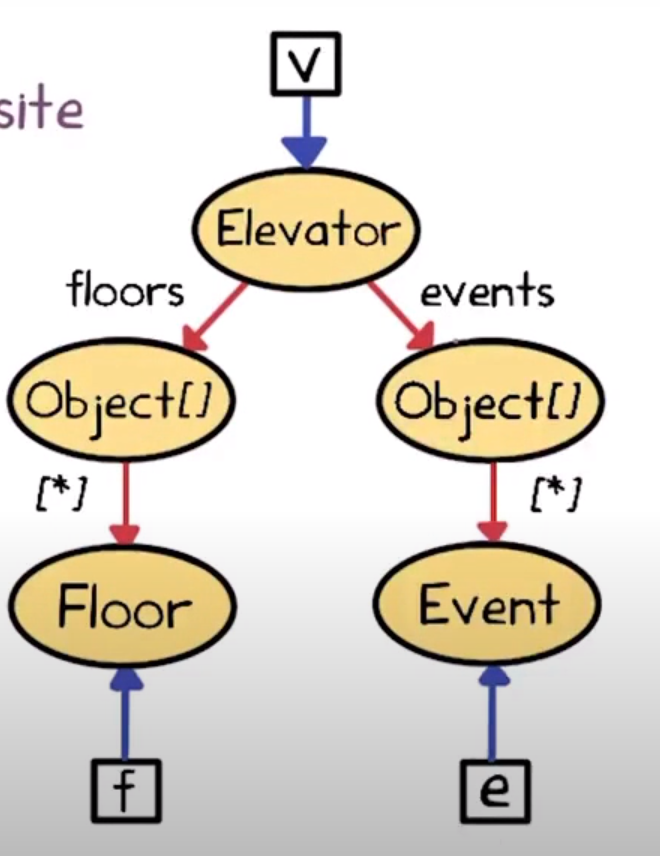

#### Type based

Esquema más barato que se puede usar cuando aplican las desventajas.

- Un objeto abstracto por **tipo**
- Tipos finitos => numero de obj abstractos finitos

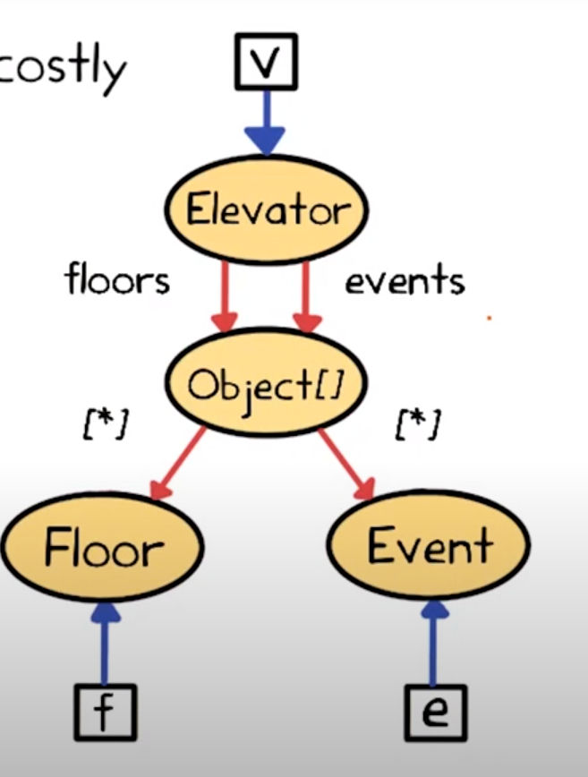

#### Heap-insensitive

**Un solo objeto** representa el heap entero

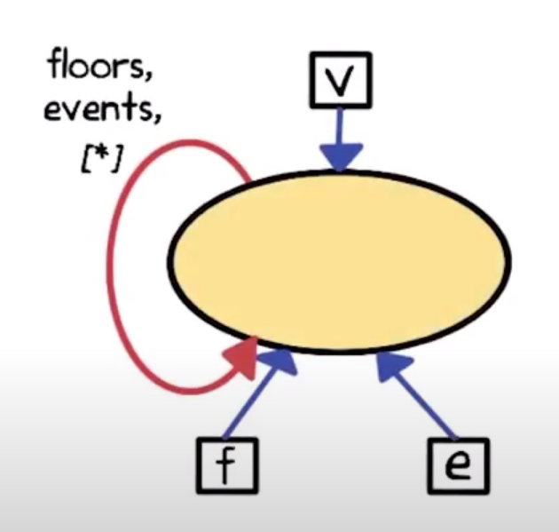

Es altamente impreciso, pero es sound. Es popular para lenguajes con
stack-directed pointers (como C, donde no se suele llamar a malloc). No sirve
mucho con heap directed pointers (como en java)

#### Tradeoffs


En la literatura hay más e incluso se pueden armar propios.

Quiz

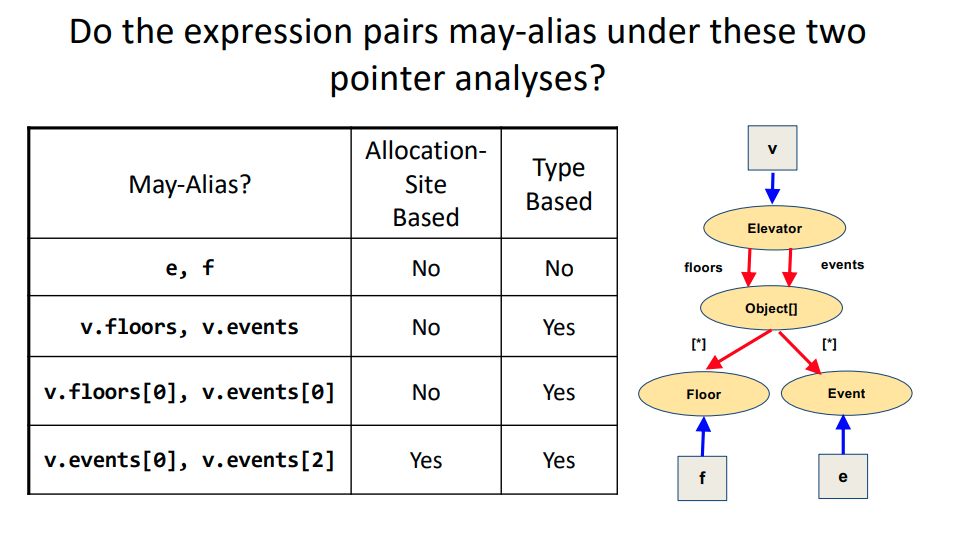

### Aggregate data types

Arrays y records (objetos)

#### Arrays

Una opción común es usar un solo campo `[*]` para representar todos los objetos
del array. No pueden distinguir elementos del mismo array.

Representacines más sofisticadas hacen distinciones, y se usan en *array
dependence analysis*: ver si dos enteros se refieren a la misma pos de un array.

Se usa para paralelizar loops secuenciales a loops paralelos

#### Records

Se conocen como structs en c o clases en lenguajes orientados a objetos. Hay
tres opciones,

1. **Field insensitive**: juntar todos los campos de cada record object

    

    Previene que distingan entre f1 y f2 en a1 o a2

2. **Field based**: junta cada campo de todos los objetos

    

    No permite distinguir campos entre objetos. Entre a1 y a2 pero si f1 y f2

3. **Field sensitive**: Cada campo de cada abstract record object está separado.

    

    Es la más precisa de todas.

## Bibliografía

Static Program Analysis (https://cs.au.dk/~amoeller/spa/spa.pdf) Autores: Anders Møller and Michael I. Schwartzbach

Capítulo 10: "Pointer Analysis"
