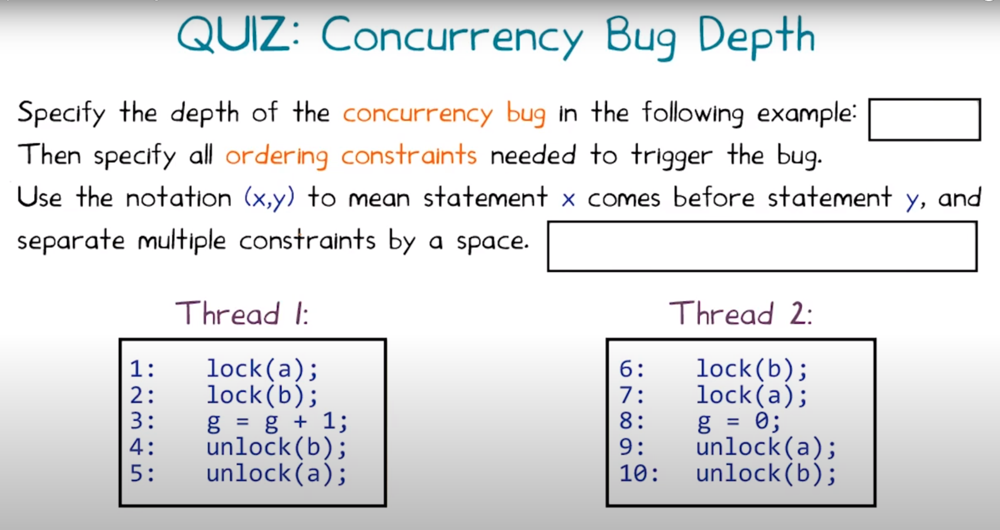

# Lección 5 - Random Testing

Contenido

- Teorema del Mono Infinito
- Fuzzing de UNIX utilities
- Random Testing de Mobile Apps
- Profundidad de Error
- Crashes/Hangs en programas concurrentes
- Random Testing de schedulings
- Herramientas: Monkey, Cuzz

Mostrar aplicaciones de random testing en mobile apps y mutlithreaded programs

Monkeytool: google, android

Cuzz: microsoft, mutltirhead

## Fuzzing

Random testing (fuzzing) tiene como idea darle inputs random a un programa, y
vemos si se comporta "correctamente". Ej. si tenemos pre o post conditions que
las cumpla, o que no crashee

Es un caso especial de mutation analysis

Es un *paradigma*, no una tecnica que usamos out of the box. La generación de
inputs va a depender de cada programa.

## Infinite monkey theorem

> "A monkey hitting keys at random on a typewriter keyboard will produce any
> given text, such as the complete works of Shakespare, with probability
> approaching 1 as time increases".

El monkey es un fuzz testing tool, y un texto es encontrar un input que expone
un bug en el programa siendo testeado.

## Case studies

- **UNIX utilities**

  La universidad de wisconsin hizo de los primeros analisis de fuzzing

  Takeaway: fuzzing puede estar bueno para tener buffer overrun errors

- **Mobile apps**: Monkey tool de google para android

- **Concurrent programs**: Cuzz de microsoft para multicore

## Fuzzing en mobile - Monkey

Suele generar una secuencia de eventos

También se pueden generar gestures

## Concurrent programs

En un programa secuencial un bug se descubre con un input particular. En cambio
un concurrente (con muchos threads) un bug se triggerea no solo con un input,
sino con un thread schedule en particular.

Típicamente se determina por el sched del SO y no es determinístico.

El approach predominante es introducir delays random entre instrucciones
(`sleep`). Esto afecta al thread scheduler. Esto es la clave de *cuzz*,
automatiza la puesta de llamadas a `sleep` antes de todos los statements.

**Bug depth** = el número de *ordering constraints* que un schedule tiene que
satisfacer para encontrar el bug

```
// thread 1
t = new T();

// thread 2
t.state == 1
```

como hay un solo constraint, depth 1

```
// thread 1
p = null;

// thread 2
if (p != null) {
  p.close();
}
```

bug depth 2 (porque thread 1 antes de 2.1 y 2.2 después de 1).

Cuzz: típicamente tienen poco depth los bugs. "small test case hyphotesis": si
hay un bug, hay un test chiquito que lo encuentra.

quiz:



Deadlock si (1, 7) y (6, 2). 2 y 7 quedan trabados y se genera un deadlock. Bug
depth 2.

Key points:

- bug depth es una buena métrica para los esfuerzos. Suele ser necesario
  enforcarse en depths bajas para encontrar la mayoría de los bugs.

- Randomización sistemática mejora el testing de concurrencia. Te da una
  probabilidad garantizada.

- Cuzz es mejor que stress testing.

## Random testing tradeoffs

Pros

- Fácil de implementar
- Se puede probar que tiene buen cubrimiento con suficientes tests
- Puede funcionar con programas de cualquier formato
- Está bueno para vulns de seguridad (encuentra cosas raras que los testers
  humanos no encuentran)

Cons

- Test suite ineficiente (test bloat)
- Puede encontrar bugs que no son tan importantes (tal vez side effects
  benignos)
- Mala cobertura

## Bib

http://rightingcode.org/lessons.html

Bibliografía
An Empirical Study of the Reliability of UNIX Utilities
Link https://minds.wisconsin.edu/bitstream/handle/1793/59090/TR830.pdf?sequence=1

A Randomized Scheduler with Probabilistic Guarantees of Finding Bugs

Link https://www.microsoft.com/en-us/research/wp-content/uploads/2016/02/asplos277-pct.pdf

