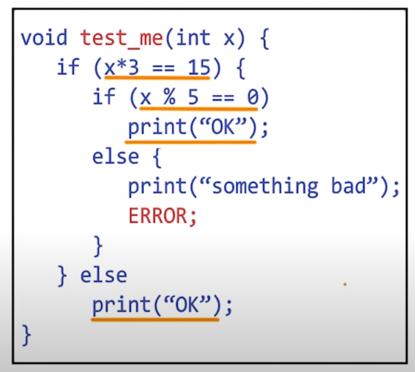
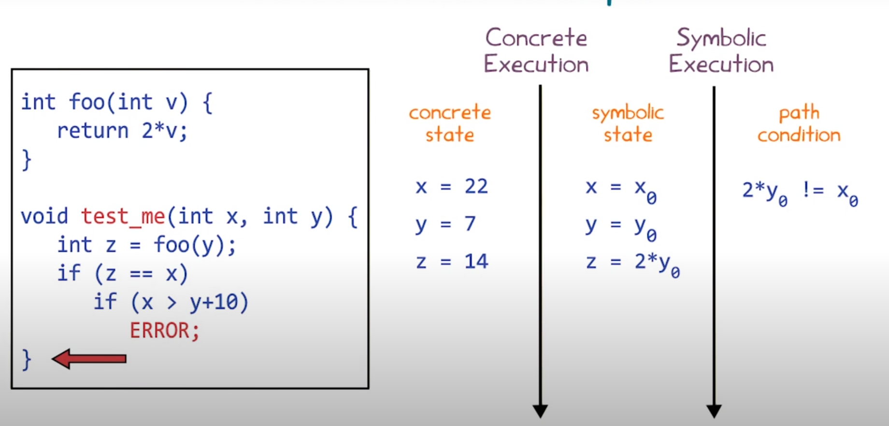
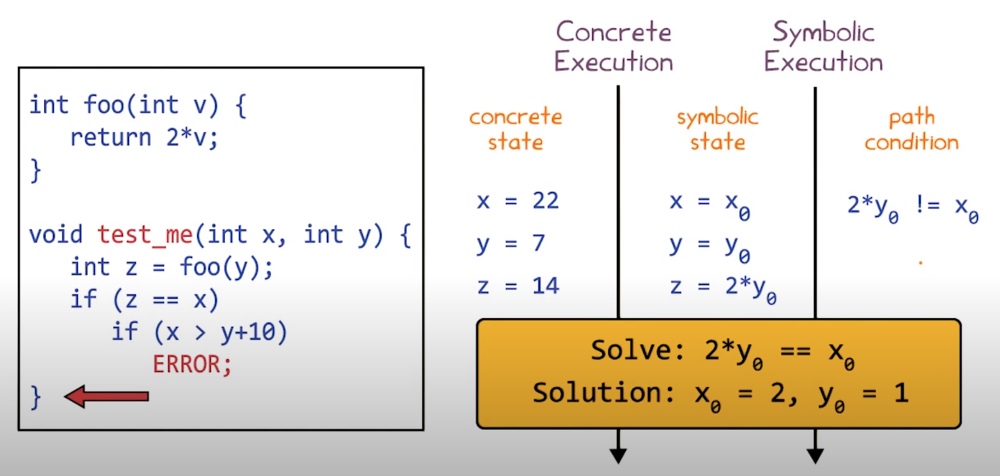
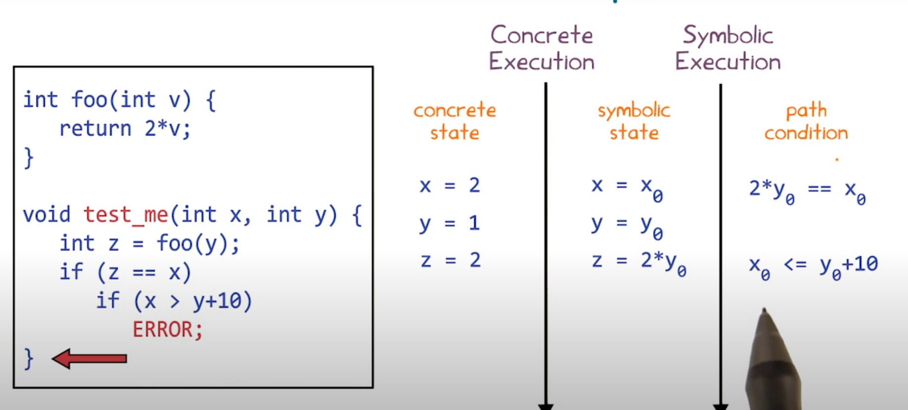
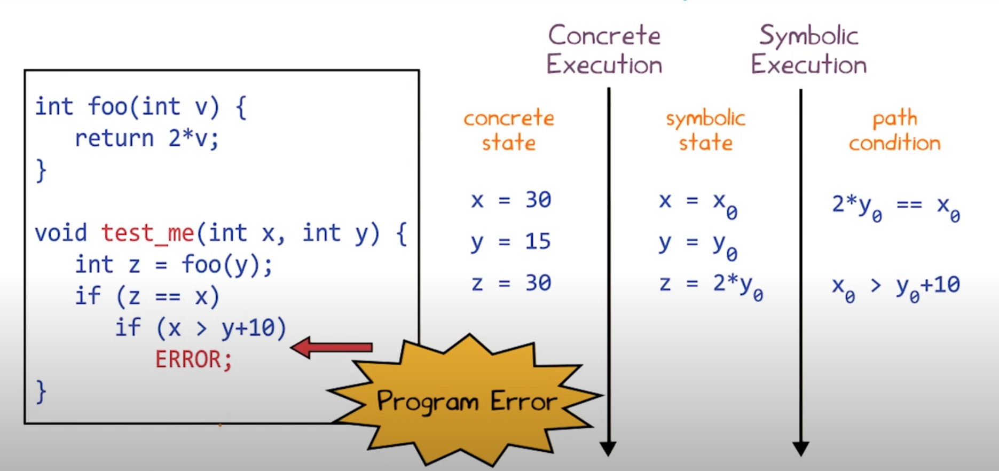
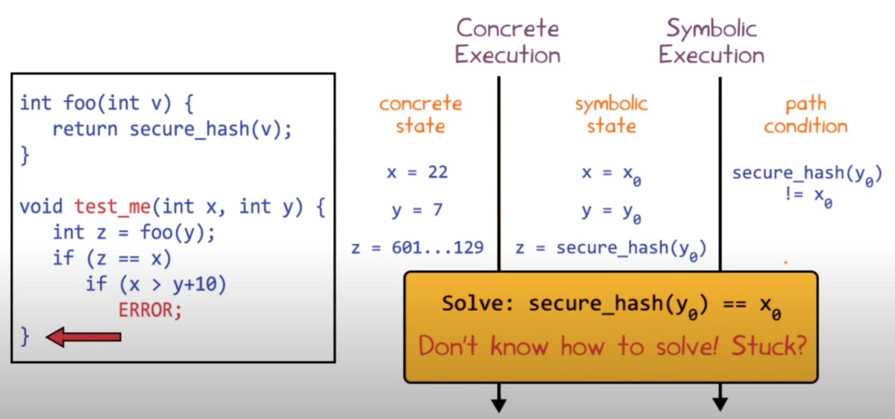
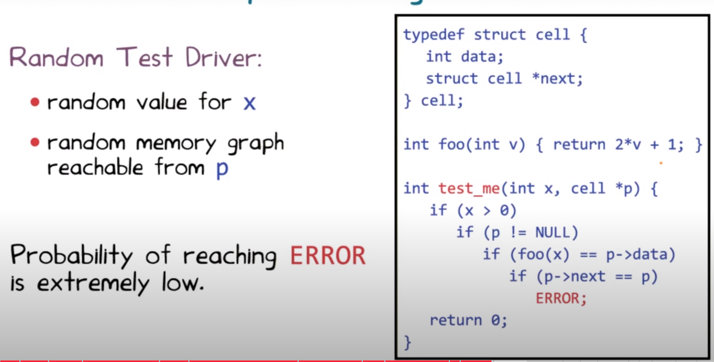

# Lección 7 - Dynamic Symbolic Execution

Es una técnica **híbrida**: combina static y dynamic analysis.

Genera inputs a un programa que lleva su ejecucion a diferentes paths. No
produce falsos positivos (pero si falsos negativos). Hay implementaciones open
source y comerciales.

## Approach

- Automatic test generation!
- Trackea el estado del programa de forma *concreta* (análisis dinamico) y
simbólica (análisis estático).
- Resuelve *constraints* para guiar la ejecución en branch points
- Explora todos los paths de ejecución de la unidad under test.

Es un ejemplo de **hybrid analysis**.

## Execution paths

**Computation tree**: forma de ver el programa como un árbol binario de
profundidad potencialmente infinita (loops). Cada nodo representa la ejecución
de un condicional, y cada arista la de una secuencia de statements no
condicionales.

Left branch: false. True branch: false.

Cada camino en el árbol representa una **clase de equivalencia** de inputs.

Queremos generar sistemáticamente inputs no equivalentes.

## Ejemplo


Vamos a representar los assertions como `assert(b) => if (!b) ERROR;`

## Symbolic execution

Los inputs se representan con símbolos en vez de valores concretos, y el
programa se ejecuta simbólicamente, guardando path constraints simbólicas.

En cada branch point, se usa un **theorem prover** para chequear si un branch
puede ser tomado (si no, la ignoramos).

### Ejemplo

Por ejemplo



- Le preguntamos al theorem prover "hay algún valor de x tal que
x*3 = 15?", y nos va a decir que "si", entonces podemos determinar que el true
branch es alcanzable. Idem el false.

- Para el 2do if, le preguntamos al theorem prover si existe x tal que cumpla
**ambas** condiciones, `x*3 = 15` y `x % 5 = 0 `

  - Pero no existe x tal que `x*3 = 15` pero `x % 5 != 0`, entonces podemos
    determinar que el false branch no es alcanzable, y nunca se alcanza el
    error.

Pero no escala para programas grandes porque hay una cantidad enorme de
condiciones.

También nos puede pasar que la pregunta a responder sea *difícil* y que no pueda
ser respondida en un tiempo razonable. En este caso, el análisis toma un
approach *sound* y da falsos positivos (ambos branches reachable cuando tal vez
no es así).

### Pseudocódigo

Pseudocódigo Ejecución simbólica
El siguiente pseudo-código es una implementación posible de la técnica de ejecución simbólica descripta por Mayur Naik donde la entrada es un programa P. El programa retorna una lista de errores detectados.

```text
Input: control-flow graph de un programa P
Output: lista de errores detectados

comp_tree := crear árbol de cómputo a partir P
init_symb_state := x=x0 para todo x variable de entrada de P
r := root(computation_tree) 
symb_state_r := execute_symbolically(init_symb_state, r)
// Si alcanzó error antes de llegar a la raíz, detengo la exploración
If symb_state_r reaches ERROR
 return { symb_state_r }
Endif
// Sino, inicializo una
errorList := {}
symbolic_states[r] := symb_state_r
path_conditions[r] := True
// para explorar los nodos voy a usar una pila
stack.push(r)
While stack.isNotEmpty()
 c := stack.pop()
 symb_state_c := symbolic_states[c]
 // evalúo simbólicamente la condición usando el estado simbólico
 symb_expression := evaluate(symb_state_c, condition(c))
 // creo la path condition para la rama "true"
 truePathCondition = path_conditions[c] && symbolic_expression==True
 // si el demostrador de teoremas no puede demostrar que es no satisfacible
 If truePathCondition!=UNSAT 
   // ejecuto simbólicamente las sentencias luego de tomar la rama "true"
   true_symb_state_c := execute_symbolically[symb_state_c, right(c)]
   If true_symb_c reaches ERROR
     errorList.add(new_symbolic_state)
   Else
     // Si no alcancé un error, continuo la ejecución simbólica
     stack.push(right(c))
     path_conditions[right(c)] := truePathCondition
     symbolic_states[right(c)] := true_symb_state_c
   Endif
 Endif
 
  // Idem pero usando "False" en lugar de "True" para left(c) 
Endwhile
return errorList
```

## Dynamic Symbolic Execution

Combinación de dos approaches para tener las ventajas de ambos sin tener las
desventajas de ninguno: concrete execution de random testing con symbolic
execution. **Dynamic Symbolic Execution** (DSE)

- Arranca con inputs random y observa los branches que se toman
- Trackea valores concretos **y** constraints simbólicas
- Cuando llega al fin del cómputo, hace backtracking hasta algún branch point y
  decide si hay un satisfying assignment que permite que se tome el otro branch.
  Si lo hay, el solver genera una asignación que la satisfaga, y sino la ignora
  como código muerto.

- Si una condición es suficientemente compleja como para que el solver no la
  pueda resolver, entonces el solver le pone valores concretos para
  simplificarlo. Esto hace que el solver sea un *incomplete* theorem prover.
  Nunca declara unsat como sat, pero puede fallar en satisfacer algún constraint
  que es satisfacible.

### Ejemplo de DSE



luego, como terminó en el false branch, hace backtracking y niega la constraint
más reciente, pidiendole a un solver valores que satisfagan `2 * y0 = x0`



luego restartea la función y la llama con los valores concretos dados por el
solver. Esta vez va a ser verdadera la condición y vamos a tener que analizar el
2do.



Ahora niega, obteniendo `x0 > y0 + 10`, pasandole ambos constraints al solver:
`x0 > y0 + 10` y `2 * y0 = x0`. Obtiene la solucion x0 = 30 y y0 = 15.

Corre nuevamente la función con esos dos valores concretos, llevando a que la
función falle y conocemos los valores concretos: x = 30 e y = 15



### Ejemplo más complejo



La idea de las funciones de hash seguras es que sea difícil resolver ecuaciones
como esa.

**Acá está la diferencia entre DSE y SE**. En esta situación, SE se hubiera
rendido y asumido que ambas branches son posibles. Pero DSE en este caso no está
trabado, porque puede usar el estado concreto de y0 = 7, y así el constraint
pasa a ser `601...129 = x0`.

> Notar que esto no podría ser al revés (buscar y a partir de x), porque son
> difíciles de invertir a propósito.

### Tercer ejemplo


Encontrar una colisión para un hash criptográficamente seguro es difícil. El
solver va a intentar de reemplazar los valores simbólicos por los concretos, y
va a quedar con unas constraints puramente concretas e insatisfacibles. DSE no
va a encontrar el error en el código! Devolvió un **falso negativo**

### Restricciones complejas

Cuando las restricciones son muy complejas para ser manejadas por el demostrador
de teoremas, DSE "simplifica" las restricciones enviadas al demostrador
reemplazando un valor simbólico con un valor concreto. Esto produce

- Las restricciones simplificadas son un subconjunto de las soluciones para
  recorrer ese camino, por lo tanto, un resultado de insatisfabilidad (UNSAT) no
  es concluyente, ya que no se analizó todo el espacio de búsqueda.

- Reduce el espacio de búsqueda de soluciones del demostrador de teoremas, lo
  que le permite en algunos casos encontrar soluciones que de otra manera no
  podría.

- El uso de restricciones simplificadas introduce unsoundness, ya que DSE puede
  producir falsos negativos (i.e. no reportar que se puede producir un error
  cuando existe un input concreto que puede alcanzar ese error)

Diferencia entre DSE y SE, parecida a diferencia entre static analysis y dynamic
analysis.

- DSE nunca modela un run del código que no podría pasar, entonces no hay
  falsos positivos (es complete). Pero puede perderse casos, entonces hay falsos
  negativos (no es sound).

- SE siempre toma branches que no está seguro de si se pueden alcanzar, entonces
  puede modelar corridas del programa que sean imposibles: no hay falsos
  negativos (nunca determina incorrectamente que un programa no tiene errores,
  es sound) pero hay falsos positivos (retorna errores espúreos, es incomplete)

## DSE con data structures

Antes vimos Korat y Randoop. Un error podría ser difícil de alcanzar con solo
random testing.



Es muy baja la probabilidad de que con inputs random llegue. En cambio, DSE lo
encontraría en a lo sumo 5 runs

## In a nutshell

- Intenta de encontrar un balance entre análisis estático y dinámico
- Genera inputs concretos que toman diferentes caminos del programa
- Para cada input, ejecuta el programa de forma concreta y simbólica

## Summary

- [Symbolic execution](#symbolic-execution) técnica para simular ejecución de un programa en inputs
  simbólicos. Trackea constraints simbólicas que pasa a un solver para ver si
  son satisfacibles y ciertos paths (branches) son posibles.

  - Dynamic SE: es un hibrído, además hace ejecución concreta.

- Sistematicamente genera inputs numéricos y de punteros (data structures) para
  explorar el computation tree de un programa con la mayor cantidad de cvg
  posible, eliminando ejecuciones redundantes.

  - Un computation tree es un modelo de todos los paths posibles que puede tomar
    la ejecución de un programa.

- El **objetivo** de DSE es determinar si un error es alcanzable con cierto
  input concreto

- DSE trackea 3 piezas de info
  - Concrete state
    - Lo usa para simplificar la parte de resolución de constraints de análisis
      estático
  - Symbolic state
    - Lo usa para guiar el análisis dinámico a seleccionar inputs concretos no
      redundantes.
  - Path condition (constraints simbólicas que le pasa al solver)

- Compelete: si reporta un error, se puede llegar a él mediante algún run del
  programa (no hay FP). Incluso puede dar los inputs concretos exactos para
  generar el error.

- A diferencia de SE pura es unsound, puede haber falsos negativos.
- DSE no tiene garantizado terminar si hay input-dependent loops. se puede
  modificar DSE para que termine después de explorar una cantidad finita de
  caminos del computation tree 

## SAGE: Scalable Automated Guided Execution

El siguiente es un artículo de divulgación que profundiza en los efectos de DSE en empresas de software. Se recomienda leer el artículo para discutir en clase.

https://patricegodefroid.github.io/public_psfiles/cacm2012.pdf

## Dudas de la lección

- Cómo funcionan los solvers? Los vamos a ver?
- Por qué es mejor tener falsos negativos que no tener falsos positivos?
